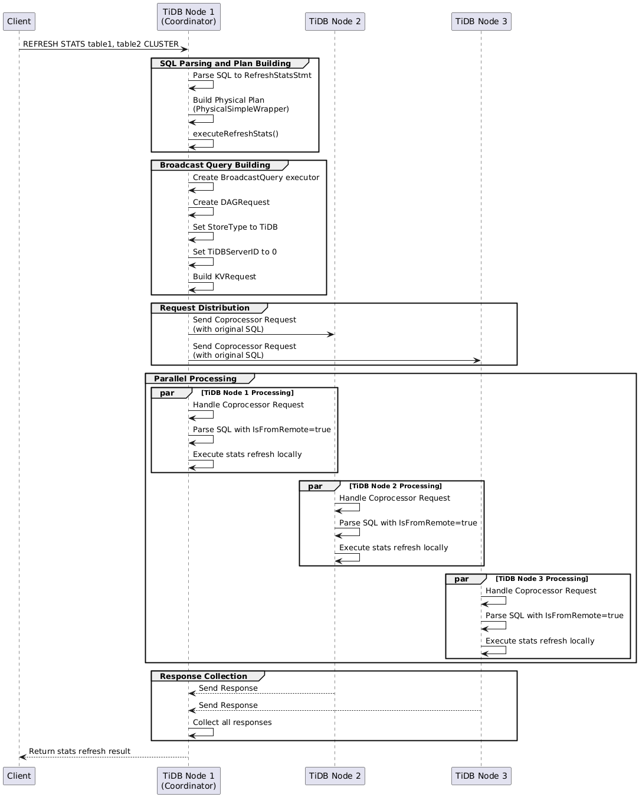

# Refresh Stats Command

- Author(s): [Poe Liu](http://github.com/0xPoe)
- Discussion PR: https://github.com/pingcap/tidb/pull/61330
- Tracking Issue: https://github.com/pingcap/tidb/issues/61273

## Table of Contents

- [Refresh Stats Command](#refresh-stats-command)
	- [Table of Contents](#table-of-contents)
	- [Introduction](#introduction)
	- [Motivation or Background](#motivation-or-background)
	- [Detailed Design](#detailed-design)
		- [Guide-level explanation](#guide-level-explanation)
		- [Reference-level explanation](#reference-level-explanation)
			- [Goals](#goals)
			- [Solution](#solution)
				- [Broadcast Query Executor](#broadcast-query-executor)
				- [Workflow](#workflow)
				- [Concurrency Control](#concurrency-control)
				- [Timeout](#timeout)
			- [FAQ](#faq)
	- [Test Design](#test-design)
		- [Functional Tests](#functional-tests)
		- [Scenario Tests](#scenario-tests)
		- [Compatibility Tests](#compatibility-tests)
		- [Performance Tests](#performance-tests)
	- [Impacts \& Risks](#impacts--risks)
	- [Investigation \& Alternatives](#investigation--alternatives)
	- [Unresolved Questions](#unresolved-questions)

## Introduction

This document proposes a new SQL command to refresh the statistics for the specified tables. This command is useful for the BR tool to refresh the statistics for the tables that have been restored. It also can be used to debug in-memory statistics issues.

## Motivation or Background

Recently, we have a project that aims to speed up statistics backup and restore for some key customers.
In the proposal, we want to perform the physical backup and restore for the stats-related tables; it would significantly reduce the time for reading and writing the stats by using JSON files.

If we implement this solution, it would introduce another problem. The backup and restore operations happen after the cluster has started, which means they occur after the statistics are initialized. Therefore, we still need a mechanism to ensure that TiDB nodes load the latest statistics into memory and are ready to serve user queries after the restore operation. Otherwise, it wouldn't be able to use the latest statistics in time.
One workaround is to ask users to perform a full restart of the TiDB nodes, which would trigger stats initialization again during startup. However, this is obviously not ideal for users. Therefore, we plan to introduce a new SQL command that the BR tool can use to trigger stats refreshment for the tables that have been restored.

Another useful use case for this command is when we need to debug in-memory statistics issues. We can leverage this command to force a refresh of the in-memory stats without restarting the cluster or re-analyzing the table.

## Detailed Design

### Guide-level explanation

This command looks as follows:

```SQL
REFRESH STATS <TARGETS> [FULL | LITE] [CLUSTER];
REFRESH STATS db1.tbl1, tbl2, db2.*, *.* FULL CLUSTER;
```

- `TARGETS` takes a list of targets separated by comma, which can be any of the following formats.
  - tab1:  tab1 under current schema.
  - db.tab1: particular tables
  - db.* : all tables under schema db
  - \*.\*: all tables in this cluster
- `FULL | LITE` names the type of refreshing statistics.
  - If the option is omitted, it takes the value from config [lite-init-stats.](https://docs.pingcap.com/tidb/stable/tidb-configuration-file/#lite-init-stats-new-in-v710)
  - Explicit `FULL` refers to `lite-init-stats=false`
  - Explicit `LITE` refers to `lite-init-stats=true`
- If `CLUSTER` is set, refreshing statistics happens for all TiDB instances. Otherwise, refreshing statistics happens to the TiDB instance connected only.

Users with the SELECT privilege on the target tables, as well as the BR tool with the ADMIN_RESTORE privilege, can use this command to refresh the statistics for the specified tables.

### Reference-level explanation

#### Goals

1. `Implement the Command`: Utilize the existing statistics initialization functionality to support the specified syntax while enforcing the necessary permission checks.
2. `Cluster-Wide Execution`: Ensure that running the command on a single node can successfully update statistics across all nodes in the cluster.

To implement this basic feature, we can extend the current functionality for both Lite and non-Lite stats initialization. Then, we can retrieve all table information specified in the target list and pass it to the respective lite and non-lite stats refreshing functions.

The main challenge is how to support the `CLUSTER` flag, as the statistics are stored in the memory of each TiDB node. Since users, including BR, may connect to only a single TiDB node, we need to find a way to refresh the statistics on other nodes, even if the command is sent to just one node. So, we will mainly focus on this challenge and explore the available ways to achieve it.

#### Solution

In TiDB, the `KILL` statement allows users to terminate a connection on any TiDB instance within the current cluster. It achieves this by leveraging the TiDB coprocessor framework to distribute the `KILL` command across different TiDB nodes.

We can adopt a similar approach to implement the `REFRESH STATS` command. Essentially, we need to implement a new coprocessor operator to send and handle the coprocessor request across different TiDB nodes.

The plan cache module has similar requirements, as it needs to flush the plan cache for tables across all TiDB nodes. Therefore, when implementing the `REFRESH STATS` command, we should design the infrastructure to be reusable for both statistics refreshing and plan cache flushing operations.

##### Broadcast Query Executor

First, we need to define a new type of executor in the protobuf file:

```protobuf
enum ExecType {
    ...
    TypeBroadcastQuery = 17;
}

message Executor {
    ...
    optional BroadcastQuery broadcast_query = 21;
}

message BroadcastQuery { optional string query = 1; }
```

We need to use this set of protobuf messages to pass the SQL statement between different TiDB nodes.

To enable execution of the `REFRESH STATS` command in TiDB, we first need to define the `REFRESH STATS` statement syntax to support parsing this new command.

```yacc
RefreshStatsStmt:
	"REFRESH" "STATS" RefreshObjectList
	{
		$$ = &ast.RefreshStatsStmt{
			RefreshObjects: $3.([]*ast.RefreshObject),
		}
	}

RefreshObjectList:
	RefreshObject
	{
		$$ = []*ast.RefreshObject{$1.(*ast.RefreshObject)}
	}
|	RefreshObjectList ',' RefreshObject
	{
		$$ = append($1.([]*ast.RefreshObject), $3.(*ast.RefreshObject))
	}

RefreshObject:
	'*' '.' '*'
	{
		$$ = &ast.RefreshObject{
			RefreshObjectScope: ast.RefreshObjectScopeGlobal,
		}
	}
|	Identifier '.' '*'
	{
		$$ = &ast.RefreshObject{
			RefreshObjectScope: ast.RefreshObjectScopeDatabase,
			DBName:             ast.NewCIStr($1),
		}
	}
|	Identifier '.' Identifier
	{
		$$ = &ast.RefreshObject{
			RefreshObjectScope: ast.RefreshObjectScopeTable,
			DBName:             ast.NewCIStr($1),
			TableName:          ast.NewCIStr($3),
		}
	}
|	Identifier
	{
		$$ = &ast.RefreshObject{
			RefreshObjectScope: ast.RefreshObjectScopeTable,
			TableName:          ast.NewCIStr($1),
		}
	}
```

Every time we receive a `REFRESH STATS` statement, it is parsed as an `ast.RefreshStatsStmt`, and we use the simple executor to handle and execute it.

```go
func (e *SimpleExec) Next(ctx context.Context, _ *chunk.Chunk) (err error) {
    ...
    case *ast.InitStatsStmt:
            err = e.executeInitStats(ctx, x)
    ...
}

func (e *SimpleExec) executeRefreshStats(ctx context.Context, s *ast.RefreshStatsStmt) error {
	if e.IsFromRemote {
		// TODO: do the real refresh stats
		return nil
	}
	return broadcast(ctx, e.Ctx(), s.Text())
}

func broadcast(ctx context.Context, sctx sessionctx.Context, sql string) error {
	broadcastExec := &tipb.Executor{
		Tp: tipb.ExecType_TypeBroadcastQuery,
		BroadcastQuery: &tipb.BroadcastQuery{
			Query: &sql,
		},
	}
	dagReq := &tipb.DAGRequest{}
	...
	dagReq.Executors = []*tipb.Executor{broadcastExec}

	var builder distsql.RequestBuilder
	kvReq, err := builder.
		SetDAGRequest(dagReq).
		SetFromSessionVars(sctx.GetDistSQLCtx()).
		SetFromInfoSchema(sctx.GetInfoSchema()).
		SetStoreType(kv.TiDB).
		SetTiDBServerID(0).
		SetStartTS(math.MaxUint64). // To make check visibility success.
		Build()
	if err != nil {
		return err
	}
	resp := sctx.GetClient().Send(ctx, kvReq, sctx.GetSessionVars().KVVars, &kv.ClientSendOption{})
	...
	for {
		subset, err := resp.Next(ctx)
		if err != nil {
			return errors.Trace(err)
		}
		if subset == nil {
			break // all remote tasks finished cleanly
		}
	}

	logutil.BgLogger().Info("Broadcast query", zap.String("sql", sql))
	return nil
}
```

When TiDB executes this statement, it first checks whether the statement comes from a remote source. If it does, TiDB performs the actual stats refreshing and returns the result. Otherwise, it indicates that the command is issued by a user or BR, so we need to broadcast it to all TiDB nodes, including the current node, using the coprocessor framework.

**To achieve this, we set the store type to TiDB, which ensures the coprocessor only sends the request to TiDB nodes. Additionally, we set the TiDB server ID to 0, which means a coprocessor task will be generated for each TiDB node.**

When a TiDB node receives a coprocessor request, it constructs a DAG executor and converts the protobuf message into an actual physical plan, specifically a [PhysicalSimpleWrapper](https://github.com/pingcap/tidb/blob/ebad7408d72d0df673ce1036e10501303df75c94/pkg/planner/core/common_plans.go#L364). During this process, the protobuf message is translated into an `REFRESH STATS` statement, which is then executed using the above executor. Since we know this command originates from a remote source, we also set the `IsFromRemote` flag accordingly during the conversion.

```go
case tipb.ExecType_TypeBroadcastQuery:
	p, err = b.pbToBroadcastQuery(e)
```

```go
func (b *PBPlanBuilder) pbToBroadcastQuery(e *tipb.Executor) (base.PhysicalPlan, error) {
	pa := parser.New()
	stmt, err := pa.ParseOneStmt(*e.BroadcastQuery.Query, "", "")
	if err != nil {
		return nil, errors.Trace(err)
	}
	simple := Simple{Statement: stmt, IsFromRemote: true, ResolveCtx: resolve.NewContext()}
	return &PhysicalSimpleWrapper{Inner: simple}, nil
}
```

Then, it will be executed by the `SimpleExec` executor by calling the `executeRefreshStats` function.

##### Workflow

The overall [workflow](https://editor.plantuml.com/uml/fLLDRzim3BtxLn0zDS06BCvjm8Os7rsB5KDhPTjb5zNX4W6AvL7qjlpxKLRTAfsT9LWEaMEzH_AHJyg5PqtSR6rMosfAK-kAuMnc3LPy1jf3VDpVNfhv53wv5SBuMtK-SuvMfjBiQDHImlPuY94_GV8XoEG9Cicoc1zUluzXtqAnk2eMwXhKydAfWFM3nV6hkEOmk_sibeiYozRacXhK_ItSQVAcMeEkLd1dTGNJnbYfTvs1VDgWIVI0nfR73WhyJkWtYZLxnLlkPRJXu6wpywRKjaqXJUb-AxEjBNubNTT8ezu0-1lBXZ5DTZxAi5frAgRazAhKdk6-GTeT5Z0Zr8pFd4Y9EHmTeimlFnJueq7VhrCXWv8GkDpL6BeJtWyYmwD2-ebqCm_WDmTwz_5BbpSH_VWAviOpcOU6ZQl-Zf67R3BOcQl9bUYzeuufG_XbU0EEp5hSQSDGUmOmEJL2KgEOHLkBClH8xMOYleRaZBpSxkl4jTZJObyLWvHdgxPLtlWhSji2juxn7LE3WyH5D1puO3MWw3kmJkngToqhQ0nhZvfyI4sUpEH8DIdb93KfyR_KJ8RKJ19_7AacfPoa9YKUfsRldFZQLJwK9rOizuw9j2azbUBo3fqbkVy5sRigOXAGQgIu2FInd4UeOEELBJSrSaFL2odorLZEiWiXoV_E7m00) is as follows:



##### Concurrency Control

Since we use the coprocessor framework, we don't need to introduce any new concurrency control mechanism. We can simply leverage the concurrency control capabilities provided by the coprocessor framework.

Specifically, we can reuse the [tidb_distsql_scan_concurrency](https://docs.pingcap.com/tidb/stable/system-variables/#tidb_distsql_scan_concurrency) variable to decide how many tasks should be handled simultaneously, or we can introduce a new variable to control how many requests should be sent.

**We should thoroughly evaluate the performance impact of this command on TiKV's online workload through comprehensive testing.**

##### Timeout

We can also leverage the timeout capabilities provided by the coprocessor framework. By overriding [MaxExecutionTime](https://github.com/pingcap/tidb/blob/24817eb4e3d284825402c75dfe5e65d6a23c35de/pkg/distsql/context/context.go#L83), we can set a custom timeout for the task.
The default timeout is 0, which means there is no timeout.
If you want to specify a timeout, you can use the following formula as a reference:

```sql
Timeout = min(
   ((Total Tables * Number of Nodes) / 1M tables per minute) + 1 minute buffer,
   15 minutes
)
```
The timeout for a batch of tasks is calculated based on the number of tables and nodes.
In this formula, we assume that initializing statistics for 1 million tables takes approximately 1 minute. **This estimate should be validated through testing.** And we add a buffer of 1 minute to account for minor delays. However, to prevent excessively long waits, the maximum timeout is capped at 15 minutes, as anything beyond that would be considered unacceptable.

#### FAQ

1. If there are already some table stats in the cluster, performing a physical recovery of stats will discard all of them, right?
   - Yes, technically, it would recreate the stats table. So in this scenario, we fall back to the stats JSON backup and restore approach to avoid this issue.
2. How should we handle receiving another init stats request while one is already being processed?
   - To solve this issue and avoid complicating the implementation, we should check whether an init stats operation is already in progress. If it is, we should return an error as early as possible.

## Test Design

We should test the following scenarios:

- Basic functionality
- Concurrency control
- Timeout
- Performance impact

### Functional Tests

We will implement comprehensive functional tests to verify the core functionality. These tests will:

- Cover all supported SQL syntax variations for the refresh stats command
- Verify successful execution across multiple TiDB nodes in a distributed environment
- Validate that statistics are correctly refreshed and updated
- Ensure proper error handling and edge cases are covered

### Scenario Tests

There are two main scenarios we should test:

- BR backup and restore: we should test the scenario where the stats are already initialized and the BR tool performs a physical recovery of the stats.
- Debugging in-memory stats issues: we should test the scenario where the stats are not initialized and the user wants to refresh the stats.

### Compatibility Tests

No compatibility tests are needed for this feature.

### Performance Tests

We need to conduct two key performance tests:

- Measure the impact on TiKV's online workload when statistics are being refreshed
- Evaluate how efficiently the system can initialize statistics across a large table set

The results of these tests will help us determine appropriate default values for concurrency limits and timeout settings.

## Impacts & Risks

This feature may have some performance impacts on the online workload in TiKV. We should thoroughly evaluate the performance impact through comprehensive testing.

## Investigation & Alternatives

To workaround the issue of stats initialization after the BR restore operation, we can ask users to perform a full restart of the TiDB nodes, which would trigger stats initialization again during startup.

## Unresolved Questions

1. What is the magnitude of performance impact on TiKV's online workload when refreshing statistics?
2. What factors should be considered when determining an appropriate timeout value based on the cluster topology?
