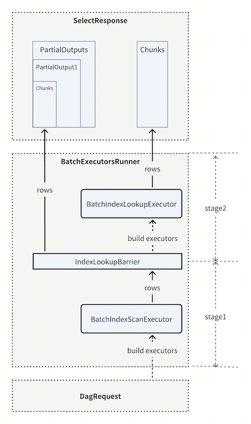

# IndexLookup Push Down

- Author(s): [Wang Chao](https://github.com/lcwangchao)
- Tracking Issue: https://github.com/pingcap/tidb/issues/62575

## Table of Contents

<!-- TOC -->
* [IndexLookup Push Down](#indexlookup-push-down)
  * [Table of Contents](#table-of-contents)
  * [Background](#background)
  * [Goal & Non-Goal](#goal--non-goal)
    * [Goal](#goal)
    * [Non-Goal](#non-goal)
  * [Design](#design)
    * [How to Use](#how-to-use)
      * [Enable IndexLookupPushDown](#enable-indexlookuppushdown)
      * [To make IndexLookupPushDown more efficient](#to-make-indexlookuppushdown-more-efficient)
    * [Detailed Implementation](#detailed-implementation)
      * [KVProto & tipb](#kvproto--tipb)
      * [TiKV side implementation](#tikv-side-implementation)
      * [TiDB side implementation](#tidb-side-implementation)
    * [Unresolved Issues](#unresolved-issues)
  * [Restrictions](#restrictions)
<!-- TOC -->

## Background

In TiDB, all secondary indexes have distinct key prefixes by default, which correspond to separate TiKV region shards. An index lookup query typically involves two rounds of KV RPCs to complete the associated index scan and table scan operations.

The first round scans the index data within the specified range. The second round retrieves the corresponding rows based on the collected index entries. TiDB schedules multiple background tasks (controlled by tidb_index_lookup_concurrency) to perform these lookup operations, with each task using the DistSQL client to send RPCs to the relevant regions in the TiKV store.
Compared to traditional databases such as MySQL and Oracle, TiDB incurs additional network overhead. This overhead reduces TiDB's performance ceiling and results in higher hardware costs for running business workloads.
This proposal aims to improve IndexLookup performance by pushing down the lookup executor to the TiKV side. In the ideal scenario where both the index and the corresponding data reside on the same store, it can reduce the two rounds of RPC to a single round, thereby minimizing performance overhead.

## Goal & Non-Goal

### Goal

The overall goal is to enable pushing down the IndexLookup operator to TiKV. In scenarios where the index region and the corresponding table region reside on the same TiKV instance, execution results can be retrieved with a single RPC, significantly improving efficiency. Benefits we can achieve include:

- **Reduced Network Overhead**: By consolidating index and data access into a single RPC, network latency is significantly decreased.

- **Lower CPU and Memory Usage on TiDB/TiKV**: Reducing the number of RPC calls decreases the CPU overhead associated with network transmission, as well as encoding and decoding processes.

- **Improved Business Performance**: In the in-house sysbench test, we have a 27% ~ 54% increase in QPS.

### Non-Goal

However, this design is not a universal solution for all IndexLookup scenarios because:

- A single TiKV instance imposes a performance ceiling on IndexLookup pushdown. For large tables, a single TiKV instance may become a bottleneck. Splitting the table or using partitioning can help distribute the load, but makes operations and maintenance more complex.

- Performance improvement depends on factors such as the distribution of indexes and primary keys, as well as the average primary key length. Users should weigh the benefits against the drawbacks before deciding whether to use this feature. Therefore, optimizing all index lookup scenarios is not the intended goal. For the detailed restrictions, see the restrictions section.

## Design

### How to Use

#### Enable IndexLookupPushDown

To use IndexLookupPushdown, users must explicitly enable it by applying a hint in the query:

```
SELECT /*+ INDEX_LOOKUP_PUSH_DOWN(t, k) */ * FROM t where key = ?
```

If the specified hint is valid, TiDB will generate a plan with IndexLookup pushdown. The execution plan may look like this:

```
+----------------------------+---------+-----------+-----------------------+------------------------------------------------+
| id                         | estRows | task      | access object         | operator info                                  |
+----------------------------+---------+-----------+-----------------------+------------------------------------------------+
| IndexLookUp_7              | 3333.33 | root      |                       |                                                |
| ├─IndexLookUp_2           | 3333.33 | cop[tikv] | table:t               |                                                |
| |  ├─IndexRangeScan_3     | 3333.33 | cop[tikv] | table:t, index:k(key) | range:[1,+inf], keep order:false, stats:pseudo |
| |  └─TableRowIDScan_4     | 3333.33 | cop[tikv] | table:t               | keep order:false, stats:pseudo                 |
| └─TableRowIDScan_6(Probe) | 0       | cop[tikv] | table:t               | keep order:false, stats:pseudo                 |
+----------------------------+---------+-----------+-----------------------+------------------------------------------------+
```

We can see IndexLookUp_2 has a tag cop[tikv], which indicates TiKV executes the IndexLookUp executor.

#### To make IndexLookupPushDown more efficient

Please note that to achieve maximum performance with IndexLookup pushdown, the index and corresponding table rows should be located in the same TiKV store. To accomplish this, we can use the placement policy. For example, we can apply the following policy to ensure that all data in table t1 is co-located on tikv-0:

```
CREATE PLACEMENT POLICY `p0` LEADER_CONSTRAINTS="[+host=tikv-0]" FOLLOWERS=2;
ALTER TABLE `t1` PLACEMENT policy `p0`;
```

If a table is huge, it's not feasible to place all its data on a single TiKV instance. In such cases, users should split the table into multiple physical tables or use a partitioned table with multiple partitions. For example, if a customer's business follows a SaaS model, they can create a partitioned table like this:

```
CREATE TABLE accounts (
    tenant_id BIGINT NOT NULL,
    account_id VARCHAR(32) NOT NULL,
    accound_name VARCHAR(64),
    create_time TIMESTAMP,
    PRIMARY KEY(tenant_id, account_id),
    KEY create_time(create_time)
)
PARTITION BY HASH(tenant_id)
PARTITIONS 1024;
```

In the SaaS model, we can assume that most queries are not cross-partition. Suppose each partition is placed on a single TiKV instance, and the partitions are evenly distributed across the cluster. In that case, we can ensure that each SQL query using the create_time index is eligible for pushdown, with different queries leveraging different TiKV instances.

### Detailed Implementation

#### KVProto & tipb

Firstly, a new executor type IndexLookUp should be added to tipb:

```
enum ExecType {
    ...
    TypeIndexLookup = 17;
}
 
message IndexLookup {
   optional int64 table_id = 1 [(gogoproto.nullable) = false];
   repeated ColumnInfo columns = 2;
   repeated int64 primary_column_ids = 3;
   repeated int64 primary_prefix_column_ids = 4;
   repeated uint32 build_side_primary_key_offsets = 5;
}
```
The field `build_side_primary_key_offsets`, as its name suggests, indicates the primary key offsets within its child output. The other fields have the same meanings as those in TableScan.
If TableScan is pushed down, the executors in the `DAGRequest` should include `IndexLookUp`. For example:

```
DAGRequest {
    Executors: [
        {
            Tp: ExecType_TypeIndexScan,
            ...
        },
        {
            Tp: ExecType_TypeLimit,
            ...
        },
        {
            Tp: ExecType_TypeIndexLookup
            ...
        },
        {
            Tp: ExecType_TypeSelection
            ...
        }
    ]
    ...
}
```

The executors shown above correspond to a SQL query with limit and selection conditions, such as:

```
SELECT * FROM t WHERE k > 1023 AND id < 128 LIMIT 10;
```

Without IndexLookup pushdown, only the first two executors handle the index rows. With IndexLookup pushdown enabled, two additional executors are added:

- `ExecType_TypeIndexLookup`, responsible for looking up data rows, and

- `ExecType_TypeSelection`, which is pushed down alongside.

To ensure correctness in cases where not all regions reside on the same TiKV instance, the coprocessor task should still be allowed to output some IndexScan rows. To achieve this, we introduce partial result fields in both DAGRequest and SelectResponse:

```
message PartialOutputBarrier {
   required uint32 position = 1;
   repeated uint32 output_offsets = 2;
   optional EncodeType encode_type = 3 [(gogoproto.nullable) = false];
}

message DAGRequest {
   ...
   repeated PartialOutputBarrier parital_output_barriers = 20;
}

message PartialOutput {
   optional EncodeType encode_type = 2 [(gogoproto.nullable) = false];
   repeated Chunk chunks = 3 [(gogoproto.nullable) = false];
}

message SelectResponse {
   ...
   repeated PartialOutput partial_outputs = 11;
}
```

`PartialOutputBarrier` indicates that the current request may contain "partial" results. In the context of IndexLookup pushdown, this means that some index rows in the response may not have corresponding lookup table data. Several fields within PartialOutputBarrier assist TiDB in decoding and extracting the primary keys.
PartialOutput is non-empty if any index rows are returned.

#### TiKV side implementation



If a coprocessor task request contains PartialOutputBarrier entries, the execution on the TiKV side will be divided into multiple stages. As illustrated above for the IndexLookup case, when a PartialOutputBarrier is encountered, the BatchExecutorRunner splits the execution into two stages:

1. The first stage builds and runs the executors preceding the barrier, collecting all output rows (index entries). These collected rows are sent to the IndexLookupBarrier, which determines the regions corresponding to the indexes. If a table row’s region is not found on the current TiKV instance, its data is encoded into the partial output chunk in SelectResponse.

2. The remaining indexes are used to construct the BatchIndexScanExecutor for stage two. The BatchExecutorRunner then drives the subsequent executors to completion and encodes their outputs into the final result chunks.

#### TiDB side implementation

We need to modify the code in IndexLookupExecutor to support the IndexLookup pushdown case. Two components are involved: indexWorker and tableWorker.
The indexWorker sends coprocessor tasks with the specified index ranges to TiKV and uses SelectResult to read chunks from the responses. To handle receiving multiple results concurrently, the SelectResult interface should be updated as follows:

```diff
type SelectResult interface {
        // NextRaw gets the next raw result.
        NextRaw(context.Context) ([]byte, error)
        // Next reads the data into chunk.
-       Next(context.Context, *chunk.Chunk) error
+       Next(context.Context, *chunk.Chunk, ...*chunk.Chunk) error
        // Close closes the iterator.
        Close() error
}
```

The indexWorker then splits the response rows into batches and creates a tableTask for each batch. If a batch contains only table rows (with no index rows requiring further lookup), we can mark the current tableTask as done and send it directly to the result channel (resultCh). Otherwise, the task must be scheduled in the worker pool. After executing the tableTask, the table rows should be merged accordingly.

When keepOrder is required, additional processing is necessary on the TiDB side. Specifically, SelectResult.Next should return results in order, with the following constraints:

- If two chunks are returned from different Next calls, the chunk from the earlier call precedes the later one.

- If two chunks are returned within the same Next call, their relative order cannot be determined.

- Rows within a single table data chunk do not have a guaranteed order. Therefore, after each SelectResult.Next call, all rows read across chunks must be re-sorted to ensure that tableTasks and their rows or indices remain ordered. Additionally, if a tableTask contains any index rows, a merge sort is needed to combine data rows retrieved from TiKV pushdown with those from the TiDB scan.

### Unresolved Issues

The coprocessor execution runs in a single thread within TiKV. Compared to the previous implementation, which could schedule multiple tasks to lookup rows concurrently across regions, the pushdown approach processes regions sequentially. This may increase latency when querying large batches. Refer to the test results in Test latency by increasing LIMIT for details.

## Restrictions

IndexLookup pushdown is not beneficial in all scenarios and comes with certain limitations:

- The performance ceiling of a single physical table is constrained by the capacity of a single TiKV instance. To use IndexLookup pushdown effectively, the table data and index rows must reside in the same TiKV store, which inherently limits the performance ceiling. For example, a single TiKV instance in a cloud environment typically has a maximum of 32 CPU cores. Unlike normal scaling, the table cannot leverage the full cluster’s resources under this constraint. One solution is to split a large table into multiple smaller tables or use a partitioned table with several smaller partitions. This approach requires users to have a clear understanding and accurate estimation of their business workload.

- For different data layouts, the optimization effect depends. The optimization effect improves as the number of lookup regions increases. Therefore, if a table’s primary key and index ranges are closely related, each statement typically needs to look up fewer regions, which limits the performance gains from pushdown optimization.

- To achieve a better performance, IndexLookupPushdown requires more manual operations. Users should evaluate their business workload to ensure that each physical table remains within the capacity limits of a single TiKV instance. For very large tables, they should consider splitting them into multiple partitions. However, these adjustments introduce additional operational complexity, so users must carefully weigh the benefits against the costs.
