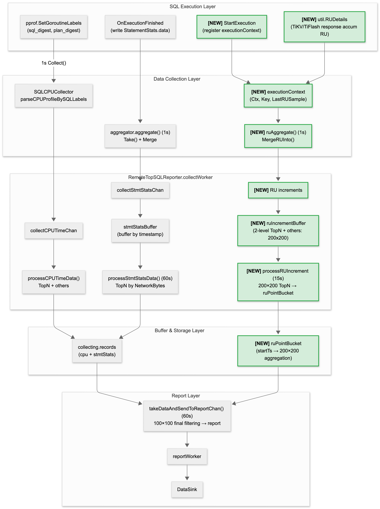

# TiDB TopRU

- Author: [zimulala](https://github.com/zimulala)
- Tracking Issue: https://github.com/pingcap/tidb/issues/65471

## Table of Contents

* [Introduction](#introduction)
  * [Background](#background)
  * [Goals](#goals)
  * [Non-Goals](#non-goals)
* [Detailed Design](#detailed-design)
  * [Architecture Overview](#architecture-overview)
  * [Functionality and Semantics](#functionality-and-semantics)
    * [TopRU Definition](#topru-definition)
    * [Feature Toggle](#feature-toggle)
  * [Data Collection Mechanism](#data-collection-mechanism)
  * [Data Model and Storage](#data-model-and-storage)
  * [Performance and Risk Analysis](#performance-and-risk-analysis)
  * [Integration with Other Observability Modules](#integration-with-other-observability-modules)
* [Limitation](#limitation)
* [Compatibility Issues](#compatibility-issues)
  * [Functional Compatibility](#functional-compatibility)
  * [Upgrade Compatibility](#upgrade-compatibility)
* [Test Design](#test-design)
* [Impact & Risk](#impact--risk)
* [Investigation & Alternatives](#investigation--alternatives)

## Introduction

### Background

Next-gen TiDB Cloud charges by RU (Request Unit). When cluster RU consumption is abnormal or reaches the limit, users need to quickly identify high RU-consuming SQLs, but currently there is no effective means to identify the main RU-consuming SQLs in near real-time.

**Typical Scenario**: When the cluster reaches the MAX RCU limit and triggers an alert, users need to quickly locate high RU-consuming SQLs to execute Terminate or optimization operations, relieve resource pressure and restore service.

**Limitations of Existing Solutions**:

| Solution | Limitation |
|----------|------------|
| Slow Log | Only records completed slow queries, cannot reflect RU consumption of executing SQLs |
| Statement Summary | Default 30-minute persistence, cannot access real-time data in memory, does not meet minute-level real-time requirements |

**TopRU** reuses TopSQL infrastructure to provide near real-time observability sorted by RU consumption, addressing the above limitations.

### Goals

1. **Sort by RU Consumption**: Support sorting and querying by cumulative RU consumption, identifying high RU SQLs (including SQLs with short execution time but high RU consumption)
2. **User-Dimension Aggregation**: Aggregate by `(user, sql_digest, plan_digest)` tuple, support viewing RU consumption distribution by user
3. **Near Real-Time Statistics**: Local 1-second sampling, batch reporting to downstream (e.g., Vector) every `report_interval` (default 60s, configurable 15s/30s/60s); end-to-end latency approximately 60~120s
4. **Compatible with Existing Capabilities**: Coexists with TopSQL's existing CPU time statistics without interference

### Non-Goals

1. **TopRU RU ≠ Billing RU**: TopRU displays RU from `util.RUDetails` runtime observation, suitable for locating high-consumption SQLs; billing and reconciliation still use Billing RU, alignment work is not included in this phase
2. **Complete Information for Executing SQLs**: Even if an executing SQL has consumed a large amount of RU, complete slow query / SQL statement information may not be available because the SQL has not finished
3. **Anomaly Detection and Auto-Alerting**: Automatic detection of abnormal RU consumption and alert generation is not supported in this phase

## Detailed Design

### Architecture Overview

TopRU reuses TopSQL's reporting pipeline and adds RU-specific **bounded window aggregation** (producing 1 data point per `report_interval`), controlling memory and CPU while ensuring near real-time capabilities.

**Architecture Diagram** (`[NEW]` marks TopRU new pipelines):



**Design Principles**:

| Principle | Description |
|-----------|-------------|
| Reuse Infrastructure | Collection point interfaces and reporting pipelines all reuse existing TopSQL implementation |
| Pre-filtering | Two-level TopN limiting at 1s collection (Top 200 users × per-user Top 200 SQLs) + others aggregation to avoid buffer bloat |
| Tiered Storage | 1s per-second storage (200×200) → 15s interval merging (200×200) → 60s merge and report (100×100) |
| Separate Storage | CPU data uses `collecting.records`, RU data uses `collecting.ruRecords`, no interference |
| Memory Control | Two-level TopN + others aggregation + hard limit protection |

**Core Data Flow**:

```
SQL Execution → ExecutionContext Registration → 1s sampling writes to timestampBuffer
                                          ↓ (Two-level TopN filtering: Top 200 users × per-user Top 200 SQLs + others aggregation)
                                          ↓ (15s) merge 15 1s intervals
                                 Merge to ruPointBucket[startTs] (result: 200 users × 200 SQLs)
                                          ↓ (60s) merge 4 15s intervals + 100×100 final filtering
                                 Batch report to downstream (DataSink)
```

### Functionality and Semantics

#### TopRU Definition

**TopRU** is an observability feature provided by TiDB for sorting and querying SQLs by RU consumption, supporting user-dimension aggregation to help users quickly locate high RU-consuming SQLs.

**RU Calculation**: `TotalRU = RRU + WRU`, obtained through `util.RUDetails`'s `RRU()` and `WRU()` methods. RU sources include responses from TiKV and TiFlash.

**RUDetails Semantics**:
- `util.RUDetails` is a runtime **cumulative** metric: during SQL execution, TiDB continuously accumulates the RU consumption increment of each request into `RUDetails` when processing TiKV/TiFlash responses.
- Therefore, the value read during sampling is "cumulative value up to the current moment", TopRU calculates the RU increment within the sampling period through `ruDelta = currentRU - lastRU` to avoid double counting.

**Aggregation Dimensions**: `(user, sql_digest, plan_digest)` tuple
- `user`: Obtained from `SessionVars.User.Username`
- `sql_digest`: SQL Digest, identifies SQL statement pattern
- `plan_digest`: Plan Digest, identifies execution plan

#### Feature Toggle

TopRU is controlled in a **subscription-driven, reference-counted** way.

| Config Item | Type | Default | Description |
|-------------|------|---------|-------------|
| `enable_top_ru` | bool | false | **Derived state**: enabled iff `ruConsumerCount > 0` (reference-counted) |
| `report_interval` | enum | 60s | Reporting interval, options: 15s/30s/60s |

**Design Considerations**:
- Independent feature (decoupled from TopSQL semantics).
- Reference counting avoids “last write wins” bugs under multiple subscribers.
- Configuration changes take effect dynamically, no restart required.

**Behavior When Disabled**:
- Stop RU sampling (`ruAggregate()` skips execution)
- Stop RU data reporting
- Collected data cleared with next reporting cycle
- Does not affect existing TopSQL functionality

### Data Collection Mechanism

#### Collection Timing

| Collection Point | Frequency | Location | Purpose |
|------------------|-----------|----------|---------|
| Local Periodic Sampling | 1s | `aggregator.ruAggregate()` | Collect RU increments of executing SQLs |
| Execution Completion Collection | Real-time | `observeStmtFinishedForTopSQL()` | Supplement final data, ensure accuracy |

#### ExecutionContext Design

Add `ExecutionContext` field in `StatementStats` to store sampling state of executing SQLs:

```go
// ExecutionContext stores the execution context of the currently executing SQL in the session
type ExecutionContext struct {
    Ctx          context.Context    // Used to read util.RUDetails
    Key          UserSQLPlanDigest  // (user, sql_digest, plan_digest)
    LastRUSample *atomic.Float64    // Last sampled cumulative RU (RRU+WRU), used to calculate increment
}

// StatementStats extension
type StatementStats struct {
    data     StatementStatsMap
    finished *atomic.Bool
    mu       sync.Mutex // Could consider changing to RWMutex, but tick/finish paths both have write operations

    execCtx *ExecutionContext // Currently executing statement
    // finishedRUIncrements caches RU increments from the finish path,
    // will be drained and aggregated by aggregator.ruAggregate() in the next 1s tick.
    finishedRUIncrements RUIncrementMap
    finishedOthersRU     float64
}

// RUIncrementMap stores RU increments in a lightweight map
type RUIncrementMap map[UserSQLPlanDigest]float64
```

**Lifecycle Management**:

- **Session Creation**: `CreateStatementStats()` existing interface, new functionality: initialize `execCtx=nil`, and initialize `finishedRUIncrements`/`finishedOthersRU`
- **SQL Start**: `StartExecution()` creates/replaces current `execCtx` (with pre-constructed key: `(user, sql_digest, plan_digest)`)
- **SQL Completion**: `FinishExecution()` calculates final ruDelta and writes to session-local finished buffer (with limit), then clears `execCtx`
- **RU Sampling Aggregation**: `MergeRUInto()` executes in each 1s tick: drains finished buffer + samples active execCtx, updates LastRUSample

#### RU Increment Calculation

Uses delta calculation mechanism to avoid double counting:

- `currentRU = RUDetails.RRU() + RUDetails.WRU()`
- `ruDelta = currentRU - LastRUSample`
- ruDelta from both active/finish paths is unified and aggregated by `MergeRUInto()` in each 1s tick (interface and timing see previous section "Lifecycle Management")

**Edge Case Handling**:
- **ruDelta <= 0**: Skip this sampling
- **util.RUDetails is nil**: Skip this sampling
- **Resource Control not enabled (`tidb_enable_resource_control = OFF`)**: Skip RU collection and reporting (avoid producing invalid all-zero data)
- **Session finished RU buffer exceeds limit**: When exceeding `MaxFinishedRUKeysPerSession`, new key's RU increment is aggregated to `finishedOthersRU` (later merged into global `_others_`)
- **SQL Execution Completed**: Clear `execCtx`, stop sampling

#### Data Flow Implementation

**1s Sampling (delegated to aggregator)**:

```go
// aggregator.run() extension
func (m *aggregator) run() {
	...
    case <-tick.C:
        m.ruAggregate()    // New RU aggregation
        m.aggregate()      // Existing CPU/stmtstats aggregation
    }
	...
}

// RU aggregation: iterate active StatementStats, sample RU increments
func (m *aggregator) ruAggregate() {
    ...
    incr := RUIncrements{Data: RUIncrementMap{}}
    m.statsSet.Range(func(statsR, _ any) bool {
        stats := statsR.(*StatementStats)
        stats.MergeRUInto(&incr)
        return true
    })

    if len(incr.Data) > 0 || incr.OthersRU > 0 {
        m.collectors.Range(func(c, _ any) bool {
            if rc, ok := c.(RUCollector); ok {
                rc.CollectRUIncrements(incr.Data, incr.OthersRU)
            }
            return true
        })
    }
}
```

**Related Interface Description**:

```go
type RUIncrements struct {
	Data     RUIncrementMap
	OthersRU float64
}

// RUCollector is an optional extension interface: can receive RU sampling data without changing existing Collector (CollectStmtStatsMap).
type RUCollector interface {
	CollectRUIncrements(increments RUIncrements)
}

// RemoteTopSQLReporter.CollectRUIncrements: reporter receives RU increments and othersRU aggregated value from 1s tick,
// writes to ruIncrementBuffer by timestamp_sec (performs two-level TopN + others pre-filtering on write).
func (tsr *RemoteTopSQLReporter) CollectRUIncrements(increments RUIncrements)
```

**Memory Control Mechanism (Two-level TopN + others aggregation)**:

To prevent memory overflow in extreme scenarios (100 users × 5000 SQLs), uses two-level TopN filtering, evicted RU is aggregated to `_others_`:
- **Layer 1**: Limit user count (Top 200 users), evict user with smallest totalRU when exceeding limit
- **Layer 2**: Limit SQL count per user (Top 200 SQLs), evict SQL with smallest totalRU when exceeding limit

This mechanism is reused across 1s/15s/60s tiers, only TopN thresholds differ (1s/15s: 200×200, 60s: 100×100).

**Related Data Structures**

```go
const (
    MaxUsersPerTimestamp = 200
    MaxSQLPerUser        = 200
)

type userBuffer struct {
	sqlRU      map[UserSQLPlanDigest]float64  // (user, sql, plan) -> RU (user is the same within the same userBuffer)
	totalRU    float64
	minRUKey   UserSQLPlanDigest
	minRUValue float64
}

type timestampBuffer struct {
    users       map[string]*userBuffer   // user -> userBuffer
    othersRU    float64                  // Aggregated RU of evicted entries
    minRUUser   string                   // Current minRU user (for eviction decision)
    minRUValue  float64                  // Current minRU value (for eviction decision)
}

// ruIncrementBuffer caches 1s sampled RU increments by second.
// Performs two-level TopN (200 users × 200 SQLs) pre-filtering on write.
type ruIncrementBuffer struct {
    items map[uint64]*timestampBuffer  // timestamp_sec -> 200×200 aggregation for that second
}

func (b *ruIncrementBuffer) Add(ts uint64, increments RUIncrementMap, othersRU float64)
func (b *ruIncrementBuffer) TakeAll() map[uint64]*timestampBuffer

// ruPointBucket caches aggregation results by 15s intervals.
// key = interval start timestamp, e.g., t1, t16, t31, t46 (15s apart)
// 100×100 final filtering at 60s reporting.
type ruPointBucket struct {
    items map[uint64]*timestampBuffer  // startTs -> 200×200 aggregation for that interval
}

func (b *ruPointBucket) Merge(startTs uint64, tb *timestampBuffer)
func (b *ruPointBucket) TakeAll() map[uint64]*timestampBuffer
```

**15s Micro-batch Processing**: Every 15s drain `ruIncrementBuffer`, merge and apply 200×200 TopN + others, write to `ruPointBucket`.

```go
// RemoteTopSQLReporter.processRUIncrementBuffer: triggered every 15s,
// drains ruIncrementBuffer, applies 200×200 TopN + others, merges to ruPointBucket.
func (tsr *RemoteTopSQLReporter) processRUIncrementBuffer()
```

**60s Reporting**: Every `report_interval` (default 60s) takes out `ruPointBucket`, merges and applies 100×100 TopN + others final filtering and reports.

```go
// RemoteTopSQLReporter.reportRUData: triggered every report_interval,
// takes out ruPointBucket, applies 100×100 TopN + others final filtering, generates TopRURecord and reports.
func (tsr *RemoteTopSQLReporter) reportRUData()
```

### Data Model and Storage

#### Storage Solution

Uses separate storage from TopSQL, `collecting.records` stores CPU data, `collecting.ruRecords` stores RU data, no interference.

**Solution Comparison**:

| Solution | Description | Evaluation |
|----------|-------------|------------|
| A: Extend records key | Change records to `(user, sql, plan)` key | ❌ High invasiveness, changes TopSQL semantics |
| B: Embed RUByUser | Embed `map[user]ru` in tsItem | ❌ High memory/GC risk |
| C: Tiered Storage | Add independent `ruRecords` | ✅ Low invasiveness, clear boundaries |

**Selection Rationale**:
- Does not change existing TopSQL (CPU TopN) semantics and main implementation
- Directly meets "per-user Top 100 & users ≤ 100" product constraints
- Naturally matches collectWorker/reportWorker's 60s reporting pipeline

#### Data Structure Extension

**TopRU Reporting Fields** (confirmed with product team):

| Field Name | Type | Description |
|------------|------|-------------|
| Keyspace | []byte | Keyspace the SQL belongs to |
| User | string | SQL executing user |
| SQLDigest | []byte | SQL Digest, identifies SQL statement pattern |
| PlanDigest | []byte | Plan Digest, identifies execution plan |
| TotalRU | float64 | Cumulative RU consumption (RRU + WRU) |
| ExecCount | uint64 | Execution count |
| SumDurationNs | uint64 | Cumulative execution time (nanoseconds) |

```go
// StatementStatsItem extension
type StatementStatsItem struct {
    // ... existing fields ...
    TotalRU float64  // New: cumulative total RU
}

type ruRecord struct {
    sqlDigest      []byte
    planDigest     []byte
    user           string   // Username
    tsItems        tsItems
    totalRU        float64  // Cumulative total RU
}

// collecting extension
type collecting struct {
    records   map[string]*record  // CPU data (key: sql+plan)
    ruRecords map[string]*record  // New: RU data (key: user+sql+plan)
    // ...
}
```

### Protobuf

TopRU reporting data interacts with external components through Protobuf protocol, reusing TopSQL's existing `SQLMeta` and `PlanMeta` definitions, adding new `TopRURecord` message type.

**Protocol Definition**:

```protobuf
// TopRURecord represents RU statistics for a single (user, sql_digest, plan_digest) combination
message TopRURecord {
    bytes  keyspace_name = 1;  // Keyspace identifier
    string user          = 2;  // Executing user
    bytes  sql_digest    = 3;  // SQL Digest
    bytes  plan_digest   = 4;  // Plan Digest
    repeated TopRURecordItem items = 5;  // Time series data
}

// TopRURecordItem represents statistics within a single time bucket
message TopRURecordItem {
    uint64 timestamp_sec = 1;  // Timestamp (seconds)
    double total_ru      = 2;  // Cumulative RU consumption
    uint64 exec_count    = 3;  // Execution count
    uint64 exec_duration = 4;  // Cumulative execution time (nanoseconds)
}
```

**TiDB-side Report Data Structure**:

```go
type ReportData struct {
    DataRecords []tipb.TopSQLRecord  // TopSQL: (sql_digest, plan_digest) → CPU/exec/latency (existing)
    SQLMetas    []tipb.SQLMeta       // SQL metadata (reused)
    PlanMetas   []tipb.PlanMeta      // Plan metadata (reused)
    RURecords   []tipb.TopRURecord   // TopRU: (user, sql_digest, plan_digest) → RU (new)
}
```

**Design Notes**:
- TopRURecord and TopSQLRecord are parallel, carrying RU and CPU dimension data respectively
- SQLMetas and PlanMetas are shared between TopSQL and TopRU to avoid duplicate transmission
- Protocol evolution commitment: only add new fields, do not modify/reuse existing field numbers, do not change existing field semantics

For detailed protocol discussion, refer to: TiDB TopRU Protocol Discussion Document

## Performance and Risk Analysis

### Performance Optimization Measures

**Implemented Optimizations**:

| Category | Measure |
|----------|---------|
| Memory | Three-tier buffer design, 1s writes to lightweight buffer (200×200), 15s re-filters and merges to point bucket |
| CPU | RU collection reuses aggregator's 1s tick, no additional collection cycles |
| Network | 60s batch reporting, reuses TopSQL's existing reporting pipeline |

**Optional Optimizations**:

| Category | Measure |
|----------|---------|
| CPU/Algorithm | Optional optimization: two-level filtering uses linear scan by default for minRU maintenance; in high cardinality/frequent eviction scenarios, bounded min-heap can be used to maintain minRU, reducing scan overhead (whether to introduce depends on benchmark) |
| Sampling Frequency | Optional optimization: current default is 1s sampling, since user-visible data updates at minute level, can consider reducing sampling frequency to 5s/10s to reduce CPU overhead |
| GC/Alloc | Optional optimization: reuse temporary buffers for digest encoding/copying (e.g., sync.Pool) to reduce small object allocation and GC pressure under high QPS |
| Concurrency | Optional optimization: ExecutionContext uses RWMutex (read-heavy, write-light) to reduce lock contention |

### Risks and Mitigations

- **OOM**: Reuses TopSQL's existing memory management mechanism + ruIncrementBuffer hard limit protection
- **CPU Spike**: RU collection and CPU collection are on the same call path, overhead is controllable
- **Data Inaccuracy**: When Resource Control is not enabled, TopRU skips RU collection and reporting (avoids invalid all-zero data); RU is only counted when enabled

### Integration with Other Observability Modules

- **Observability System (User-side)**: Uses `(sql_digest, plan_digest)` as correlation key, supports jumping to slow log details or Statement Summary.

## Limitation

1. **Data Loss Due to Bounded Buffer in Collection Pipeline**: Collection pipeline uses bounded channel (capacity=2) to pass data, using non-blocking send to avoid affecting SQL execution. When `collectWorker` cannot process in time (e.g., GC pause, processing logic takes time) causing channel to be full, new sampling batches will be dropped, observable via `IgnoreCollectChannelFullCounter` metric. This behavior is the same as TopSQL.

2. **Data Precision Impact**:
   - **Historical Data of Boundary SQLs May Be Lost**: If a SQL does not enter a user's Top 100 within a timestamp, its RU data will be aggregated to global "_others_"; if that SQL enters Top 100 in subsequent timestamps, previous timestamp data cannot be recovered
   - **TopN Boundary Fluctuation**: SQLs ranked 99-102 may repeatedly enter/exit Top 100 at each timestamp, causing some time points' data to be in "_others_"

3. **Cross-Node Limitation**: Data is only collected on the current TiDB node, reuses TopSQL's existing cross-node limitations

## Compatibility Issues

### Functional Compatibility

- **Resource Control**: Resource Control must be enabled to get accurate RU data; when disabled, TopRU skips RU collection and reporting
- **TopSQL**: Fully compatible with existing CPU statistics, can sort by CPU/RU simultaneously

### Upgrade Compatibility

- **Version Upgrade**: TopRU is automatically available as a new feature, no additional configuration required
- **Protobuf**: RU fields use optional, old clients can ignore new fields
- **Data**: In-memory data is not persisted, re-collected after upgrade

## Test Design

### Functional Test

- **Data Collection**: Local sampling/execution completion collection correctness, RU increment calculation, execCtx/finished buffer lifecycle
- **Aggregation**: `(user, sql_digest, plan_digest)` aggregation correctness, same SQL from different users counted separately
- **Query**: Sort by RU, query by user dimension, Top N sorting, RU Share Percent calculation
- **Edge Cases**: RU = 0 (Resource Control not enabled), user is empty (internal SQL), execution time < 1s

### Performance Test

- Benchmark: Measure local sampling and reporting overhead, verify memory usage
  - 1000 users × 500 active SQLs collection
- Stress Test: Performance impact evaluation under high QPS scenarios
  - Observe CPU and memory usage
- Regression Test: Ensure TopSQL's existing performance is not significantly impacted

### Compatibility Test

- Resource Control enabled/disabled scenarios
- Protobuf forward compatibility
- Coexistence with existing TopSQL functionality
  - Behavior after upgrading from older TopSQL version is not affected

## Impact & Risk

### Risks & Mitigations

For risks and mitigations, see "Performance and Risk Analysis" section.

### Rollback Plan

TopRU feature supports dynamic disabling through configuration toggle, no restart required:

- After disabling, stops sampling and reporting, collected data cleared with reporting cycle
- Does not affect existing TopSQL functionality

## Investigation & Alternatives

### Early Approach: 10s Aggregation TopK Filtering (Original Requirement: Report 60 Data Points Per Minute)

**Early Approach Description**:
- At 1s collection, write all RU increments to `ruIncrementBuffer` without filtering
- At 10s, trigger aggregation, sort each user's SQLs by totalRU, take Top 100
- SQLs exceeding Top 100 are aggregated to `_others_`

**Memory Estimation Baseline** (based on TopRU reporting fields):

Each `(keyspace, user, sql_digest, plan_digest)` record payload is roughly **~120 bytes/entry**
(~16 keyspace + ~16 user + 32 sql_digest + 32 plan_digest + 8 total_ru + 8 exec_count + 8 sum_duration_ns).
Note this is a **lower-bound payload estimate**; Go in-memory structures (e.g. map/string overhead) can be significantly larger.

**Shortcomings**:

1. **High Memory Risk**:
   - In extreme scenarios (100 users × 5000 SQLs), `ruIncrementBuffer` could expand to 500,000 entries within 1s
   - Each entry ~120 bytes, 1s memory usage could reach ~60 MB, 10s accumulation could reach **0.6 GB**
   - Easily triggers OOM in high concurrency scenarios

2. **High Computation Overhead**:
   - 10s aggregation requires full sorting of all users' all SQLs
   - 100 users × 5000 SQLs sorting complexity is O(n log n), could take over 100ms
   - Affects collectWorker main loop, could cause reporting delays

3. **Lack of Pre-protection**:
   - No rate limiting at 1s collection, entirely depends on 10s filtering
   - If 10s filtering fails or delays, memory could go out of control

### Alternative B: 1s Real-time TopN (Direct Filtering to Bucket Per Second)

**Approach Description**:
- At 1s collection, directly apply two-level TopN (200 users × 200 SQLs) on pointBucket
- Maintain minHeap on each write, real-time eviction
- Apply 100×100 final filtering at 60s reporting

**Shortcomings**:

1. **High CPU Overhead**:
   - TopN maintenance (minHeap insert/extract) required every second
   - 60 TopN calculations within 60s
   - High CPU pressure under high QPS scenarios

2. **Complex Hot Path**:
   - 1s tick path changes from O(1) to O(log K)
   - Increases p99 latency jitter risk
