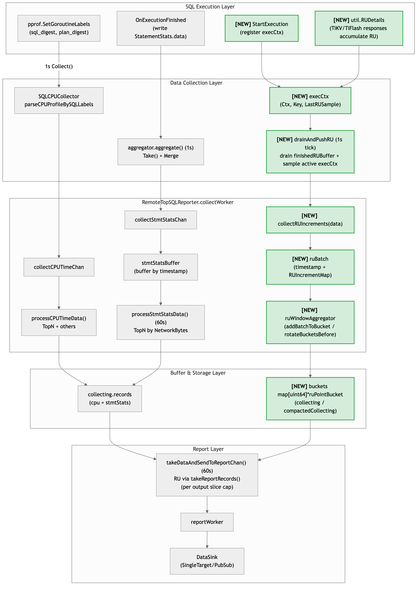

# TiDB TopRU

- Author: [zimulala](https://github.com/zimulala)
- Tracking Issue: https://github.com/pingcap/tidb/issues/65471

## Table of Contents

* [Introduction](#introduction)
  * [Background](#background)
  * [Goals](#goals)
  * [Non-Goals](#non-goals)
* [Detailed Design](#detailed-design)
  * [Architecture Overview](#architecture-overview)
  * [Functionality and Semantics](#functionality-and-semantics)
    * [TopRU Definition](#topru-definition)
    * [Feature Toggle](#feature-toggle)
  * [Data Collection Mechanism](#data-collection-mechanism)
  * [Data Model and Storage](#data-model-and-storage)
  * [Performance and Risk Analysis](#performance-and-risk-analysis)
  * [Integration with Other Observability Modules](#integration-with-other-observability-modules)
* [Limitation](#limitation)
* [Compatibility Issues](#compatibility-issues)
  * [Functional Compatibility](#functional-compatibility)
  * [Upgrade Compatibility](#upgrade-compatibility)
* [Test Design](#test-design)
* [Impact & Risk](#impact--risk)
* [Investigation & Alternatives](#investigation--alternatives)

## Introduction

### Background

Next-gen TiDB Cloud charges by RU (Request Unit). When cluster RU consumption is abnormal or reaches the limit, users need to quickly identify high RU-consuming SQLs, but currently there is no effective means to identify the main RU-consuming SQLs in near real-time.

**Typical Scenario**: When cluster RU usage reaches the configured limit and triggers an alert, users need to quickly locate high RU-consuming SQLs to execute terminate or optimization operations, relieve resource pressure and restore service.

**Limitations of Existing Solutions**:

| Solution | Limitation |
|----------|------------|
| Slow Log | Only records completed slow queries, cannot reflect RU consumption of executing SQLs |
| Statement Summary | Default 30-minute persistence, cannot access real-time data in memory, does not meet minute-level real-time requirements |

**TopRU** reuses TopSQL infrastructure to provide near real-time observability sorted by RU consumption, addressing the above limitations.

### Goals

1. **Sort by RU Consumption**: Support sorting and querying by cumulative RU consumption, identifying high RU SQLs (including SQLs with short execution time but high RU consumption)
2. **User-Dimension Aggregation**: Aggregate by `(user, sql_digest, plan_digest)` tuple, support viewing RU consumption distribution by user
3. **Near Real-Time Statistics**: Local 1-second sampling, with output generated on aligned 60-second closed windows; `item_interval_seconds` controls the item timestamp granularity within each 60-second output window. End-to-end latency is approximately 60~120s
4. **Compatible with Existing Capabilities**: Coexists with TopSQL's existing CPU time statistics without interference

### Non-Goals

1. **TopRU RU ≠ Billing RU**: TopRU displays RU from `util.RUDetails` runtime observation, suitable for locating high-consumption SQLs; billing and reconciliation still use Billing RU, alignment work is not included in this phase
2. **Complete Information for Executing SQLs**: Even if an executing SQL has consumed a large amount of RU, complete slow query / SQL statement information may not be available because the SQL has not finished
3. **Anomaly Detection and Auto-Alerting**: Automatic detection of abnormal RU consumption and alert generation is not supported in this phase
4. **Export Mode Scope**: TopRU in this design only supports the PubSubService subscription mode; exporting via SingleTargetDataSink (fixed-target gRPC push mode) is out of scope.

## Detailed Design

### Architecture Overview

TopRU reuses TopSQL's reporting pipeline and adds RU-specific **bounded window aggregation** (producing output on aligned 60-second closed windows), controlling memory and CPU while ensuring near real-time capabilities.

**Architecture Diagram** (`[NEW]` marks TopRU new pipelines):



**Design Principles**:

| Principle | Description |
|-----------|-------------|
| Reuse Infrastructure | Collection point interfaces and reporting pipelines all reuse existing TopSQL implementation |
| Pre-filtering | Upstream 1s RU aggregation has hard cap `maxRUKeysPerAggregate=10000`; downstream keeps `_others_` aggregation to bound cardinality |
| Tiered Storage | RU records are compacted in aligned stages (see Memory Control and Related Data Structures) |
| Separate Storage | CPU data remains on `collecting.records`; RU output is emitted by `ruAggregator.takeReportRecords(...)` into `ReportData.RURecords` |
| Memory Control | Two-level TopN + others aggregation + hard limit protection |

**Core Data Flow**:

```text
SQL Execution → ExecutionContext Registration
                                          ↓ (1s tick) drainAndPushRU (active + finished deltas)
                                          ↓ CollectRUIncrements
                                          ↓ ruWindowAggregator (1s ingest, 15s merge, 60s closed-window finalize)
                                          ↓ ReportData.RURecords
                                          ↓ Batch report to downstream (DataSink)
```

### Functionality and Semantics

#### TopRU Definition

**TopRU** is an observability feature provided by TiDB for sorting and querying SQLs by RU consumption, supporting user-dimension aggregation to help users quickly locate high RU-consuming SQLs.

**RU Calculation**: `TotalRU = RRU + WRU`, obtained through `util.RUDetails`'s `RRU()` and `WRU()` methods. RU sources include responses from TiKV and TiFlash.

**RUDetails Semantics**:
- `util.RUDetails` is a runtime **cumulative** metric: during SQL execution, TiDB continuously accumulates the RU consumption increment of each request into `RUDetails` when processing TiKV/TiFlash responses.
- Therefore, the value read during sampling is "cumulative value up to the current moment", TopRU calculates the RU increment within the sampling period through `ruDelta = currentRU - lastRU` to avoid double counting.

**Aggregation Dimensions**: `(user, sql_digest, plan_digest)` tuple
- `user`: Obtained from the effective authenticated identity (`vars.User.String()`), typically in `user@host` form
- `sql_digest`: SQL Digest, identifies SQL statement pattern
- `plan_digest`: Plan Digest, identifies execution plan

#### Feature Toggle

TopRU is controlled in a **subscription-driven, reference-counted** way.

| Config Item | Type | Default | Description |
|-------------|------|---------|-------------|
| `subscriptors` includes `COLLECTOR_TYPE_TOPRU` | enum | empty | TopRU toggle via subscription; enabled when `ruConsumerCount > 0`, controlling RU collection and sending. |
| `item_interval_seconds`                        | enum | 60s | TopRURecordItem aggregation interval, options: 15s/30s/60s |

**`item_interval_seconds` Semantics**:
- Only one effective interval is supported globally.
- Configurable values are `15s` / `30s` / `60s`, with default `60s`.
- Concurrent updates from multiple subscribers follow the current implementation behavior: later registration wins.
- This behavior is implementation-defined (not invalid usage); the effective interval is the most recently registered one.

**Design Considerations**:
- Independent feature (decoupled from TopSQL semantics).
- Reference counting avoids “last write wins” bugs under multiple subscribers.
- Configuration changes take effect dynamically, no restart required.

**Behavior When Disabled**:
- Stop RU sampling (`ruAggregate()` skips execution)
- Stop RU data reporting
- Collected data cleared with next reporting cycle
- Does not affect existing TopSQL functionality

### Data Collection Mechanism

#### Collection Timing

| Collection Point | Frequency | Location | Purpose |
|------------------|-----------|----------|---------|
| Local Periodic Sampling | 1s | `drainAndPushRU()` | Pull incremental RU snapshots from currently running SQLs in the 1s tick |
| Execution Completion Collection | Real-time | `observeStmtFinishedForTopProfiling()` | Flush finish-path deltas at statement end to reduce undercount of short-lived SQLs |

#### ExecutionContext Design

Add `ExecutionContext` in `StatementStats` to store per-statement sampling state, and use a buffered RU-delta map for finish-path supplements:

```go
// ExecutionContext stores the execution context of the currently executing SQL in the session
type ExecutionContext struct {
    RUDetails   *util.RUDetails
    Key         RUKey
    LastRUTotal float64
}

// StatementStats extension
type StatementStats struct {
    data     StatementStatsMap
    finished *atomic.Bool
    mu       sync.Mutex // Protects StatementStats; tick/finish paths both perform writes

    execCtx *ExecutionContext // Currently executing statement
    // finishedRUBuffer caches finish-path RU deltas and is drained every 1s tick.
    finishedRUBuffer RUIncrementMap
}

// RUIncrement represents a delta RU consumption for one RUKey.
type RUIncrement struct {
    TotalRU      float64
    ExecCount    uint64
    ExecDuration uint64
}

// RUIncrementMap stores aggregated RU increments keyed by (user, sql_digest, plan_digest).
type RUIncrementMap map[RUKey]*RUIncrement
```

**Lifecycle Management**:

- **Session Creation**: `CreateStatementStats()` keeps existing interface; RU path initializes `execCtx=nil` and `finishedRUBuffer`
- **SQL Start**: `OnExecutionBegin()` creates/replaces current `execCtx` (with pre-constructed key: `(user, sql_digest, plan_digest)`)
- **SQL Completion**: `OnExecutionFinished()` calculates final ruDelta and writes to session-local finished buffer (with limit), then clears `execCtx`
- **RU Sampling Aggregation**: `MergeRUInto()` executes in each 1s tick: drains finished buffer + samples active execCtx, updates LastRUTotal

#### RU Increment Calculation

Uses delta calculation mechanism to avoid double counting:

- `currentRU = RUDetails.RRU() + RUDetails.WRU()`
- `ruDelta = currentRU - LastRUTotal`
- ruDelta from both active/finish paths is unified and aggregated by `MergeRUInto()` in each 1s tick (interface and timing see previous section "Lifecycle Management")

**Edge Case Handling**:
- **ruDelta <= 0**: Skip this sampling
- **util.RUDetails is nil**: Skip this sampling
- **Session finished RU buffer behavior**: `MergeRUInto()` drains `finishedRUBuffer` every tick and samples active execution RU in the same call.
- **SQL Execution Completed**: Clear `execCtx`, stop sampling

#### Data Flow Implementation

**Current Path (contract-level)**:

1. `drainAndPushRU` runs on the 1-second tick and drains RU deltas from both active execution contexts and finished buffers.
2. `CollectRUIncrements` receives drained increments.
3. `ruWindowAggregator` ingests aligned 15s buckets, compacts closed buckets, and applies per-slice output caps for 60s closed-window reports.
4. Final closed-window records are emitted as `ReportData.RURecords`.

**Related Interface Description**:

```go
// RUCollector is an optional extension interface: can receive RU sampling data
// without changing existing Collector (CollectStmtStatsMap).
type RUCollector interface {
	CollectRUIncrements(data stmtstats.RUIncrementMap)
}

// Reporter wraps producer-side timestamp at enqueue time.
type ruBatch struct {
	data      stmtstats.RUIncrementMap
	timestamp uint64
}

// RemoteTopSQLReporter.CollectRUIncrements: receives merged RU increments from
// drainAndPushRU, wraps ruBatch(timestamp+data), and feeds ruWindowAggregator.
func (tsr *RemoteTopSQLReporter) CollectRUIncrements(data stmtstats.RUIncrementMap)
```

**Memory Control Mechanism (Aggregation guardrails + TopN)**:

To prevent memory overflow in extreme scenarios, TopRU uses layered caps instead of a single TopN rule: upstream 1s aggregation has a hard key cap (`maxRUKeysPerAggregate=10000`), and reporter-side compaction follows `400×400` (online pre-cap) → `200×200` (bucket close with `_others_`) → `100×100` (per output slice).

Note: for `item_interval=15s/30s`, a 60s report contains multiple slices, so total users in one 60s report can exceed 100.

**Related Data Structures**

```go
const (
	maxTopUsers           = 200
	maxTopSQLsPerUser     = 200
	ruReportTopNUsers     = 100
	ruReportTopNSQLsPerUser = 100
)

// ruPointBucket: active bucket keeps 400×400 pre-cap collecting;
// closed bucket keeps 200×200 compacted snapshot.
type ruPointBucket struct {
	collecting          *ruCollecting
	compactedCollecting *ruCollecting
	startTs             uint64
}

// ruWindowAggregator stores aligned 15s buckets and emits 60s closed-window reports.
type ruWindowAggregator struct {
	buckets           map[uint64]*ruPointBucket
	lastReportedEndTs uint64
	mu                sync.Mutex
}

func (a *ruWindowAggregator) addBatchToBucket(ts uint64, increments stmtstats.RUIncrementMap)
func (a *ruWindowAggregator) rotateBucketsBefore(boundaryStart uint64)
func (a *ruWindowAggregator) takeReportRecords(nowTs, itemInterval uint64, keyspaceName []byte) []tipb.TopRURecord
```

**15s Bucket Rotation/Compaction**: incoming data is attributed to aligned 15s buckets; when a bucket becomes closed, it is compacted from `400×400` pre-cap to `200×200` snapshot.

```go
func (a *ruWindowAggregator) rotateBucketsBefore(boundaryStart uint64)
```

**60s Closed-Window Reporting**: `ruWindowAggregator` takes one aligned 60s window; for each output slice (`item_interval=15s/30s/60s`) it applies `100×100` compacting, then serializes into `ReportData.RURecords`. For 15s/30s, multiple slices are included in one 60s report.

```go
func (a *ruWindowAggregator) takeReportRecords(nowTs, itemInterval uint64, keyspaceName []byte) []tipb.TopRURecord
```

### Data Model and Storage

#### Storage Solution

Uses separate storage boundaries from TopSQL:
- CPU stmtstats are still collected from `collecting.records` (TopSQL path).
- RU records are produced by `ruAggregator.takeReportRecords(...)` and attached as `ReportData.RURecords` on report tick.
- Current path does **not** rely on a `collecting.ruRecords` map.

**Solution Comparison**:

| Solution | Description | Evaluation |
|----------|-------------|------------|
| A: Extend records key | Change records to `(user, sql, plan)` key | ❌ High invasiveness, changes TopSQL semantics |
| B: Embed RUByUser | Embed `map[user]ru` in tsItem | ❌ High memory/GC risk |
| C: Window Aggregator + Side Output | Keep CPU in `collecting.records`, emit RU via `ruAggregator` into `ReportData.RURecords` | ✅ Low invasiveness, clear boundaries |

**Selection Rationale**:
- Does not change existing TopSQL (CPU TopN) semantics and main implementation
- Directly matches the final output contract: each item-interval slice is compacted to Top 100 users × Top 100 SQLs per user; one 60s report may contain multiple slices
- Naturally matches collectWorker/reportWorker's 60s reporting pipeline

#### Data Structure Extension

**TopRU Reporting Fields** (confirmed with product team):

| Field Name | Type | Description |
|------------|------|-------------|
| Keyspace | []byte | Keyspace the SQL belongs to |
| User | string | SQL executing user |
| SQLDigest | []byte | SQL Digest, identifies SQL statement pattern |
| PlanDigest | []byte | Plan Digest, identifies execution plan |
| TotalRU | float64 | Cumulative RU consumption (RRU + WRU) |
| ExecCount | uint64 | Execution count |
| SumDurationNs | uint64 | Cumulative execution time (nanoseconds) |

### Protobuf

TopRU reporting data interacts with external components through Protobuf protocol, reusing TopSQL's existing `SQLMeta` and `PlanMeta` definitions, adding new `TopRURecord` message type.

**Protocol Definition**:

```protobuf
// TopRURecord represents RU statistics for a single (user, sql_digest, plan_digest) combination
message TopRURecord {
    bytes  keyspace_name = 1;  // Keyspace identifier
    string user          = 2;  // Auth identity in user@host form
    bytes  sql_digest    = 3;  // SQL Digest
    bytes  plan_digest   = 4;  // Plan Digest
    repeated TopRURecordItem items = 5;  // Time series data
}

// TopRURecordItem represents statistics within a single time bucket
message TopRURecordItem {
    uint64 timestamp_sec = 1;  // Timestamp (seconds)
    double total_ru      = 2;  // Cumulative RU consumption
    uint64 exec_count    = 3;  // Execution count
    uint64 exec_duration = 4;  // Cumulative execution time (nanoseconds)
}
```

**TiDB-side Report Data Structure**:

```go
type ReportData struct {
    DataRecords []tipb.TopSQLRecord  // TopSQL: (sql_digest, plan_digest) → CPU/exec/latency (existing)
    SQLMetas    []tipb.SQLMeta       // SQL metadata (reused)
    PlanMetas   []tipb.PlanMeta      // Plan metadata (reused)
    RURecords   []tipb.TopRURecord   // TopRU: (user, sql_digest, plan_digest) → RU (new)
}
```

**Design Notes**:
- TopRURecord and TopSQLRecord are parallel, carrying RU and CPU dimension data respectively
- SQLMetas and PlanMetas are shared between TopSQL and TopRU to avoid duplicate transmission
- Protocol evolution commitment: only add new fields, do not modify/reuse existing field numbers, do not change existing field semantics

## Performance and Risk Analysis

### Performance Optimization Measures

**Implemented Optimizations**:

| Category | Measure |
|----------|---------|
| Memory | Staged guardrails (upstream key cap + bucket/output caps), see Memory Control and Related Data Structures |
| CPU | RU collection reuses aggregator's 1s tick, no additional collection cycles |
| Network | 60s batch reporting, reuses TopSQL's existing reporting pipeline |

**Optional Optimizations**:

| Category | Measure |
|----------|---------|
| CPU/Algorithm | Optional optimization: two-level filtering uses linear scan by default for minRU maintenance; in high cardinality/frequent eviction scenarios, bounded min-heap can be used to maintain minRU, reducing scan overhead (whether to introduce depends on benchmark) |
| Sampling Frequency | Optional optimization: current default is 1s sampling, since user-visible data updates at minute level, can consider reducing sampling frequency to 5s/10s to reduce CPU overhead |
| GC/Alloc | Optional optimization: reuse temporary buffers for digest encoding/copying (e.g., sync.Pool) to reduce small object allocation and GC pressure under high QPS |
| Concurrency | Keep `sync.Mutex` in current implementation; revisit lock strategy only with benchmark evidence under high-contention workloads |

### Risks and Mitigations

- **OOM**: Reuses TopSQL's existing memory management mechanism + ruWindowAggregator bounded-window protection
- **CPU Spike**: RU collection and CPU collection are on the same call path, overhead is controllable

### Integration with Other Observability Modules

- **Observability System (User-side)**: Uses `(sql_digest, plan_digest)` as correlation key, supports jumping to slow log details or Statement Summary.

## Limitation

1. **Data Loss Due to Bounded Buffer in Collection Pipeline**: Collection pipeline uses bounded channel (capacity=2) to pass data, using non-blocking send to avoid affecting SQL execution. When `collectWorker` cannot process in time (e.g., GC pause, processing logic takes time) causing channel to be full, new sampling batches will be dropped, observable via `IgnoreCollectRUChannelFullCounter` metric. In addition, `stmtstats.aggregator.drainAndPushRU()` caps distinct RU keys per aggregate (`maxRUKeysPerAggregate=10000`); keys beyond the cap are dropped directly (not merged into "_others_"), observable via `IgnoreExceedRUKeysCounter` / `IgnoreExceedRUTotalCounter`.

2. **Data Precision Impact**:
   - **Historical Data of Boundary SQLs May Be Lost**: If a SQL does not enter Top 100 in one output slice, its RU data in that slice is compacted into per-user `others SQL` when the user still remains in TopN users, and only falls into global `<others>` when the user is also squeezed out of TopN users; if that SQL enters Top 100 in later slices/windows, previously compacted slice data cannot be recovered.
   - **TopN Boundary Fluctuation**: SQLs ranked around 99-102 may repeatedly enter/exit Top 100 between adjacent slices/windows, causing some slice data to be compacted into per-user `others SQL` or global `<others>`.

3. **Cross-Node Limitation**: Data is only collected on the current TiDB node, reuses TopSQL's existing cross-node limitations

## Compatibility Issues

### Functional Compatibility

- **TopSQL**: Fully compatible with existing CPU statistics, can sort by CPU/RU simultaneously

### Upgrade Compatibility

- **Version Upgrade**: TopRU is opt-in through PubSub subscription; existing subscribers remain TopSQL-only unless they request `COLLECTOR_TYPE_TOPRU` and provide `TopRU` config
- **Protobuf**: TopRU uses additive protobuf schema evolution; old clients ignore unknown fields/messages
- **Data**: In-memory data is not persisted, re-collected after upgrade

## Test Design

### Functional Test

- **Data Collection**: Local sampling/execution completion collection correctness, RU increment calculation, execCtx/finished buffer lifecycle
- **Aggregation**: `(user, sql_digest, plan_digest)` aggregation correctness, same SQL from different users counted separately
- **Query**: Sort by RU, query by user dimension, Top N sorting, RU Share Percent calculation
- **Edge Cases**: RU = 0, user is empty (internal SQL), execution time < 1s

### Performance Test

- Benchmark: Measure local sampling and reporting overhead, verify memory usage
  - 1000 users × 500 active SQLs collection
- Stress Test: Performance impact evaluation under high QPS scenarios
  - Observe CPU and memory usage
- Regression Test: Ensure TopSQL's existing performance is not significantly impacted

### Compatibility Test

- Protobuf forward compatibility
- Coexistence with existing TopSQL functionality
  - Behavior after upgrading from older TopSQL version is not affected

## Impact & Risk

### Risks & Mitigations

For risks and mitigations, see "Performance and Risk Analysis" section.

### Rollback Plan

TopRU feature supports dynamic disabling through configuration toggle, no restart required:

- After disabling, stops sampling and reporting, collected data cleared with reporting cycle
- Does not affect existing TopSQL functionality

## Investigation & Alternatives

### Early Approach: 10s Aggregation TopK Filtering (Original Requirement: Report 60 Data Points Per Minute)

**Early Approach Description**:
- At 1s collection, write all RU increments to `ruIncrementBuffer` without filtering
- At 10s, trigger aggregation, sort each user's SQLs by totalRU, take Top 100
- SQLs exceeding Top 100 are aggregated to `_others_`

**Memory Estimation Baseline** (based on TopRU reporting fields):

Each `(keyspace, user, sql_digest, plan_digest)` record payload is roughly **~120 bytes/entry**
(~16 keyspace + ~16 user + 32 sql_digest + 32 plan_digest + 8 total_ru + 8 exec_count + 8 sum_duration_ns).
Note this is a **lower-bound payload estimate**; Go in-memory structures (e.g. map/string overhead) can be significantly larger.

**Shortcomings**:

1. **High Memory Risk**:
   - In extreme scenarios (100 users × 5000 SQLs), `ruIncrementBuffer` could expand to 500,000 entries within 1s
   - Each entry ~120 bytes, 1s memory usage could reach ~60 MB, 10s accumulation could reach **0.6 GB**
   - Easily triggers OOM in high concurrency scenarios

2. **High Computation Overhead**:
   - 10s aggregation requires full sorting of all users' all SQLs
   - 100 users × 5000 SQLs sorting complexity is O(n log n), could take over 100ms
   - Affects collectWorker main loop, could cause reporting delays

3. **Lack of Pre-protection**:
   - No rate limiting at 1s collection, entirely depends on 10s filtering
   - If 10s filtering fails or delays, memory could go out of control

### Alternative B: 1s Real-time TopN (Direct Filtering to Bucket Per Second)

**Approach Description**:
- At 1s collection, directly apply two-level TopN (200 users × 200 SQLs) on pointBucket
- Maintain minHeap on each write, real-time eviction
- Apply final per-slice filtering at 60s reporting

**Shortcomings**:

1. **High CPU Overhead**:
   - TopN maintenance (minHeap insert/extract) required every second
   - 60 TopN calculations within 60s
   - High CPU pressure under high QPS scenarios

2. **Complex Hot Path**:
   - 1s tick path changes from O(1) to O(log K)
   - Increases p99 latency jitter risk
