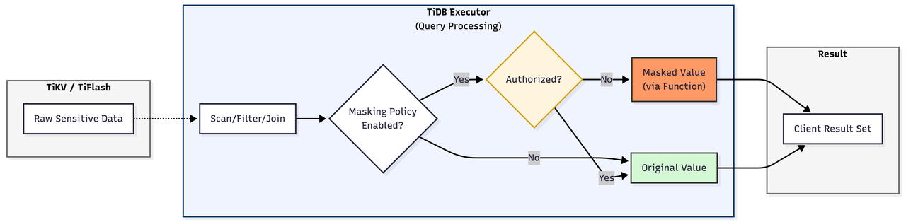
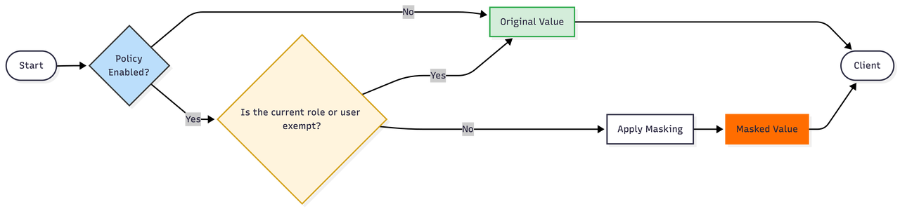
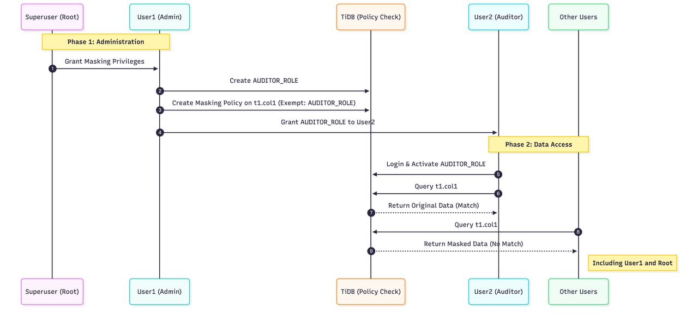

# Proposal: Server-side Column-Level Data Masking

- Author(s):     [@tiancaiamao](https://github.com/tiancaiamao)
- PM:            Frank (feature spec owner)
- Last updated:  2026-02-27
- Tracking:      FRM-2351
- Discussion at: https://github.com/pingcap/tidb/issues/65744

## Abstract

This proposal introduces server-side column-level data masking in TiDB.
Masking is defined as a policy bound to a table column and evaluated at query-result time.

The feature focuses on:

- Role/user-aware dynamic masking via SQL expressions.
- Built-in masking functions for common redaction patterns.
- DDL and metadata surfaces to create/alter/drop/inspect masking policies.
- Optional operation-level restriction controls (`RESTRICT ON ...`) for security-sensitive write/read transformations.

The goal is to protect sensitive data exposure while keeping application SQL behavior predictable.

## Background

Enterprises in regulated industries (for example PCI-DSS workloads) require strict control over who can view original column values (PAN, PII, date attributes, etc.).
TiDB currently lacks native server-side column masking semantics and depends on application-side SQL function usage, which is hard to enforce consistently.

This proposal closes that gap with native masking policies enforced by TiDB.

## Proposal

### Goals

- Provide server-side column-level data masking in TiDB.
- Support conditional masking logic using session identity (`current_user()`, `current_role()`).
- Support full/partial/null/date masking patterns.
- Add SQL DDL and SHOW interfaces for full policy lifecycle management.
- Add optional operation restrictions with `RESTRICT ON`.
- Ensure masking metadata is persisted in system tables and visible for operations/audit.

### Non-goals

- Masking non-column data (logs, external backups, etc.).
- Masking virtual/generated columns.
- Full parity with Oracle syntax/API style.
- Global detached policy binding model (not adopted due to complexity and error risk).

### Design overview



#### Policy model

A masking policy is bound to one table column and contains:

- Policy identity (`policy_name`).
- Target binding (`schema/table/column` and internal IDs).
- SQL expression used for masking logic.
- Optional restriction set (`RESTRICT ON`).
- Runtime state (`ENABLED`/`DISABLED`).

Each column can have at most one masking policy.

#### Evaluation semantics

Masking is **AT RESULT**:

- Query planning/execution uses original values.
- Storage values are unchanged.
- Returned result values are masked based on policy expression and session identity.

Implications:

- `JOIN` / `WHERE` / `GROUP BY` / `HAVING` / `ORDER BY` / set operators still compute on raw values.
- Users with DML privileges can still write raw values unless blocked by `RESTRICT ON` rules.

### SQL syntax

#### Create / add policy

```sql
CREATE [OR REPLACE] MASKING POLICY [IF NOT EXISTS] <policy_name>
  ON <table_name> (<column_name>)
  AS <masking_expression>
  [RESTRICT ON <operation_list>]
  [ENABLE | DISABLE];
```

```sql
ALTER TABLE <table_name>
  ADD MASKING POLICY <policy_name> ON (<column_name>)
  AS <masking_expression>
  [RESTRICT ON <operation_list>]
  [ENABLE | DISABLE];
```

Rules:

- `OR REPLACE` and `IF NOT EXISTS` are mutually exclusive.
- Temporary tables, system tables, and views are not supported.
- One active policy per column.

#### Alter policy

```sql
ALTER TABLE <table_name> ENABLE MASKING POLICY <policy_name>;
ALTER TABLE <table_name> DISABLE MASKING POLICY <policy_name>;
ALTER TABLE <table_name> DROP MASKING POLICY <policy_name>;

ALTER TABLE <table_name>
  MODIFY MASKING POLICY <policy_name>
  SET EXPRESSION = <new_sql_expression>;

ALTER TABLE <table_name>
  MODIFY MASKING POLICY <policy_name>
  SET RESTRICT ON <operation_list>;
```

#### Metadata observation

```sql
SHOW CREATE TABLE <table_name>;
SHOW MASKING POLICIES FOR <table_name>;
SHOW MASKING POLICIES FOR <table_name> WHERE column_name = '<column_name>';
```

`SHOW CREATE TABLE` returns policy name and state per column in compact form.
Detailed expressions are exposed via `SHOW MASKING POLICIES ...`.

### `RESTRICT ON` semantics

`operation_list` values:

- `INSERT_INTO_SELECT`
- `UPDATE_SELECT`
- `DELETE_SELECT`
- `CTAS`
- `NONE` (default)

Example:

```sql
RESTRICT ON (INSERT_INTO_SELECT, DELETE_SELECT)
```

When restricted operations attempt to read from a masked column without required privileges, TiDB should reject execution with a masking access-denied error.

### Expression semantics

Policies use SQL expressions (typically `CASE WHEN`) and support identity checks based on:

- `current_user()`
- `current_role()`

Supported comparators include:

- `IN`
- `NOT IN`
- `=`
- `!=`

Default-deny behavior is recommended: users/roles not matching allow conditions should get masked results.

### Built-in masking functions

- `MASK_PARTIAL(col, preserve_left, preserve_right, mask_char)`
- `MASK_FULL(col, mask_char_or_default)`
- `MASK_NULL(col)`
- `MASK_DATE(col, format_or_template)`

### Supported column types

Primary supported scope:

- String-like: `VARCHAR`, `CHAR`, `TEXT` family, `BLOB` family
- Temporal: `DATE`, `TIME`, `DATETIME`, `TIMESTAMP`, `YEAR`

For `LONGTEXT` and `BLOB` types, required minimum behavior is:

- Full masking, or
- Null masking

### DDL guard and cascade drop

- DDL guard: type/length/precision modification on a masked column is blocked.
- Cascade drop: dropping a masked column (or its table) removes associated masking policy metadata synchronously.

This prevents policy/column divergence and security gaps.

### System table design

Masking metadata is stored in:

- `mysql.tidb_masking_policy`

Reference schema:

```sql
CREATE TABLE mysql.tidb_masking_policy (
  policy_id BIGINT PRIMARY KEY,
  schema_name VARCHAR(64) NOT NULL,
  table_name VARCHAR(64) NOT NULL,
  table_id BIGINT NOT NULL,
  column_id BIGINT NOT NULL,
  column_name VARCHAR(64) NOT NULL,
  policy_name VARCHAR(64) NOT NULL,
  masking_type VARCHAR(32) NOT NULL DEFAULT 'CUSTOM',
  expression TEXT NOT NULL,
  status ENUM('ENABLED', 'DISABLED') DEFAULT 'ENABLED',
  created_at TIMESTAMP DEFAULT NOW(),
  created_by VARCHAR(128),
  updated_by VARCHAR(128),
  updated_at TIMESTAMP DEFAULT NOW() ON UPDATE NOW(),
  UNIQUE KEY uk_table_policy (table_id, policy_name),
  UNIQUE KEY uk_table_column (table_id, column_id),
  INDEX idx_schema_table (schema_name, table_name)
) ENGINE=InnoDB DEFAULT CHARSET=utf8mb4;
```

Notes:

- `table_id`/`column_id` are used as stable bindings across rename operations.
- `masking_type` is a textual classification for observability (for example `MASK_PARTIAL`, `MASK_FULL`, `CUSTOM`), while runtime behavior is still determined by expression evaluation.

### Authorization model



Administrative privileges:

- `CREATE MASKING POLICY`
- `ALTER MASKING POLICY`
- `DROP MASKING POLICY`

`ALTER MASKING POLICY` covers:

- `SET EXPRESSION`
- `SET RESTRICT ON`
- `ENABLE` / `DISABLE`

Runtime data exposure is still controlled by policy expression logic (`current_user()` / `current_role()` conditions), not by the DDL privilege itself.

### Operational workflow (example)



1. Security admin is granted masking-policy management privileges.
2. Admin creates a business role (for example `AUDITOR_ROLE`) for unmasked access.
3. Admin defines policy with role/user allow-list logic.
4. Admin grants the role to target users.
5. Authorized sessions with active role read raw values; others read masked values.

## Rationale

This design prioritizes predictable SQL behavior and lower rollout risk:

- Uses explicit SQL policy objects and expression-based rules, which are easy to audit and reason about.
- Keeps storage and predicate semantics unchanged (AT RESULT), reducing execution-path regressions.
- Uses per-column binding with stable internal IDs to survive rename operations.
- Adds optional `RESTRICT ON` controls to satisfy stricter compliance needs without forcing Oracle-like restrictions by default.

## Compatibility

- Syntax and behavior are TiDB-specific (not MySQL-compatible feature parity).
- BR/TiCDC can carry masking-related DDL and metadata, but user/role tables are not automatically synchronized.
- Downstream clusters should provision corresponding users/roles to keep expected access behavior.
- Dump/validation tools may see masked values if executed by non-exempt users.

## Implementation

High-level implementation scope:

- Parser/AST support for masking policy DDL and `RESTRICT ON` syntax.
- Metadata persistence in `mysql.tidb_masking_policy`.
- Planner/executor integration for AT RESULT masking expression evaluation.
- Privilege checks for policy management operations.
- SHOW/inspection surfaces (`SHOW CREATE TABLE`, `SHOW MASKING POLICIES ...`).
- DDL guard and cascade-drop hooks for masked columns.
- Plan-cache invalidation when masking bindings change.

Non-functional expectations:

- Minor read-latency overhead due to per-row expression and identity checks.
- Pushdown opportunities to TiKV/TiFlash should be benchmarked for batch workloads.

## Open issues

- Finalized error code selection for masking access denial in restricted operations should align with existing TiDB/MySQL error code allocation policy.
- Exact optimizer pushdown and plan-cache invalidation strategy should be validated by implementation benchmarks.
- FK-related inference risks require clear operational guidance in user-facing docs.

## References

- PCI DSS v4.0.1 (PAN display masking requirements)
- Oracle DBMS_REDACT documentation
- IBM DB2 `CREATE MASK`
- SQL Server Dynamic Data Masking
- Snowflake masking policy syntax
