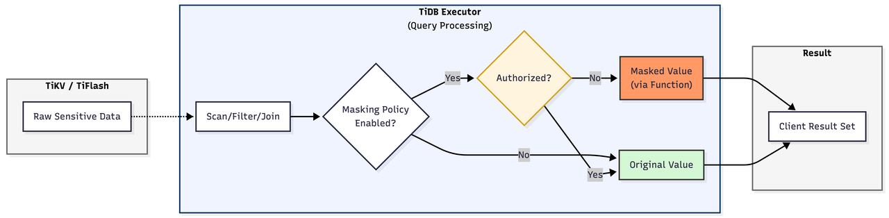
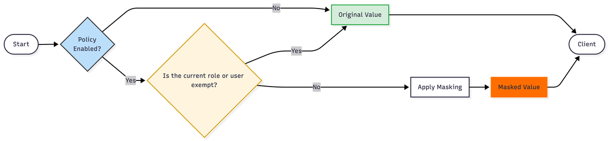
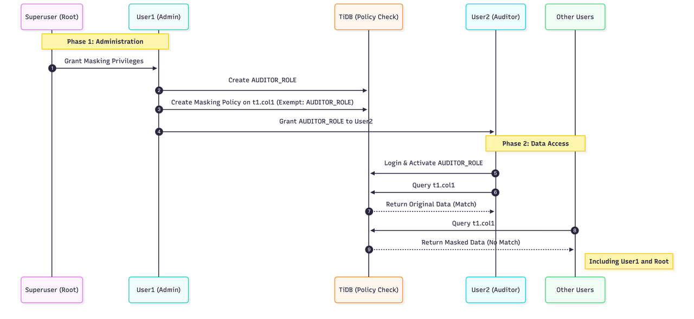

# Proposal: Server-side Column-Level Data Masking

- Author(s):     [@tiancaiamao](https://github.com/tiancaiamao)
- PM:            Frank (feature spec owner)
- Last updated:  2026-03-25
- Tracking:      FRM-2351
- Discussion at: https://github.com/pingcap/tidb/issues/65744

## Abstract

This proposal introduces server-side column-level data masking in TiDB.
Masking is defined as a policy bound to a table column and evaluated at query-result time.

The feature focuses on:

- Role/user-aware dynamic masking via SQL expressions.
- Built-in masking functions for common redaction patterns.
- DDL and metadata surfaces to create/alter/drop/inspect masking policies.
- Optional operation-level restriction controls (`RESTRICT ON ...`) for security-sensitive write/read transformations.

The goal is to protect sensitive data exposure while keeping application SQL behavior predictable.

## Background

Enterprises in regulated industries (for example workloads subject to the Payment Card Industry Data Security Standard (PCI DSS)) require strict control over who can view original column values (Primary Account Number (PAN), Personally Identifiable Information (PII), date attributes, etc.).
TiDB currently lacks native server-side column masking semantics and depends on application-side SQL function usage, which is hard to enforce consistently.

This proposal closes that gap with native masking policies enforced by TiDB.

## Design

### Goals

- Provide server-side column-level data masking in TiDB.
- Support conditional masking logic using session identity (`current_user()`, `current_role()`).
- Support full/partial/null/date masking patterns.
- Add SQL DDL and SHOW interfaces for full policy lifecycle management.
- Add optional operation restrictions with `RESTRICT ON`.
- Ensure masking metadata is persisted in system tables and visible for operations/audit.

### Non-goals

- Masking non-column data (logs, external backups, etc.).
- Masking virtual/generated columns.
- Full parity with Oracle syntax/API style.
- Global detached policy binding model (not adopted due to complexity and error risk).
- Managing cross-component user/role synchronization strategy for BR/TiCDC pipelines.

### Design overview



#### Policy model

The implementation treats masking policy as a table-owned schema object, not as a detached global object.
This is intentionally close to how engineers reason about index-like table attachments:
create table first, then attach policy, and let table lifecycle drive policy lifecycle.

Each policy record carries:

- logical identity (`policy_name`)
- target binding (`db/table/column`, plus `table_id/column_id`)
- masking expression
- optional `RESTRICT ON` operation set
- runtime status (`ENABLED` / `DISABLED`)

Key design constraints are:

- masking policy scope is per-table, not global
- `policy_name` uniqueness is enforced inside one table (`table_id + policy_name`)
- one column can have at most one policy (`table_id + column_id`)

Using per-table scope avoids global name collision and maps naturally to DDL ownership and cleanup logic.

#### Evaluation semantics

Masking is implemented as **AT RESULT** rewriting. In other words, table data and predicate semantics stay unchanged, and masking is applied when producing query results.

From an execution perspective:

- planner/executor still use raw values for `JOIN`, `WHERE`, `GROUP BY`, `HAVING`, `ORDER BY`, set operators
- returned projection values are rewritten by policy expression based on runtime identity (`current_user()` / `current_role()`)

This choice minimizes optimizer/storage regressions and keeps compatibility risk lower than predicate-time rewriting.
The tradeoff is that raw values can still participate in write/read transformations unless restricted by `RESTRICT ON`.

### Architecture and lifecycle design

This section describes how the feature is expected to be wired in code, so implementation work can be split by ownership instead of by SQL statement list.

#### DDL write path

1. Parse DDL from either `CREATE MASKING POLICY ...` or `ALTER TABLE ... ADD/MODIFY/... MASKING POLICY`.
2. Resolve target table/column and run target/expression validation.
3. Persist policy metadata to `mysql.tidb_masking_policy` as the Single Source of Truth (SSOT).
4. Emit schema change (`ActionCreateMaskingPolicy` / `ActionAlterMaskingPolicy` / `ActionDropMaskingPolicy`).
5. Invalidate policy cache in `InfoSchema`; actual policy rows are reloaded lazily on next access.

#### Query read path

1. Build plan with current statement `InfoSchema` (or stale/snapshot `InfoSchema` when applicable).
2. Resolve masking binding by `(table_id, column_id)`.
3. Rewrite result projection with masking expression (AT RESULT behavior).
4. For restricted operations (`INSERT ... SELECT`, `UPDATE ... (SELECT ...)`, `DELETE ... (SELECT ...)`, `CTAS`), run restriction check against masked source columns before execution.

#### Metadata maintenance path

- `RENAME TABLE` / `RENAME COLUMN` updates policy metadata binding names while keeping ID-based binding continuity.
- `DROP COLUMN` / `DROP TABLE` performs synchronous policy cleanup in `mysql.tidb_masking_policy`.
- Guardrails on masked-column type/length/precision changes prevent policy/column divergence.

#### Component responsibilities

- Parser/AST: SQL grammar and AST nodes for policy DDL + `RESTRICT ON`.
- DDL: target validation, metadata writes, lifecycle synchronization, schema actions.
- InfoSchema: delayed loading and cache invalidation model for masking metadata.
- Planner/Executor: AT RESULT expression rewrite and restricted-operation enforcement.
- BR/TiCDC integration: carry DDL semantics and preserve cross-cluster binding correctness.

Primary code ownership map (for implementation navigation):

- Parser/AST: `pkg/parser/parser.y`, `pkg/parser/ast/ddl.go`
- DDL path: `pkg/ddl/executor.go`, `pkg/ddl/masking_policy.go`, `pkg/ddl/table.go`, `pkg/ddl/modify_column.go`
- InfoSchema loading/cache: `pkg/infoschema/masking_policy.go`, `pkg/infoschema/masking_policy_loader.go`, `pkg/infoschema/builder.go`
- Planner/executor behavior: `pkg/planner/core/point_get_plan.go`, `pkg/planner/core/masking_policy_restrict.go`, `pkg/executor/show.go`
- BR integration (design target): restore should replay policy DDL semantics instead of raw row replay for `mysql.tidb_masking_policy`

#### BR restore compatibility design

Masking policy metadata uses `mysql.tidb_masking_policy` as the Single Source of Truth (SSOT), but restore cannot replay source table rows blindly.

Reason:

- BR restores schema first, then restores data.
- Restored table and column IDs can differ from source cluster IDs.
- Direct replay of source `mysql.tidb_masking_policy` rows can bind policies to wrong target IDs.

Design:

1. Read source policy rows as logical policy definitions.
2. Reconstruct canonical `CREATE MASKING POLICY ...` semantics from those definitions.
3. During restore schema phase, execute reconstructed masking-policy DDL against restored tables.
4. Let target cluster generate correct target `table_id/column_id` bindings.
5. Do not directly replay source physical rows for `mysql.tidb_masking_policy`.

### SQL interface (reference)

#### Create / add policy

```sql
CREATE [OR REPLACE] MASKING POLICY [IF NOT EXISTS] <policy_name>
  ON <table_name> (<column_name>)
  AS <masking_expression>
  [RESTRICT ON <operation_list>]
  [ENABLE | DISABLE];
```

```sql
ALTER TABLE <table_name>
  ADD MASKING POLICY <policy_name> ON (<column_name>)
  AS <masking_expression>
  [RESTRICT ON <operation_list>]
  [ENABLE | DISABLE];
```

Rules:

- `OR REPLACE` and `IF NOT EXISTS` are mutually exclusive.
- Temporary tables, system tables, and views are not supported.
- One policy per column (`table_id + column_id` uniqueness).
- Policy name uniqueness is table-scoped (`table_id + policy_name`).
- `CREATE MASKING POLICY` and `ALTER TABLE ... ADD MASKING POLICY` are equivalent creation entry points (same internal object model and runtime behavior).
- The only user-visible syntax difference is that `OR REPLACE` / `IF NOT EXISTS` are available on `CREATE MASKING POLICY`.

#### Alter policy

```sql
ALTER TABLE <table_name> ENABLE MASKING POLICY <policy_name>;
ALTER TABLE <table_name> DISABLE MASKING POLICY <policy_name>;
ALTER TABLE <table_name> DROP MASKING POLICY <policy_name>;

ALTER TABLE <table_name>
  MODIFY MASKING POLICY <policy_name>
  SET EXPRESSION = <new_sql_expression>;

ALTER TABLE <table_name>
  MODIFY MASKING POLICY <policy_name>
  SET RESTRICT ON <operation_list>;
```

#### Metadata observation

```sql
SHOW CREATE TABLE <table_name>;
SHOW MASKING POLICIES FOR <table_name>;
SHOW MASKING POLICIES FOR <table_name> WHERE column_name = '<column_name>';
```

Observation boundary:

`SHOW CREATE TABLE` is kept intentionally lightweight: it only tells operators that a policy exists on a column and whether it is enabled.
It does not try to serialize full policy definition.

Full policy inspection is delegated to `SHOW MASKING POLICIES`, which is the detailed operational surface for expression/restrict metadata.
This split keeps `SHOW CREATE TABLE` stable/readable while giving tooling a dedicated API for policy introspection.

### `RESTRICT ON` semantics

`operation_list` values:

- `INSERT_INTO_SELECT`
- `UPDATE_SELECT`
- `DELETE_SELECT`
- `CTAS`
- `NONE` (default)

Example:

```sql
RESTRICT ON (INSERT_INTO_SELECT, DELETE_SELECT)
```

At execution time, restricted operations are validated against source masked columns.
The check is semantic: TiDB evaluates whether the current session is effectively allowed to read unmasked source data under the bound policy expression.
If not allowed, the statement is rejected with masking access-denied error.

### Expression semantics

Policies use SQL expressions (typically `CASE WHEN`) and support identity checks based on:

- `current_user()`
- `current_role()`

Supported comparators include:

- `IN`
- `NOT IN`
- `=`
- `!=`

Default-deny behavior is recommended: users/roles not matching allow conditions should get masked results.

### Built-in masking functions

- `MASK_PARTIAL(col, preserve_left, preserve_right, mask_char)` - Partially masks string values while preserving both ends
  - Logic: Provides granular control for partial redaction of string data
  - Types: `VARCHAR`, `CHAR`, `TEXT`
  - `preserve_left`: Number of leading characters to keep
  - `preserve_right`: Number of trailing characters to keep
  - `mask_char`: Single character used for masking (e.g., '*', 'X')
  - Example: `MASK_PARTIAL(credit_card, 6, 4, '*')` keeps first 6 and last 4 characters

- `MASK_FULL(col)` - Masks the entire column value by repeating the specified character
  - `col`: The column to mask (string, datetime, or numeric types)
  - For datetime types: returns '1970-01-01' (date) or '1970-01-01 00:00:00' (datetime)
  - Example: `MASK_FULL(ssn)` returns 'XXXXXXXXX' for a 9-digit SSN

- `MASK_NULL(col)` - Returns NULL for the column value
  - `col`: The column to mask (any supported type)
  - Example: `MASK_NULL(salary)` always returns NULL

- `MASK_DATE(col, date_literal)` - Replaces the date value with a fixed date literal
  - `col`: The date/time column to mask
  - `date_literal`: Fixed date string in 'YYYY-MM-DD' format (e.g., '1970-01-01')
  - Example: `MASK_DATE(birth_date, '1970-01-01')` returns '1970-01-01' for any date value

### Supported column types

Primary supported scope:

- String-like: `VARCHAR`, `CHAR`, `TEXT` family, `BLOB` family
- Temporal: `DATE`, `TIME`, `DATETIME`, `TIMESTAMP`, `YEAR`

For `LONGTEXT` and `BLOB` types, required minimum behavior is:

- Full masking, or
- Null masking

### DDL guard and cascade drop

- DDL guard: type/length/precision modification on a masked column is blocked.
- Cascade drop: dropping a masked column (or its table) removes associated masking policy metadata synchronously.

This prevents policy/column divergence and security gaps.

### System table design

Masking metadata is stored in table:

- `mysql.tidb_masking_policy`

Reference schema:

```sql
CREATE TABLE mysql.tidb_masking_policy (
  policy_id bigint(64) NOT NULL AUTO_INCREMENT,
  policy_name varchar(64) NOT NULL,
  db_name varchar(64) NOT NULL,
  table_name varchar(64) NOT NULL,
  table_id bigint(64) NOT NULL,
  column_name varchar(64) NOT NULL,
  column_id bigint(64) NOT NULL,
  expression text NOT NULL,
  status varchar(16) NOT NULL,
  masking_type varchar(32) NOT NULL,
  restrict_on varchar(256) NOT NULL DEFAULT 'NONE',
  created_at datetime(6) NOT NULL,
  updated_at datetime(6) NOT NULL,
  created_by varchar(288) NOT NULL DEFAULT '',
  PRIMARY KEY(policy_id),
  UNIQUE KEY uk_table_policy(table_id, policy_name),
  UNIQUE KEY uk_table_column(table_id, column_id)
);
```

#### Design decision: Single Source of Truth (SSOT) in `mysql.tidb_masking_policy`

The storage design intentionally uses `mysql.tidb_masking_policy` as the only runtime source of truth.
Policy metadata is not duplicated into `TableInfo` and not maintained in a second metadata channel.

Why this direction:

- avoids dual-write ordering and recovery complexity leading to buggy implementation
- avoids "meta copy A vs system-table copy B" divergence handling
- tolerance of user misoperation like modify `mysql.tidb_masking_policy` directly
- keeps policy evolution logic concentrated in one path

This means policy is logically table-owned but physically stored in isolated system-table metadata (closer to privilege metadata storage style).
Stable binding is still preserved through `table_id/column_id`, so rename operations keep policy association intact.
On policy-related DDL, in-memory policy cache is invalidated and rebuilt on demand.

### InfoSchema loading model

There is a dependency cycle risk during bootstrap/schema construction:

- reading `mysql.tidb_masking_policy` needs SQL execution
- SQL execution needs usable `InfoSchema`
- eager policy materialization during initial `InfoSchema` build would re-enter that dependency

The implementation resolves this by delayed policy loading:

1. build base `InfoSchema` first
2. after base `InfoSchema` is usable, load policy rows through restricted SQL
3. materialize in-memory map keyed by `(table_id, column_id)`

This keeps initialization path acyclic while preserving runtime policy correctness.

### Snapshot / stale-read compatibility contract

Because policy metadata is externalized (not embedded in table meta), snapshot behavior must be explicitly defined:

For any statement executed at read timestamp `T`, policy state resolution and table schema resolution must observe the same timeline.
In practice, old schema + latest policy (or the reverse) is treated as invalid behavior.

Expected behavior for engineering and tests:

- no policy visible at `T` => no masking at `T`
- enabled policy visible at `T` => masking evaluated by policy definition at `T`

This contract is the compatibility baseline for `tidb_snapshot`, `AS OF TIMESTAMP`, stale transaction modes, and `tidb_read_staleness`.

### Authorization model



Administrative privileges:

- `CREATE MASKING POLICY`
- `ALTER MASKING POLICY`
- `DROP MASKING POLICY`

`ALTER MASKING POLICY` covers:

- `SET EXPRESSION`
- `SET RESTRICT ON`
- `ENABLE` / `DISABLE`

Runtime data exposure is still controlled by policy expression logic (`current_user()` / `current_role()` conditions), not by the DDL privilege itself.

### Operational workflow (example)



1. Security admin is granted masking-policy management privileges.
2. Admin creates a business role (for example `AUDITOR_ROLE`) for unmasked access.
3. Admin defines policy with role/user allow-list logic.
4. Admin grants the role to target users.
5. Authorized sessions with active role read raw values; others read masked values.

## Rationale

This design prioritizes predictable SQL behavior and lower rollout risk:

- Uses explicit SQL policy objects and expression-based rules, which are easy to audit and reason about.
- Keeps storage and predicate semantics unchanged (AT RESULT), reducing execution-path regressions.
- Uses per-column binding with stable internal IDs to survive rename operations.
- Adds optional `RESTRICT ON` controls to satisfy stricter compliance needs without forcing Oracle-like restrictions by default.

### Design tradeoffs

The chosen architecture has clear tradeoffs worth keeping explicit for maintainers:

- Externalized policy storage improves metadata consistency handling, but requires careful cache/snapshot coordination.
- AT RESULT masking keeps planner/storage behavior stable, but means data-flow restrictions must be handled explicitly through `RESTRICT ON`.
- Lightweight `SHOW CREATE TABLE` improves readability, but detailed tooling must use `SHOW MASKING POLICIES`.

### Example Usage

```sql
-- Example 1: MASK_PARTIAL - keep first 3 and last 3 characters of a phone number
CREATE TABLE contacts (
  id INT PRIMARY KEY,
  name VARCHAR(100),
  phone VARCHAR(20)
);

CREATE MASKING POLICY p_mask_phone
  ON contacts(phone)
  AS MASK_PARTIAL(phone, 3, 3, '*') ENABLE;

INSERT INTO contacts VALUES (1, 'Alice', '1234567890');
-- Query returns: '123****890' (masked in the middle)
SELECT phone FROM contacts WHERE id = 1;

-- Example 2: MASK_FULL - completely mask SSN
CREATE MASKING POLICY p_mask_ssn
  ON employees(ssn)
  AS MASK_FULL(ssn, 'X') ENABLE;

-- Query returns: 'XXXXXXXXX' for any 9-digit SSN
SELECT ssn FROM employees WHERE id = 1;

-- Example 3: MASK_DATE - normalize birth dates
CREATE MASKING POLICY p_mask_birthdate
  ON users(birth_date)
  AS MASK_DATE(birth_date, '1970-01-01') ENABLE;

-- Query returns: '1970-01-01' for any birth date
SELECT birth_date FROM users WHERE id = 1;

-- Example 4: MASK_NULL - hide salary information
CREATE MASKING POLICY p_mask_salary
  ON employees(salary)
  AS MASK_NULL(salary) ENABLE;

-- Query returns: NULL for all salary values
SELECT salary FROM employees WHERE id = 1;
```

## Compatibility

- Syntax and behavior are TiDB-specific (not MySQL-compatible feature parity).
- BR/TiCDC can carry masking-related DDL and metadata semantics to downstream clusters.
- Runtime masking decisions depend on identity evaluation (`current_user()` / `current_role()`), so missing or diverged user/role state in downstream clusters can change effective masking behavior.
- BR restore should rebuild masking policies by replaying `CREATE MASKING POLICY` semantics against restored target tables, instead of directly replaying source rows from `mysql.tidb_masking_policy` (restored table/column IDs may differ across clusters).
- Dump/validation tools may see masked values if executed by non-exempt users.

> **Caution**
> User/role synchronization behavior in BR/TiCDC is out of scope of this masking-policy design.
> This design only defines masking-policy semantics and metadata behavior.
> Therefore, downstream masking validation MUST treat user/role alignment as a hard prerequisite.
> If downstream user/role state is not explicitly reconciled and verified first, masking validation results MUST be considered invalid.
> Current behavior can vary by component, version, and flags/filters (for example, BR `--with-sys-table` and table filters; TiCDC system-schema filtering), so operators MUST verify actual downstream user/role state in each deployment.

## Implementation

This section is an implementation scope checklist. Architecture and lifecycle decisions are defined in `Architecture and lifecycle design` above.

High-level implementation scope:

- Parser/AST support for masking policy DDL and `RESTRICT ON` syntax.
- Metadata persistence in `mysql.tidb_masking_policy`.
- Planner/executor integration for AT RESULT masking expression evaluation.
- Privilege checks for policy management operations.
- SHOW/inspection surfaces (`SHOW CREATE TABLE`, `SHOW MASKING POLICIES ...`).
- DDL guard and cascade-drop hooks for masked columns.
- Plan-cache invalidation when masking bindings change.

Non-functional expectations:

- Minor read-latency overhead due to per-row expression and identity checks.
- Pushdown opportunities to TiKV/TiFlash should be benchmarked for batch workloads.

## Open issues

- Finalized error code selection for masking access denial in restricted operations should align with existing TiDB/MySQL error code allocation policy.
- Exact optimizer pushdown and plan-cache invalidation strategy should be validated by implementation benchmarks.
- FK-related inference risks require clear operational guidance in user-facing docs.

## References

- [PCI DSS v4.0.1](https://www.pcisecuritystandards.org/standards/pci-dss/) (Primary Account Number (PAN) display masking requirements)
- [Oracle DBMS_REDACT documentation](https://docs.oracle.com/en/database/oracle/oracle-database/21/arpls/DBMS_REDACT.html#GUID-61439993-CC76-40FF-AC6E-24A323947DA8)
- [IBM DB2 `CREATE MASK`](https://www.ibm.com/docs/en/db2/12.1.0?topic=statements-create-mask)
- [SQL Server Dynamic Data Masking](https://docs.microsoft.com/en-us/sql/relational-databases/security/dynamic-data-masking)
- [Snowflake masking policy syntax](https://docs.snowflake.com/en/sql-reference/sql/create-masking-policy)
