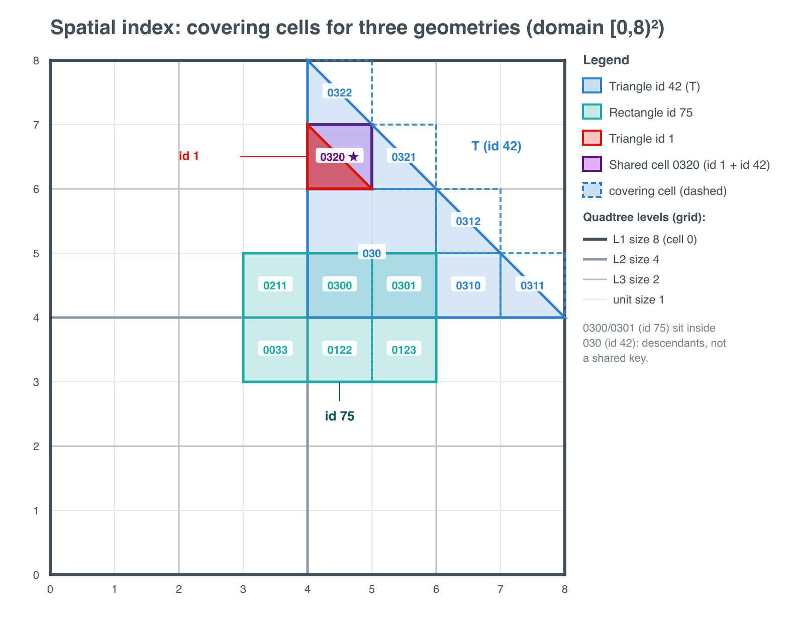

# TiDB Design Documents

- Author(s): [Mattias Jonsson](http://github.com/mjonss)
- Discussion PR: this PR (work in progress); builds on the earlier draft https://github.com/pingcap/tidb/pull/38916
- Tracking Issue: https://github.com/pingcap/tidb/issues/6347

## Table of Contents

* [Introduction](#introduction)
* [Motivation or Background](#motivation-or-background)
* [Detailed Design](#detailed-design)
* [Test Design](#test-design)
    * [Functional Tests](#functional-tests)
    * [Scenario Tests](#scenario-tests)
    * [Compatibility Tests](#compatibility-tests)
    * [Benchmark Tests](#benchmark-tests)
* [Impacts & Risks](#impacts--risks)
* [Investigation & Alternatives](#investigation--alternatives)
* [Unresolved Questions](#unresolved-questions)

## Introduction

This document proposes a spatial index for TiDB that accelerates proximity ("within
radius") and containment ("point in polygon", bounding-box overlap) queries on a
geometry column. The index is a TiKV secondary index that decomposes a geometry into a
set of covering cells of a space-filling curve (Hilbert ordering, S2 cells for
geographic data and a planar quadtree for Cartesian data), stores one ordered key per
covering cell using TiDB's existing multi-valued-index mechanism, and answers spatial
queries by scanning the cell ranges that cover the query region and then refining
candidates with the exact predicate.

The scope of this document is the **index only**. The `GEOMETRY` data type, its EWKB
storage, and the `ST_*` functions are treated as a prerequisite that lands
independently (see Motivation); the index is designed against a small contract from
that type. Supporting working documents with the full survey, decision logs, and a
concrete first-deliverable plan live alongside this file under
`docs/design/spatial-index/` (`research.md`, `PLAN.md`, `PLAN-points-mvp.md`,
`CONTEXT.md`).

## Motivation or Background

Geospatial support is one of the most requested TiDB features. Tracking issue #6347
carries the `feature/accepted` label and ranks among the top open issues by reactions.
The dominant real-world workload is simple and concrete: store a location per row
(latitude/longitude or a planar coordinate) and answer "what is near me", "which region
contains this point", or "what overlaps this box". Bike-share, ride-hailing, parcel
delivery, and asset-tracking applications all reduce to points plus proximity and
geofence queries.

TiDB has no spatial support today: only the `mysql.TypeGeometry` type constant exists
(`pkg/parser/mysql/type.go`), with no value representation and no `ST_*` functions. The
geometry type and basic functions are expected to land independently, following the
staged plan in the earlier geospatial design (PR #38916,
`docs/design/2022-10-27-geospatial.md`) and its parser/type work
(PRs #66602, #60295, #38611 and tikv/tikv#13652). That earlier design explicitly deferred the spatial index,
stating it "needs more research". This document fills that gap.

Without an index, the queries above are full table scans. The index is what turns them
into selective lookups once point tables grow large, which is precisely where the demand
is. The index must accelerate the predicates real workloads use: bounded distance
(`ST_Distance`/`ST_Distance_Sphere` under a radius), containment (`ST_Contains`,
`ST_Within`), intersection (`ST_Intersects` and the MBR family). Per-row computations
without spatial locality (`ST_Area`, `ST_Length`, accessors) have no index story, the
same as in MySQL.

## Detailed Design

### Overall approach

MySQL, MariaDB, and PostGIS index spatial data with an R-tree (PostGIS via GiST). An
R-tree is a tree of overlapping bounding rectangles that assumes single-node, in-place
tree maintenance. It does not fit TiKV, which is a distributed, range-sharded, globally
ordered key-value store. The proven fit for an ordered KV store is a **space-filling
curve**: linearize 2D proximity into 1D key proximity so spatial queries become range
scans over the existing index machinery. Space-filling-curve spatial indexing is a
long-established, general technique (Hilbert curves, Morton/Z-order, geohash, and
Google's open-source S2 cell library), used across many systems; CockroachDB is one
independent precedent that applies it on a distributed ordered KV store comparable to
TiKV (S2 cell covering over an inverted index).

TiDB already has the needed primitive: the **multi-valued index (MVI)**, where one row
produces many ordered index entries (today used for JSON array membership). A spatial
index maps onto it directly: cover each geometry with a set of hierarchical cells and
write one index entry per covering cell. Queries follow the standard spatial
**filter-and-refine** pattern: cover the query region into cell ranges, range-scan to
get candidate rows, then evaluate the exact predicate to drop false positives. The
index always returns a superset; correctness lives in the refine step.

### Index entry layout

For a table `t` (table id `T`) with a spatial index (index id `I`) on a geometry column,
each covering cell of a row's geometry produces one entry (the value is a single encoded
object, shown in braces):

    t{T}_i{I}_{cell_key}_{clustered_pk} -> { minX, minY, maxX, maxY,
                                             [optional geometry summary],
                                             [optional EWKB if covering index] }

- `cell_key` is the space-filling-curve cell id (encodes level and Hilbert/cell
  position). The entries are therefore ordered by the curve.
- `clustered_pk` is the row handle, appended for uniqueness (as for any non-unique
  index).
- The value stores the geometry's bounding box, enabling a cheap pre-lookback filter
  (intersect the stored bbox against the query box using only the index entry, before
  fetching the row). This recovers part of an R-tree's MBR pruning inside the flat MVI
  without maintaining a tree. Optionally it stores a simplified geometry summary, or the
  full EWKB to make the index covering (refine without any row fetch).
- The common (non-partitioned) case needs nothing more. Only a global index on a
  partitioned table adds a `partition_id` to the value (a later phase, see Partitioned
  tables), the `PARTITION BY` physical partition id, not the primary key, so the
  lookback can find the row's partition.

A **point** is contained in exactly one cell, so a point geometry produces exactly one
entry (no fan-out); MVI machinery is then unnecessary and a plain secondary index entry
suffices. A **polygon or linestring** is covered by several cells (bounded by a max-cells
parameter) and fans out to several entries, which is the MVI case.

### Coverer and SRID schemes

A single engine-neutral `Coverer` abstraction isolates the curve/cell math:

    EncodePoint(srid, x, y) -> cell_key            // for a stored geometry (point: one cell)
    Cover(srid, geometry)   -> []cell_key          // covering cells of an extent
    CoverQuery(srid, region) -> []cell_range       // cell ranges covering a query region

Two implementations, chosen by the column's SRID, sit behind it:

- **SRID 0 (abstract Cartesian plane): planar quadtree / Z-order.** SRID 0 has no
  natural bounds, so the index fixes a configurable coordinate domain (default
  `[-(1<<31), (1<<31)-1]` per axis, a generous bound covering common coordinate systems
  with headroom; CockroachDB's docs use the same value), quadtree-subdivides it, and
  leaves out-of-domain coordinates correct but un-prunable.
- **SRID 4326 (WGS 84 lat/long): S2 spherical cells** via `github.com/golang/geo/s2`
  (Apache 2.0, Google's open-source S2 port). S2 handles the antimeridian and poles
  natively and covers a distance query as a spherical cap, which a flat lat/long grid
  cannot do correctly.

Two tuning knobs are distinct: **max level** controls cell precision; **max cells per
geometry** caps fan-out for extents (points are always one entry regardless of level).

### Write, update, and delete paths

Index maintenance is transactional with the row, identical to any TiDB secondary index
(no special handling needed, the standard index write path applies):

- Insert: parse EWKB, compute the covering cells and the bbox, write the row and one
  index entry per covering cell in the same transaction.
- Update of the geometry: compute old and new covering cells, delete the old entries,
  write the new entries, update the row, all in one transaction.
- Delete: delete the row and its covering-cell entries in one transaction.

### Query path

1. Compute the query region (a window rectangle, or a distance-bounded disc on a plane /
   cap on the sphere) from the predicate's constant arguments.
2. `CoverQuery` the region into cell ranges.
3. Range-scan those ranges over the index.
4. Apply the bbox stored in the index value as a cheap pre-filter.
5. Deduplicate candidate handles (a polygon matched via several cells appears once per
   cell).
6. Look the surviving rows up by handle (skipped if a covering index stores the
   geometry).
7. Apply the exact predicate (`ST_Intersects`/`ST_Contains`/exact distance) to produce
   the final result.

The bounded form `WHERE within radius ORDER BY distance LIMIT k` is supported by serving
the `WHERE` from the index and letting an ordinary `TopN` sort the small candidate set.
Native nearest-neighbour (`ORDER BY distance LIMIT k` with no radius) is not served by a
plain cell index and is deferred (it needs an expanding-ring operator).

### Worked example: indexing and querying a triangle

This condenses the full walkthrough (with the cell grid) in
`docs/design/spatial-index/research.md`. Take a triangle `T = (4,4), (8,4), (4,8)` (the
region `x>=4, y>=4, x+y<=12`) in a small domain `[0,16)²`; its bounding box is
`[4,8]×[4,8]`, a small box well inside the domain. Cells are squares of side
`domain/2^L`; a cell id is a path of quadrant digits, so a cell's ancestors are its id
prefixes and its descendants share its id as a prefix (a contiguous key range).

The covering mixes levels: a coarse cell where the triangle solidly fills it, finer
cells hugging the diagonal edge. For `T` that is one size-2 cell plus six size-1 cells:

    030                  (size 2, the solid interior corner)
    0310 0311 0312       (size 1, lower-right edge)
    0320 0321 0322       (size 1, upper-left edge)

Storage: row `id=42` writes one entry per covering cell, all sharing the handle and the
encoded bbox object, differing only in `cell_key`:

    t{T}_i{I}_030_42  -> {4,4,8,8}
    t{T}_i{I}_0310_42 -> {4,4,8,8}
    ...
    t{T}_i{I}_0322_42 -> {4,4,8,8}

These multiple keys are the MVI fan-out: an MVI is one row writing multiple index keys
(as for JSON-array columns), not multiple values under one key. A point would write a
single entry and need no MVI.

Search covers the query region into cells, then for each query cell finds stored cells
that are it, an ancestor, or a descendant: a finer query matches a coarser stored cell
via ancestor prefixes (a few point lookups); a coarser query matches finer stored cells
via a descendant range scan; the stored bbox cheaply rejects non-overlaps before the row
fetch; and the exact predicate removes the over-cover of partial cells (a point in `0311`
just past the hypotenuse passes the bbox but fails `ST_Contains`).

### Partitioned tables: global vs local

The local-vs-global index choice is the general TiDB secondary-index tradeoff, not
spatial-specific. What is spatial-specific is that a pure spatial predicate constrains
the geometry, never the (non-spatial) partition key, so it cannot drive partition
pruning. Therefore a **local** (per-partition) spatial index fans out to all partitions
by default, while a **global** spatial index (one Hilbert-ordered namespace across all
partitions, `partition_id` in the value) keeps fanout proportional to the query's
spatial extent. The exception is a workload whose queries always co-constrain the
partition key (e.g. multi-tenant partitioned by `tenant_id`, queried `WHERE tenant_id =
N`), where a local index prunes and is preferable. Range-partitioning a table on the
Hilbert value to gain pruning is redundant with TiKV's automatic Region range-
partitioning of the ordered keyspace, so a partitioned spatial table is effectively
always partitioned by a non-spatial key. This reuses TiDB's existing global-index
machinery (`docs/design/2020-08-04-global-index.md`).

### Phasing

1. **Phase 1, points-only MVP** (detailed in `docs/design/spatial-index/PLAN-points-mvp.md`):
   a `POINT`, `NOT NULL`, SRID-constrained column, one entry per row, modeled as an
   expression index on a hidden virtual generated column `tidb_spatial_key(position)` so
   it reuses expression-index DDL and the non-MVI write path. SRID 0 first, then 4326.
   Non-partitioned tables.
2. **Phase 2, generic geometry**: multi-cell covering via MVI, bbox in the index value,
   `ST_Intersects`/`ST_Contains` on polygons and linestrings.
3. **Phase 3, partitioned tables**: global spatial index with `partition_id`.
4. **Later**: coprocessor pushdown of the refine predicate, expanding-ring kNN operator,
   and a TiFlash columnar spatial path (the coverer is kept engine-neutral to allow it).

### Key integration points

(Verified against current code; see `docs/design/spatial-index/PLAN-points-mvp.md` for
line-level detail.) Expression index / hidden column: `pkg/parser/ast/ddl.go`,
`pkg/meta/model/column.go`, `pkg/ddl/index.go`. Index metadata: `pkg/meta/model/index.go`
(`IndexInfo`, `MVIndex`). Predicate-to-range and access path: `pkg/util/ranger/detacher.go`,
`pkg/planner/core` (`getPossibleAccessPaths`, `skylinePruning`), `pkg/planner/util/path.go`.
Index KV write: `pkg/table/tables/index.go` (`GenIndexKVIter`, plain vs multi-valued
generator), `pkg/tablecodec/tablecodec.go`. Builtin registration: `pkg/expression/builtin.go`.

### Compatibility

- **Partition table**: a spatial index on a partitioned table should be global (see
  above); local is valid only for partition-key-co-constrained workloads.
- **Clustered index**: the spatial index is a secondary index; it does not change the
  table's clustering. A clustered-by-geometry organization is an explicitly rejected
  alternative (see Investigation).
- **Parser/DDL**: new `SPATIAL INDEX` surface (or `USING`), internally an expression
  index plus spatial metadata on `IndexInfo`. DDL backfill reuses the index backfill
  framework.
- **Planner/statistics**: a new access path and predicate recognition; the cost model
  must account for the candidate-superset behavior and MVI fan-out (MVI row/NDV can
  exceed table row count, already noted in `pkg/statistics/analyze.go`).
- **Executor**: refine reuses the exact predicate as a retained filter; no new operator
  in Phase 1/2.
- **TiKV**: no storage-engine change; entries are ordinary ordered keys. Coprocessor
  pushdown of refine is a later, optional enhancement.
- **TiFlash/BR/TiCDC/Dumpling**: the index is regular index data; tools that handle
  secondary indexes need no special casing beyond understanding the geometry value
  (which is the prerequisite type's concern). TiFlash spatial is out of scope here.
- **Upgrade/Downgrade**: the index metadata is additive. Downgrade to a release without
  spatial-index support requires dropping spatial indexes first (same as other newer
  index kinds); to be confirmed during implementation.

## Test Design

### Functional Tests

- Coverer unit tests: a point encodes to one cell; `CoverQuery` of a region returns
  ranges that include the cell of every contained point (zero false negatives vs a
  brute-force check over random points), for both SRID 0 and 4326.
- Result-equivalence: for seeded tables, distance-within, `ST_Contains`/`ST_Within`, and
  `ST_Intersects` queries return identical rows with the index dropped and created.
- Plan tests: `EXPLAIN` shows a spatial index range scan plus a refine filter instead of
  a full scan; the index-entry count equals the expected per-row covering-cell count.

### Scenario Tests

- Proximity ("stores within 10 km of a point", including `ORDER BY distance LIMIT k`).
- Geofence (point-in-polygon over a region table).
- SRID 4326 edge cases: a query region crossing the antimeridian and one near a pole.
- Multi-tenant partitioned table: per-tenant spatial query (local index prunes) and, in
  Phase 3, cross-tenant spatial query (global index).

### Compatibility Tests

- Partition table (local and global), clustered and non-clustered tables, charset/
  collation irrelevance for the geometry value, async commit.
- Parser/DDL/planner/statistics/executor as listed in Compatibility.
- External components: Dumpling/Lightning round-trip of a table with a spatial index;
  TiCDC and BR pass-through; behavior unaffected when TiFlash is absent.
- Upgrade and downgrade paths.

### Benchmark Tests

- Candidate-set precision (false-positive ratio after the cell range scan and after the
  bbox pre-filter) on representative point data (e.g. the Capital Bikeshare dataset used
  in TiDB docs), to tune cell depth and max-cells.
- Write amplification (index entries per row; one for points, bounded for extents) and
  insert/update throughput vs an unindexed table.
- Query latency and rows-scanned vs a full table scan, across selectivities.

## Impacts & Risks

Impacts (intended): proximity and containment queries on large geometry tables become
selective index scans instead of full scans; for points, write amplification is one
index entry per row.

Risks:

- **Covering tightness**: too-coarse cells inflate the candidate set; too-fine cells
  inflate fan-out and index size. Needs measurement; mitigated by the bbox pre-filter.
- **Geometry update cost**: updating a geometry rewrites its covering-cell entries
  (bounded for points). The clustered-by-geometry alternative would be far worse, which
  is one reason it is rejected.
- **Prerequisite coupling**: the index depends on the geometry type and `ST_*` functions
  landing; mitigated by coding against a thin accessor so churn stays localized.
- **Refine library gaps**: exact `ST_Intersects`/`ST_Contains` may need code beyond
  `go-geom`; to be verified.
- **Global index costs** (Phase 3): cross-partition writes and partition-DDL cleanup are
  the usual global-index costs, inherited because global is the spatial default.
- **SRID 0 domain**: data outside the configured bounds stays correct but unindexed (a
  performance, not correctness, risk).

## Investigation & Alternatives

A full survey is in `docs/design/spatial-index/research.md`. Summary:

- **R-tree / GiST** (MySQL, MariaDB, PostGIS): excellent on a single node, including
  native kNN, but the overlapping-node tree does not shard onto TiKV's ordered keyspace
  and needs in-place rebalancing. Not viable as a distributed TiDB index.
- **ER-tree** ("An LSM-Tree Index for Spatial Data", He & Chen, Algorithms 2022,
  15(4):113): a Hilbert R-tree embedded in LSM SSTables. It handles generic geometries
  with one entry each (extent in MBRs) and avoids dual-index lookups, but only because
  the data is stored **clustered** by `Hilbert(geometry)`. As a clustered organization
  it consumes the table's single clustering choice and makes geometry updates expensive;
  as a TiDB secondary index it would require maintaining a standalone Hilbert-packed
  R-tree, reintroducing tree maintenance on ordered KV. Recorded as the alternative for
  a future clustered/storage-engine-native spatial index, not chosen here.
- **Clustered Hilbert organization vs secondary index**: clustered removes the row
  lookback but costs the clustering slot and expensive geometry updates; this proposal
  chooses the secondary index, which leaves the table clustered as the user wants and
  keeps geometry updates cheap, at the cost of a lookback (mitigated by the bbox
  pre-filter and the optional covering value).
- **Geohash via generated column + plain index** (MySQL `ST_Geohash` style): works for
  points but is the points-only special case of this design; this proposal makes it
  automatic and extends it to generic geometries.

## Unresolved Questions

- User-facing DDL grammar: MySQL-compatible `SPATIAL INDEX (col)` (parser work) vs
  `CREATE INDEX ... USING HILBERT` / explicit expression-index syntax. Internal
  representation is identical, so this can be chosen late.
- Index value contents: bbox only, bbox plus simplified geometry, or full EWKB
  (covering); fixed per index or a `WITH` option; the index-size/write-amplification
  budget.
- Where the bbox pre-filter runs: TiDB after the scan, or pushed to the TiKV
  coprocessor.
- Global vs local policy for partitioned tables: default to global, allow local, or
  choose by detected workload (pure-spatial vs partition-key-co-constrained); whether to
  warn when a local spatial index cannot prune.
- `partition_id` encoding: reuse the existing global-index value encoding.
- Phase 1 mechanism wrinkle: the hidden-generated-column expression index normally has an
  empty value, so carrying the bbox/coordinates needs a small index-value-generation
  extension.
- Cell-depth and max-cells defaults; SRID 0 default bounds and out-of-domain behavior.
- S2 library adoption (`github.com/golang/geo`) vs a minimal in-house spherical coverer.
- Whether a clustered spatial table is ever a target use case (would revive the ER-tree
  direction).
- 3D: 2D is required (MySQL/MariaDB are 2D-only; PostGIS has 3D/4D with ND-GiST). The
  cell-key encoding is kept dimension-tagged to allow a future 3D coverer, but 3D is out
  of scope and gated on the type carrying a Z coordinate.
