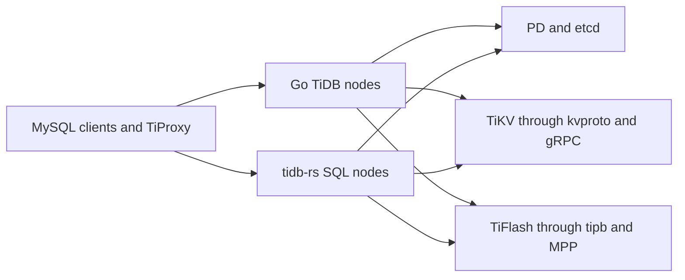
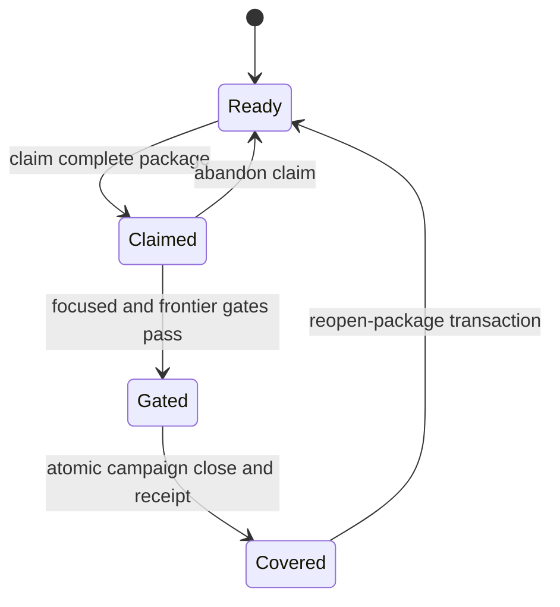

# TiDB Rust Rewrite: Design

- Author: qiliu
- Status: active
- Last revised: 2026-07-22

## Summary

The project will replace TiDB's Go SQL layer with a standalone Rust SQL node,
`tidb-rs`, while preserving TiDB behavior and the protocols used by MySQL
clients, PD, TiKV, TiFlash, and mixed-version TiDB clusters.

There are two different atomic boundaries:

- The **deployment boundary** is a complete SQL node. Go and Rust do not share
  an address space. A Rust node joins the cluster through existing serialized
  protocols and is introduced through shadow, read-only, read-write, and
  full-peer stages.
- The **implementation and acceptance boundary** is one complete upstream Go
  package or module. A package may map to several Rust crates, but no file,
  function, feature, SQL shape, or test subset can be declared complete on its
  own.

This is source-first transcreation. The Go implementation and its entire test
and support inventory remain the behavioral oracle until a Rust package closes
with checked evidence. Rust may change ownership, memory layout, task
supervision, and crate structure; it may not change observable SQL, wire,
transaction, storage, planner, or error behavior during the rewrite.

## Goals

1. Deliver a production-deployable Rust TiDB SQL node without cgo or any other
   in-process Go-to-Rust bridge.
2. Preserve exact TiDB compatibility across SQL semantics, MySQL protocol,
   plans, errors, transaction behavior, KV encodings, and cluster protocols.
3. Transcreate every in-scope Go package completely, including every original
   test and support artifact.
4. Make progress reviewable and reversible through package receipts,
   differential gates, and cluster-level rollout stages.
5. Use Rust-native crate boundaries, ownership, memory management, and
   concurrency where they simplify the implementation without changing its
   contract.
6. Produce useful intermediate systems: a reusable parser, a production-grade
   Rust TiKV client path, and a read-only SQL node.

## Non-goals

- No cgo, shared C ABI, FFI handles, or hybrid Go/Rust process.
- No SQL-language, optimizer, cost-model, wire-protocol, or KV-format redesign
  during transcreation.
- No TiKV or PD rewrite. They are external services reached through their
  existing protocols.
- No initial rewrite of BR, Lightning, Dumpling, DM, or TiCDC. They are
  separate executables and can be evaluated independently after the SQL node
  reaches parity.
- No progress claims based on Rust line counts, connected demos, or broad Rust
  test counts. Completion is package- and behavior-based.
- No new feature-slice porting. Existing partial code is seed material, not an
  acceptance unit.

## Sources of truth

The Go source and tests are the semantic authority. The design document defines
stable architecture and acceptance rules; it does not contain volatile progress
counts.

- Current state and generated counts: [`rust/STATUS.md`](../../rust/STATUS.md)
- Current architecture and open gaps: [`rust/HANDOFF.md`](../../rust/HANDOFF.md)
- Active whole-package ExecPlan:
  [`rust/workstreams/plans/2026-07-whole-package-transcreation.md`](../../rust/workstreams/plans/2026-07-whole-package-transcreation.md)
- Ownership and receipt protocol:
  [`rust/PARALLEL.md`](../../rust/PARALLEL.md)
- Production-source inventory:
  [`rust/difftests/corpus/coverage/go_source_inventory.tsv`](../../rust/difftests/corpus/coverage/go_source_inventory.tsv)
- Original test/support inventory:
  [`rust/difftests/corpus/coverage/go_test_inventory.tsv`](../../rust/difftests/corpus/coverage/go_test_inventory.tsv)
- Package manifests and receipts:
  [`rust/workstreams/slices/`](../../rust/workstreams/slices/) and
  [`rust/workstreams/package-receipts/`](../../rust/workstreams/package-receipts/)

Pinned external Go modules have adjacent `external_go_*` inventories. Generated
ledgers enumerate individual obligations; checked package manifests group those
rows into the only valid completion unit.

## System boundary

`tidb-rs` is an independent process. It participates in a mixed cluster using
the same serialized interfaces as a Go TiDB node.

The stable language-neutral boundaries are:

1. MySQL wire protocol, including authentication, TLS, commands, prepared
   statements, result framing, warnings, status flags, and connection lifetime.
2. PD and TiKV gRPC APIs defined by kvproto, including region routing,
   transactional KV, coprocessor requests, resource control, and errors.
3. tipb DAG and expression trees evaluated by TiKV's Rust coprocessor.
4. MPP task and exchange protocols used by TiFlash.
5. etcd and system-table protocols used for schema leases, metadata locks,
   server registration, ownership, statistics, and background work.

The SQL node is the correct deployment boundary because its internal parser,
session, planner, expression, executor, and transaction interfaces are
pointer-rich and highly coupled. Turning those interfaces into an FFI boundary
would add permanent serialization, scheduler, lifetime, and debugging costs.

A TiDB node is horizontally replaceable, but it is not literally stateless.
Connections, prepared statements, transaction state, caches, leases, and some
background-role state are node-local. Cluster topology makes incremental
replacement possible; exact session and ownership semantics still have to be
implemented before the relevant rollout stage.

## Whole-package transcreation contract

### The package is atomic

For an upstream Go package or separately versioned Go module, transcreation
includes all of the following:

- every production source file;
- generated outputs and their generator inputs;
- build-tag and platform variants;
- internal and external test packages;
- every test, subtest, benchmark, fuzz target, and example;
- fixtures, golden results, embedded assets, and `testdata` trees;
- failpoints, helper programs, runner scripts, and build metadata.

The inventory must be exhaustive and exclusive: every artifact is owned once,
and no artifact silently falls outside the package manifest. A receipt cannot
be inferred from a working feature or from a subset of tests.

### One Go package may become multiple Rust crates

Rust layout follows cohesion, ownership, dependency direction, and compile-time
cost rather than Go directory history. One Go package may therefore map to
several Rust crates or modules. This is encouraged when it produces smaller
stable interfaces or isolates heavy dependencies.

The split never weakens acceptance:

- one umbrella manifest owns the complete Go package;
- all Rust crates and shared consumer seams are declared in its write set;
- all constituent work is staged together;
- the package has one gate and one completion receipt;
- no constituent crate can promote package coverage independently.

Conversely, multiple Go packages may share a Rust foundation crate only when
ownership and dependency receipts remain unambiguous. Shared code is not a way
to collapse unported package obligations.

### Dependency closure

Package manifests form a directed acyclic graph. A package can close only when
every direct internal Go dependency is either:

- included in the same dependency-closed umbrella; or
- represented by a current covered schema-2 package receipt.

Existing Rust helpers, legacy feature slices, mocks, and connected end-to-end
paths do not satisfy this rule. If a prerequisite is reopened, unreceipted
dependents cannot close against it. Covered dependents must be reopened and
removed from covered state in reverse dependency order before the prerequisite
can be reopened. After the prerequisite is repaired, packages are re-gated in
normal dependency order.

## Package state and evidence lifecycle

A package receipt means that one exact source revision, test inventory,
manifest, Rust write set, and gate result were accepted together. It is durable
evidence, not irrevocable truth.

Normal completion is an atomic campaign transaction: validate claims,
dependency closure, source/test/support coverage, exact write-set hashes,
focused evidence, shared frontier gates, and package receipts; then promote all
members together. A failed gate promotes nothing.

When later auditing finds missing behavior, tests, support artifacts, consumer
paths, or incorrect parity, `reopen-package` is mandatory. The transaction:

1. requires a covered schema-2 package with no active claim or campaign;
2. refuses to proceed while any covered transitive dependent remains;
3. removes the current package receipt and returns the manifest to `ready`;
4. preserves historical campaign records as audit history;
5. requires the package to be claimed, repaired, fully gated, and receipted
   again.

Receipts, manifest states, ledgers, and generated status must never be repaired
by hand. A discovered false-positive receipt is a correctness defect and is
reopened immediately; it is not protected to preserve a progress number.

Unreceipted Rust code may remain as explicitly labeled staging or seed evidence.
It cannot promote ledger rows, satisfy a dependency, authorize downstream
completion, or be reported as a transcreated package.

## Execution model

The migration is executed by one implementation owner at the package/frontier
level. Work is serial across mutable integration seams so that responsibility,
evidence, and rollback remain unambiguous.

For each package or dependency-closed frontier:

1. Audit the complete Go source, test, support, generated, and build inventory.
2. Define or correct the schema-2 manifest, dependency edges, Rust mapping, and
   exact mutable write set.
3. Claim the whole package before behavior-changing implementation work.
4. Transcreate the complete behavior directly from Go, preserving control-flow
   order, constants, errors, state transitions, encodings, cancellation, and
   concurrency semantics.
5. Port or differentially cover every original test and support artifact.
6. Run focused package gates during development using a reused Cargo target.
7. Run the dependency-frontier and workspace gates with 12 build jobs.
8. Close the campaign atomically, generate the receipt, and refresh status.
9. If the audit or gate exposes a cross-package flaw, fix the owning package or
   reopen its receipt; do not add a downstream conditional workaround.

Claims protect scope even in a single-owner workflow. Worktrees may isolate
dirty experiments or rollback points, but they do not create independent
completion authorities. Shared seams such as crate roots, parser/AST routing,
datatype/evaluation context, planner/executor/session dispatch, server
connection lifecycle, transaction/storage authority, and evidence generation
are changed in one controlled frontier.

## Translation rules

The normal method is structural Go-to-Rust transcreation:

- retain observable branch ordering and error precedence;
- retain integer widths, overflow behavior, hash/equality framing, and wire or
  SQL rendering;
- retain cancellation points, retry boundaries, and state transitions;
- preserve exact public diagnostic identity and text where clients or tests
  observe them;
- use original test vectors before inventing replacement cases;
- add Rust-only tests for ownership, memory safety, and runtime failure modes,
  but never use them as substitutes for original Go tests.

Rust-native redesign is required only at genuine runtime boundaries:

- GC pools become ownership, reuse, or arenas;
- goroutines and channels become supervised tasks and typed channels;
- pointer identity becomes explicit IDs, indices, or arena references;
- `any` registries and init-time globals become typed registries and explicit
  construction;
- defer/recover cleanup becomes RAII plus explicit panic and error policy.

If the faithful Rust form is unclear, preserve behavior first and isolate the
decision behind a narrow interface. Optimizer, SQL, transaction, protocol, and
storage redesign happens only after parity, under a separate design.

## Target Rust architecture

The workspace is organized by stable responsibility, not by a forced one-to-one
copy of Go directories. The exact current crate map belongs in `rust/HANDOFF.md`;
the target domains are:

| Domain | Responsibilities |
| --- | --- |
| Protocol and server | MySQL packet codec, TLS, auth plugins, command dispatch, prepared statements, connection lifecycle |
| Parser and language model | lexer, parser, AST, restore/format, MySQL identifiers, diagnostics |
| Datatype and codec | datum, decimal, temporal, JSON, collation, charset, row/key/value encodings |
| Session runtime | variables, statement context, privileges, prepared state, transaction lifecycle, retry/replay |
| Catalog and domain | infoschema snapshots, schema leases, metadata locks, bootstrap/system tables, server information |
| Planner | preprocess/resolve, logical and physical planning, rules, costs, hints, bindings, privilege checks |
| Expression and executor | scalar and aggregate evaluation, chunks/batches, relational operators, spill, admin execution |
| Distributed query | coprocessor request lowering, result streaming, TiFlash MPP planning and coordination |
| Storage client | PD client, region cache, snapshots, optimistic and pessimistic transactions, retries and fault handling |
| Statistics and DDL | statistics lifecycle, ownership, jobs, backfill/reorg, schema-state transitions |
| Protocol definitions | kvproto and tipb generation plus compatibility fixtures |

Crate roots expose contracts and routing; feature behavior lives in owned
modules. Compatibility aliases and duplicate authorities are removed when an
owner transition completes. There must be one production authority for
storage, one for session state, and one for each parser/planner/executor route.

## Runtime design rules

### Concurrency

- Tokio owns network I/O, timers, cancellation, and long-lived service tasks.
- CPU-bound parsing, planning, and expression work remains synchronous on the
  connection task until profiling proves that a bounded worker pool is needed.
- Every background task has an owner, shutdown path, error policy, and test.
- Per-connection state is not held across `.await` without an explicit reason;
  shared mutable state uses narrow typed synchronization.
- Blocking storage or filesystem work never runs silently on an async executor.

### Memory

- AST and plan trees use arenas or indexed ownership where lifetime is naturally
  statement-scoped.
- Row batches and protocol buffers are reused with bounded retention.
- Strings and byte slices borrow packet, schema, or arena storage when the
  lifetime is explicit; unsafe lifetime extension is prohibited.
- Caches have explicit size accounting and eviction behavior.
- Performance claims require end-to-end measurements, not allocation anecdotes.

### Errors and diagnostics

- MySQL error number, SQLSTATE, message, warning behavior, and status flags are
  compatibility surfaces.
- Internal errors keep structured context and source chains without leaking
  Rust implementation details to clients.
- Panic is never a normal SQL error path. Connection and background-task panic
  policy is explicit and fault-tested.

### Session and cluster state

- Session variables are typed definitions with defaults, scopes, validation,
  dependency rules, and protocol-visible behavior.
- Connection, prepared-statement, and transaction state have explicit state
  machines.
- Schema version, metadata-lock reporting, bootstrap version, ownership, and
  statistics tables use the same encodings and transition rules as Go TiDB.

## Verification architecture

No single test suite proves parity. Acceptance is layered from package inventory
to live mixed-cluster behavior.

### Package gate

Every package receipt requires:

1. complete source/test/support inventory with no unowned or multiply owned
   artifacts;
2. focused Rust tests corresponding to every original Go test obligation;
3. explicit disposition for tests that cannot run unchanged, with equivalent
   differential or integration evidence;
4. exact manifest dependencies and Rust write-set hashes;
5. formatting, compilation, strict Clippy, and crate-local tests;
6. required differential, fault, and live evidence for the package's contract.

Original TiDB tests are obligations, not suggestions. A rewritten or merged
Rust test must map back to every source test case, subtest, fixture, and golden
result it covers. Tests excluded by platform or build tags remain inventoried
with a checked disposition. Deleting a Go test from the upstream tree does not
silently delete historical compatibility evidence from an accepted revision.

### Differential rings

1. **Parser ring:** AST shape, restore output, flags, offsets, parameter markers,
   warnings, and exact diagnostics across the full corpus and fuzzed mutations.
2. **Planner ring:** normalized logical and physical plans, ranges, properties,
   costs where stable, hints, privileges, and errors on the same schemas and
   statistics.
3. **Execution ring:** rows, types, ordering, warnings, affected rows, status,
   and errors for SQL integration suites and generated edge cases.
4. **Transaction ring:** commit/rollback, isolation, lock conflicts, deadlocks,
   retries, pessimistic locking, async commit, 1PC, stale reads, and failover
   against real TiKV.
5. **Protocol ring:** handshake, TLS, authentication, every supported command,
   prepared statements, long data, cursors, packet fragmentation, cancellation,
   disconnects, and client compatibility.
6. **Mixed-cluster ring:** schema lease and MDL, rolling upgrade, server
   registration, capability routing, topology change, failover, and ownership
   transitions.

### Workspace gate

A dependency frontier closes only after its package gates pass together in one
clean integration state. Completion and release candidates additionally require
the repository Ready verification profile, including repository lint when code
changed. Expensive live suites run when the frontier touches their contract;
they are never replaced by mocks when real PD/TiKV behavior is at issue.

## Deployment ladder

### 1. Shadow node

TiProxy or a capture/replay harness mirrors eligible traffic to `tidb-rs`.
Rust results are compared with Go results and discarded. The shadow stage
measures semantic differences, crashes, resource use, and latency without
serving responses.

### 2. Read-only SQL node

The node accepts production MySQL connections and serves the statements in its
declared capability set through real PD/TiKV and TiFlash paths. Unsupported
statements are rejected before side effects with a stable capability error so
the proxy can route the session to Go TiDB.

Read-only deployment requires, at minimum:

- complete connection lifecycle, TLS, authentication, command, prepared-query,
  result, cancellation, and error behavior for the supported client surface;
- schema snapshot, schema lease, metadata-lock reporting, system-table reads,
  privilege checks, and session semantics needed by those statements;
- real region routing, snapshot reads, coprocessor DAG lowering/result decoding,
  retry, backoff, cancellation, and topology-change behavior;
- MySQL-client-to-real-PD/TiKV live tests and shadow differential evidence.

The first deployable milestone is a bounded read-only node, but it does not
close any Go package merely by connecting these paths.

### 3. Read-write SQL node

The node adds complete DML and transaction semantics. Entry requires the full
transaction differential ring against real TiKV, including pessimistic and
optimistic modes, autocommit, retries, lock resolution, async commit, 1PC,
schema changes during transactions, and client disconnect/cancellation.

### 4. Full peer

The node becomes eligible for DDL, statistics, and other background ownership.
It can bootstrap supported cluster versions, preserve job/system-table
encodings, survive rolling upgrades, and operate without a Go TiDB node.
Go nodes may drain only after full-peer mixed-cluster and disaster-recovery
gates pass.

Rollback at every mixed-cluster stage is a topology operation: stop routing new
sessions, drain Rust nodes, and continue on Go nodes. Rollback must not require
data conversion or in-process compatibility glue.

## Acceptance phases

The phases order acceptance dependencies, not partial feature completion.
Implementation may discover or stage code outside the current phase, but it
cannot skip package or runtime prerequisites.

| Phase | Deliverable | Exit gate |
| --- | --- | --- |
| 0. Language and datatype foundations | Fully receipted parser/language, type, collation, codec, and protocol-definition packages needed above them | Package inventories closed; parser and datatype differential rings pass |
| 1. Storage and distributed-read foundations | Production PD/region/snapshot/coprocessor path plus complete prerequisite packages | Real-cluster read, retry, fault, topology, and compatibility suites pass |
| 2. Deployable read-only node | Standalone binary serving its declared read-only surface through the real stack | MySQL-client live test, shadow parity, TLS/auth/session/schema/MDL, and operational gates pass |
| 3. Read-write node | Complete DML and transaction client behavior without background ownership | Transaction differential, fault-injection, upgrade, and durability gates pass |
| 4. Full peer | DDL, statistics, bootstrap, ownership, background jobs, and operational parity | Full original inventory, mixed-cluster, upgrade/downgrade, failure-recovery, performance, and production canary gates pass |

## Failure recovery and drift handling

- Inventory drift is regenerated from source and reviewed before further
  package closure.
- An abandoned or stale claim is released through the queue tool, not by
  editing the manifest.
- A false or stale receipt is reopened through the atomic transaction.
- A reopened prerequisite blocks dependent closure; covered dependents are
  reopened first.
- A live proof that covers only a bounded statement or topology remains bounded
  evidence. It never expands itself into package coverage.
- A compatibility failure is fixed in the package that owns the violated
  invariant. Downstream special cases are rejected unless the Go contract
  itself requires them.
- Generated status is refreshed after state transitions and is never treated as
  an editable progress narrative.

## Principal risks and controls

| Risk | Control |
| --- | --- |
| The Go tree changes during transcreation | Pin every manifest and receipt to source/test inventories; regenerate drift reports; rebase by package |
| Existing partial Rust code creates false confidence | Label it seed-only; require schema-2 package receipts and dependency closure |
| Original tests are silently omitted | Exhaustive test/support ledger, checked dispositions, and receipt-time inventory gates |
| A valid-looking receipt later proves incomplete | Atomic `reopen-package`, reverse-dependent reopening, and full re-gating |
| Rust crate splits hide missing Go behavior | One umbrella manifest and one receipt for the complete Go package |
| SQL semantics drift during cleanup | Structural transcreation first; redesign only after parity under a separate proposal |
| Rust client behavior lags client-go | Treat client-go as the specification; prove parity against real PD/TiKV and fault injection |
| Mixed nodes disagree on schema or ownership | Dedicated schema-lease, MDL, system-table, rolling-upgrade, and ownership suites |
| Performance work changes behavior | Differential correctness gate first; profile and benchmark only accepted paths |
| Long migration accumulates duplicate authorities | One production owner per seam; remove superseded compatibility and routing paths when ownership transfers |

## Rejected alternatives

### Big-bang replacement

A siloed full rewrite produces no deployable feedback until the end and lets
source drift accumulate. Package receipts plus cluster-level rollout provide
bounded, reviewable proofs earlier.

### In-process package replacement

The internal interfaces are too chatty and pointer-rich for a durable FFI seam.
Serialization and dual runtimes would become permanent complexity, while the
existing network boundaries already provide a clean process-level cut.

### Feature-slice porting

Porting only the code needed by the next demo hides unvisited branches and
tests, creates overlapping ownership, and makes progress impossible to audit.
Feature slices are therefore frozen legacy evidence, not new work units.

### Semantic redesign during translation

Changing optimizer, transaction, protocol, or SQL semantics while changing
language makes failures hard to localize and invalidates differential testing.
Parity and redesign are separate projects.

### Mock-only storage validation

Mocks cannot prove region routing, lock resolution, retries, commit protocols,
or topology behavior. They are useful for focused tests but cannot replace
required real PD/TiKV gates.

## Completion definition

The Rust rewrite is complete only when all of the following are true:

1. Every in-scope upstream Go package/module has a current schema-2 receipt at
   the accepted source revision, with complete source and original-test/support
   coverage.
2. The Rust node passes parser, planner, execution, transaction, protocol, and
   mixed-cluster differential rings with no unexplained divergence.
3. It serves production read and write workloads through real PD, TiKV, and
   TiFlash paths, including failures, retries, topology changes, and rolling
   upgrades.
4. It can perform full-peer ownership and background roles and can operate
   without a Go TiDB node for supported cluster versions.
5. The workspace contains no active legacy feature-slice authority, duplicate
   production routing, hidden FFI bridge, or compatibility path whose only
   purpose was the migration.
6. Correctness, compatibility, performance, resource use, observability,
   deployment, rollback, and disaster-recovery gates all pass on a clean
   release candidate.

Until then, progress is reported as exact covered packages and bounded runtime
capabilities, never as an estimated rewrite percentage.
