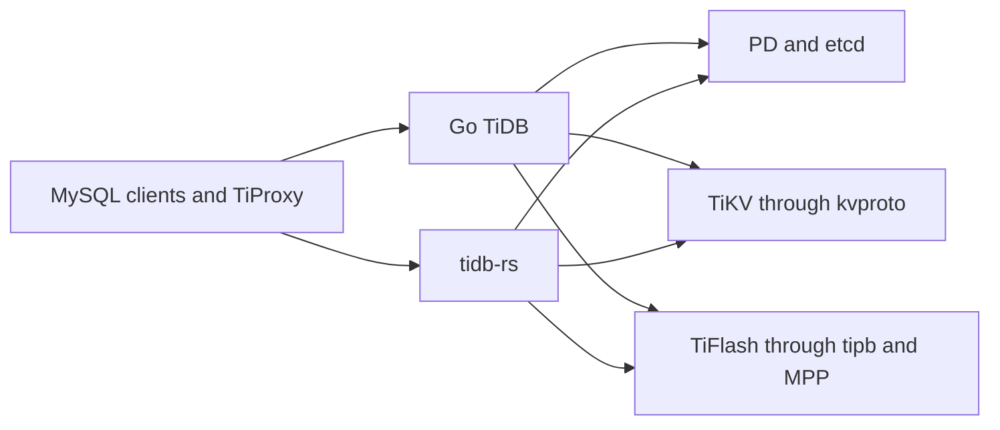

# TiDB Rust Rewrite

- Author: qiliu
- Status: active
- Last revised: 2026-07-23

## Outcome

Build `tidb-rs`, a standalone Rust replacement for TiDB's Go SQL node. It must
remain compatible with MySQL clients, PD, TiKV, TiFlash, and mixed-version TiDB
clusters. Go and Rust never share a process through cgo or FFI.

The Go implementation is the behavioral authority. Rewriting proceeds by
transcreating complete Go packages, not by growing feature slices. A Go package
may become several Rust crates when that produces a cleaner dependency graph,
but its source, tests, generated files, and support data are accepted together.

## Boundaries

The deployment boundary is a whole SQL node:

The stable cross-process contracts are MySQL wire protocol, PD and TiKV gRPC,
tipb DAG/MPP messages, and etcd-compatible coordination. Internal parser,
session, planner, expression, executor, and transaction APIs are pointer-rich
and chatty; turning them into an FFI boundary would create permanent migration
machinery.

## Whole-package rule

A package is complete only when all of these have been transcreated or given an
explicit equivalent disposition:

- every production file, platform/build-tag variant, generated output, and
  generator input;
- every internal and external test, subtest, benchmark, fuzz target, and
  example;
- fixtures, goldens, embedded assets, `testdata`, failpoints, helper programs,
  runner scripts, and build metadata;
- the complete observable behavior: values, errors, ordering, state changes,
  cancellation, concurrency, and wire/storage encodings.

Translation follows the Go control flow first. Rust-native ownership, crate
splits, arenas, RAII, typed registries, and supervised async tasks are welcome
when they remove complexity without changing behavior. Optimizer, SQL,
transaction, protocol, and storage redesigns wait until parity.

Direct internal Go dependencies must already be current, or the selected work
must include the dependency-closed group. Existing partial Rust code is seed
material, never evidence of package completion.

## Development loop

There is one worker and one loop. No workflow object exists besides the active
package, the current Go owner file, Git, and ordinary tests:

1. Choose one dependency-ready Go package and walk its Go files in source
   order.
2. Translate one whole production file together with its whole test owner.
3. Run only the affected Rust tests; fix every broken consumer directly when a
   shared type changes.
4. Commit and push the green edit, then immediately take the next Go file.
5. Once, at package close, compare the directory inventories and run the broad
   Go/Rust parity suites.

The whole Go package is the **completion and parity-claim boundary**, not a
branch, commit, or integration gate. Keeping weeks of valid work in one frozen
working tree slows development and increases merge risk without improving
correctness. Intermediate commits may cover any coherent subset of the active
package, but their messages and status reports must say that the package is
still open.

Do not maintain campaign numbers, queues, claims, receipts, per-test status
rows, frozen slices, or integration branches. They duplicate information
already present in Go source, test output, and Git. A package-close inventory is
generated from the live trees instead of manually updated during coding.

The source layout follows ownership, not implementation history. Each Go
production or test file has one primary Rust owner module. Do not create modules
for individual grammar alternatives, bugs, or test rows.
Split a Go file only when the result is a stable Rust dependency boundary with
several cohesive types; never split it merely to make a partial port look
closed. Existing leaf modules are folded back into their Go owner while that
owner is completed.

Run focused compiler or test commands whenever useful. Do not run workspace
sweeps after every local edit. A shared public API change is migrated through
all compile failures in the same edit, without a compatibility layer, and gets
one workspace compile before commit. Full Clippy, tests, docs, differential,
and live checks run once at package close. The Go tree is the inventory and
behavior authority, Cargo and Go are the runners, and Git records small
recoverable checkpoints.

## Target architecture

| Domain | Responsibility |
| --- | --- |
| Protocol/server | MySQL framing, TLS, authentication, commands, prepared statements, connection lifecycle |
| Parser/language | lexer, parser, AST, restore, identifiers, diagnostics |
| Datatype/codec | values, temporal/JSON/vector types, charset/collation, row/key/value encodings |
| Session/catalog | variables, privileges, prepared and transaction state, infoschema, leases, MDL, system tables |
| Planner | resolve, logical and physical plans, rules, cost, properties, hints, bindings |
| Expression/executor | scalar and aggregate evaluation, relational operators, batches, spill, admin execution |
| Distributed query | coprocessor request/result lifecycle and TiFlash MPP |
| Storage | PD client, region cache, snapshots, locks, transactions, retries, fault handling |
| Statistics/DDL | statistics lifecycle, ownership, jobs, backfill, reorg, schema transitions |
| Protocol definitions | kvproto and tipb generation and compatibility fixtures |

There must be one production authority for each runtime seam. Compatibility
aliases and duplicate implementations are removed when the complete owning
package moves.

## Runtime rules

- Tokio owns network I/O, timers, cancellation, and supervised long-lived
  tasks. Every task has an owner, shutdown path, and error policy.
- Parsing, planning, and expression evaluation stay synchronous until profiling
  proves that bounded offload is useful.
- Statement-scoped trees use arenas or indexed ownership where appropriate.
  Packets and row batches are reused with bounded retention.
- MySQL error number, SQLSTATE, message, warnings, affected rows, and status
  flags are compatibility surfaces. Panic is not a SQL error path.
- Connections, prepared statements, transactions, schema leases, caches, and
  background roles are node-local state even though SQL nodes are horizontally
  replaceable.
- Unsupported behavior fails before mutation or external publication.

## Verification

No single suite proves parity:

1. The complete Go package and its transcreated source tests prove the local
   translation.
2. Parser differential tests compare AST, restore output, offsets, warnings,
   flags, and errors.
3. Planner differential tests compare normalized plans, ranges, properties,
   costs where stable, hints, privileges, and errors.
4. Execution differential tests compare rows, types, ordering, warnings,
   affected rows, status, and errors.
5. Transaction tests cover isolation, locks, deadlocks, retries, pessimistic and
   optimistic modes, async commit, 1PC, stale reads, and failures on real TiKV.
6. Protocol tests cover handshake, TLS, authentication, commands, prepared
   statements, cursors, fragmentation, cancellation, and disconnects.
7. Mixed-cluster tests cover schema lease/MDL, topology, rolling upgrade,
   ownership, failover, and recovery.

There is no special acceptance operation. Formatting, owning-crate tests,
workspace Clippy/tests, repository lint, and relevant live checks run through
their ordinary commands. Mocks never replace live checks.

## Deployment ladder

1. **Shadow node.** Mirror eligible traffic, compare with Go TiDB, and discard
   Rust results.
2. **Read-only node.** Serve an explicitly supported read surface through real
   PD/TiKV/TiFlash with complete connection, session, schema, retry, and
   cancellation behavior for that surface.
3. **Read-write node.** Add full DML and transaction semantics after real-TiKV
   differential and failure testing.
4. **Full peer.** Add DDL, statistics, bootstrap, ownership, background jobs,
   mixed-version operation, and disaster recovery.

Rollback is a topology operation: stop routing new sessions to Rust, drain
Rust nodes, and continue on Go nodes. It must not require data conversion.

## Completion

The rewrite is complete only when every in-scope Go package and original
test/support obligation has a transcreated Rust implementation, all
differential and mixed-cluster rings pass, the Rust node serves production
read/write workloads through real services, full-peer roles work without a Go
node, and no migration-only duplicate authority remains.

Until then, report exact current packages and bounded live capabilities, never
an estimated percentage.
