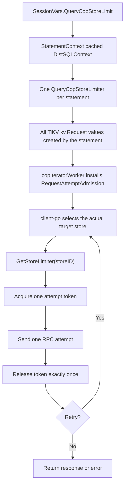

# Query-Level Per-Store Coprocessor Request Limiter

- Author(s): [Zhigao Tong](https://github.com/solotzg)
- Discussion PR: <https://github.com/pingcap/tidb/pull/69360>
- Tracking Issue: <https://github.com/pingcap/tidb/issues/69359>
- Related client-go PR: <https://github.com/tikv/client-go/pull/2026>

## Table of Contents

- [Introduction](#introduction)
- [Motivation or Background](#motivation-or-background)
    - [Goals](#goals)
    - [Non-Goals](#non-goals)
- [Detailed Design](#detailed-design)
    - [User Interface](#user-interface)
    - [Concurrency Semantics](#concurrency-semantics)
    - [Architecture](#architecture)
    - [Statement Lifetime and Ownership](#statement-lifetime-and-ownership)
    - [Limiter Implementation](#limiter-implementation)
    - [Request Attempt Admission in client-go](#request-attempt-admission-in-client-go)
    - [Retries](#retries)
    - [Cancellation and Errors](#cancellation-and-errors)
    - [Interaction with the Request-Local Limiter](#interaction-with-the-request-local-limiter)
    - [Observability](#observability)
    - [Compatibility and Rollout](#compatibility-and-rollout)
- [Test Design](#test-design)
    - [Functional Tests](#functional-tests)
    - [Scenario Tests](#scenario-tests)
    - [Compatibility Tests](#compatibility-tests)
    - [Benchmark Tests](#benchmark-tests)
- [Impacts & Risks](#impacts--risks)
    - [Impacts](#impacts)
    - [Risks](#risks)
- [Investigation & Alternatives](#investigation--alternatives)
- [Unresolved Questions](#unresolved-questions)

## Introduction

This document proposes a statement-scoped, per-store concurrency limit for TiKV
coprocessor request attempts. The limit applies after client-go selects the
actual target TiKV store, so synchronous requests, asynchronous requests, and
retries are all admitted against the correct store.

The feature adds the `tidb_query_cop_store_limit` system variable. Its value is
the maximum number of request attempts from one statement that may be in flight
to one TiKV store. The default is `15`; `0` disables the statement-level
per-store limit.

## Motivation or Background

`tidb_distsql_scan_concurrency` controls worker concurrency for one DistSQL
request. It does not provide a statement-wide per-store bound:

- one SQL statement can create multiple DistSQL requests, for example for
  partitioned or index-lookup execution;
- one DistSQL request can fan out to many regions and stores;
- client-go can retry an RPC after selecting a different store;
- a worker-concurrency limit does not directly describe the number of actual
  RPC attempts sent to one store.

Consequently, a single statement can create uneven pressure on individual TiKV
stores even when its DistSQL worker concurrency looks reasonable. A limit at the
request-attempt boundary provides a direct guardrail without changing planning
or result semantics.

### Goals

- Limit the number of in-flight TiKV coprocessor request attempts from one
  statement to each TiKV store.
- Apply admission to the actual store selected for every client-go attempt,
  including retries.
- Share the same per-store limit across all DistSQL requests belonging to the
  statement.
- Preserve prompt cancellation and release every acquired token exactly once.
- Keep the disabled path compatible with existing request-local limiting.
- Expose blocking admission wait in `EXPLAIN ANALYZE`.

### Non-Goals

- Limit aggregate traffic from all statements on one TiDB instance.
- Coordinate limits across TiDB instances.
- Provide a cluster-wide TiKV admission-control or resource-control policy.
- Limit TiFlash, TiDB endpoint, transactional KV, or non-coprocessor requests.
- Guarantee FIFO ordering or workload fairness between statements.
- Replace TiKV Resource Control, client-go's process-wide store limit, or
  `tidb_distsql_scan_concurrency`.
- Change SQL planning or the rows returned by a statement.

## Detailed Design

### User Interface

The feature introduces one system variable:

| Property | Value |
| --- | --- |
| Name | `tidb_query_cop_store_limit` |
| Scope | Global and Session |
| Type | Unsigned integer |
| Range | `0` to `256` |
| Default | `15` |
| `SET_VAR` hint | Supported |
| Meaning of `0` | Disable the statement-level per-store limiter |
| Meaning of `N > 0` | Allow at most `N` in-flight TiKV cop request attempts per store per statement |

Examples:

```sql
-- Change the value for subsequent statements in this session.
SET SESSION tidb_query_cop_store_limit = 8;

-- Disable the limiter for one statement.
SELECT /*+ SET_VAR(tidb_query_cop_store_limit=0) */ *
FROM t
WHERE id BETWEEN 1 AND 1000;

-- Use a stricter limit for one statement.
SELECT /*+ SET_VAR(tidb_query_cop_store_limit=2) */ *
FROM t
WHERE k > 100;
```

A global value becomes the default for new sessions. A session or `SET_VAR`
value is captured when the statement's DistSQL context is initialized. Changing
the variable does not resize a limiter already used by an executing statement.

### Concurrency Semantics

For a configured value `N`, the following invariant is maintained for every
statement and TiKV store ID:

```text
0 <= admitted_attempts(statement, store_id) <= N
```

An attempt starts when admission succeeds. It ends when that client-go attempt
finishes or when client-go aborts before sending it, for example because
client-go's process-wide store-token acquisition fails. The release happens
before a retry is admitted.

The key is the target TiKV store ID, not the region ID, store address, or proxy
store ID. Limiters are created lazily, so a statement allocates limiter state
only for stores that it attempts to access.

The limit is per statement. If `Q` statements on one TiDB instance all target
the same store, this design permits up to `Q * N` attempts in aggregate. An
instance-wide or cluster-wide limit is outside the initial scope.

### Architecture



The TiDB data flow is:

```text
SessionVars.QueryCopStoreLimit
    -> StatementContext.DistSQLContext.QueryCopStoreLimiter
    -> kv.Request.QueryCopStoreLimiter
    -> tikvrpc.Request.RequestAttemptAdmission
    -> client-go RegionRequestSender
    -> QueryCopStoreLimiter.GetStoreLimiter(actualStoreID)
```

No protobuf or TiKV server change is required.

### Statement Lifetime and Ownership

`session.GetDistSQLCtx()` creates the `QueryCopStoreLimiter` while initializing
the DistSQL context cached in `StatementContext`. Every call within the same
statement receives the same DistSQL context and therefore the same limiter.
This makes the limit span all DistSQL requests created by that statement.

`QueryCopStoreLimiter` owns a lazily populated map:

```go
type QueryCopStoreLimiter struct {
    limit  int
    stores sync.Map // storeID -> *CoprRequestLimiter
}
```

The map and its per-store limiters become unreachable when the statement
context and its responses are released. There is no background worker or
explicit limiter shutdown procedure.

### Limiter Implementation

`CoprRequestLimiter` is a fixed-capacity counting semaphore implemented by a
buffered channel:

```go
type CoprRequestLimiter struct {
    token chan struct{}
}
```

It provides:

- `TryAcquire()` for the uncontended fast path;
- `AcquireWithContext(ctx, done)` for blocking admission that observes both the
  request context and iterator shutdown;
- `Release()` to return one acquired token;
- `Capacity()` for inspection and tests.

`Release()` panics on a redundant release. This is an internal invariant check:
every successful acquire must have exactly one owner and exactly one release.

The channel implementation does not promise strict FIFO ordering among waiting
goroutines. The feature guarantees only the concurrency bound and cancellation
behavior.

### Request Attempt Admission in client-go

TiDB cannot reliably acquire the per-store token before calling client-go.
Region cache changes, replica selection, forwarding, retry, or leader changes
can make the final target store differ from TiDB's earlier expectation.

The associated client-go change adds:

```go
type RequestAttemptAdmissionFunc func(
    ctx context.Context,
    storeID uint64,
) (release func(), err error)
```

client-go calls this hook after selecting the actual target store and before
each synchronous or asynchronous RPC attempt. The hook receives the target
store ID rather than the proxy store ID.

If the hook returns a non-nil release function and no error, client-go calls the
release function exactly once after that attempt terminates. If a defensive
implementation returns both a release function and an error, client-go releases
the token immediately because no attempt will be sent.

Admission follows the request context. The per-attempt RPC timeout starts after
admission succeeds and therefore does not bound admission wait. This avoids
using up the RPC execution timeout while the request is intentionally queued,
but an outer statement timeout or cancellation still stops the wait.

Asynchronous sends acquire admission asynchronously instead of blocking the
caller of the asynchronous API.

### Retries

Each retry is a new request attempt:

1. client-go selects the store for the current attempt;
2. the attempt acquires that store's limiter;
3. client-go sends or aborts the attempt;
4. client-go releases the token;
5. retry processing selects a store again;
6. the next attempt is admitted against that newly selected store.

This ordering is important when a retry moves from store `A` to store `B`.
Holding the token for `A` while waiting for or sending to `B` would incorrectly
charge the old store and could leak capacity across retries.

### Cancellation and Errors

The blocking acquire observes two cancellation sources:

- the client-go request context;
- the cop iterator's `finishCh`.

If the request context is canceled, admission returns the context error. If the
iterator is already closing, TiDB uses an internal
`errCoprRequestLimiterFinished` sentinel and treats it as normal iterator
shutdown.

Cancellation before admission does not consume a token. Cancellation after
admission is handled by client-go's normal attempt cleanup and releases the
token exactly once.

An admission error terminates the client-go request without sending an RPC. The
existing TiDB send-error path converts and propagates non-shutdown errors.

### Interaction with the Request-Local Limiter

TiDB already has a request-local `CoprRequestLimiter` used by paths such as
merge-sort index lookup. The two limiter fields have explicit precedence:

```text
QueryCopStoreLimiter != nil
    -> use the statement per-store limiter
QueryCopStoreLimiter == nil && CoprRequestLimiter != nil
    -> use the request-local limiter
both nil
    -> no TiDB cop request admission
```

The limiters are not acquired together. Acquiring both would introduce
double-throttling and would make one scope hold capacity while waiting for
another scope. It would also make cancellation and tuning behavior harder to
explain.

This decision has an intentional consequence: with the default statement-level
limit enabled, the request-local aggregate limit becomes a fallback rather than
an additional bound. A statement can have up to `N` admitted attempts to each
of several stores, even if the request-local limiter would have imposed a lower
aggregate bound. The scenario and benchmark tests must cover this trade-off.

### Observability

TiDB records admission wait only when an acquire blocks:

```go
type LimiterWaitStats struct {
    TotalTime time.Duration
    MaxTime   time.Duration
}
```

- `TotalTime` is the sum of blocking waits across request attempts and cop
  iterators participating in the runtime-stat entry.
- `MaxTime` is the longest single blocking wait.
- Fast-path admission is not recorded as a wait.
- The initial design intentionally does not collect an admission count.

The response is closed before the final limiter statistics are collected. This
ordering waits for cop iterator workers to exit so their wait statistics are
complete.

When non-zero, the values are displayed in the cop task section of
`EXPLAIN ANALYZE`:

```text
limiter_wait:{total:432ms, max:17ms}
```

The initial implementation does not add limiter wait to statement summary,
slow-log fields, Prometheus metrics, or SQL status variables. Those consumers
would require statement-level aggregation independent of plan runtime stats.

### Compatibility and Rollout

#### SQL and plan compatibility

The limiter changes scheduling, not planning or row semantics. The system
variable is hint-updatable, but its value does not participate in physical plan
selection. Existing plan-cache behavior for `SET_VAR` applies.

The default value of `15` is a behavior change: statements that previously had
more than 15 concurrent attempts to one TiKV store will wait. They may therefore
have higher latency or reach an existing outer timeout. Setting the value to `0`
restores the disabled behavior.

#### TiKV and protocol compatibility

There is no request protobuf or TiKV server dependency. Old and new TiKV
versions behave identically because admission happens in TiDB and client-go.

The TiDB source change requires the client-go API introduced by the related
client-go PR. This is a compile-time dependency, not an on-wire rolling-upgrade
dependency.

#### Mixed TiDB versions

During a rolling TiDB upgrade, statements executed by upgraded TiDB instances
can be limited while statements executed by older TiDB instances are not. The
feature does not coordinate state between instances, so this difference is
expected until all TiDB instances run the new version.

#### TiFlash and other request types

The cop worker installs the admission callback only when the task store type is
TiKV. TiFlash and TiDB endpoint tasks remain unchanged. Transactional KV and
other client-go request types do not receive this callback.

## Test Design

### Functional Tests

TiDB limiter tests:

- capacity and fast-path acquire/release;
- blocking until another owner releases a token;
- request-context cancellation and iterator-finish cancellation;
- redundant-release invariant;
- concurrent acquire/release without token leaks;
- independent limiters for different store IDs;
- one shared limiter for all requests in one statement;
- `0` creates no statement-level limiter;
- default, global/session assignment, and `SET_VAR` behavior;
- propagation to TiKV requests and exclusion from TiFlash attempts;
- statement-level limiter precedence and request-local fallback;
- runtime-stat merge, clone, string formatting, and response-close ordering.

client-go tests:

- synchronous and asynchronous admission;
- admission rejection and context cancellation;
- release on store-token failure;
- exactly-once release for success and failure;
- retry admission using the newly selected store;
- release of the previous attempt before admitting a retry;
- asynchronous runtime statistics excluding admission wait.

Tests that assert blocking should use deterministic synchronization or
`testing/synctest`, not wall-clock sleeps as a scheduling precondition.

### Scenario Tests

- One statement fans out to many regions on one store and never exceeds `N`
  attempts.
- One statement targets several stores and can use up to `N` attempts
  independently on each store.
- Multiple DistSQL requests from one statement share the same per-store limit.
- A store change during retry releases the old store and acquires the new store.
- Query cancellation while admission is blocked returns promptly and leaks no
  tokens.
- Merge-sort index lookup behaves correctly with the statement-level limiter
  enabled and with it disabled.
- TiFlash queries remain unaffected.

A manual verification should run the same `EXPLAIN ANALYZE` workload with a
non-binding limit and a restrictive limit. The implementation PR observed:

```text
limit=16: limiter wait total=0ms, max=0ms
limit=1:  limiter wait total approximately 426ms to 439ms,
          max approximately 16ms to 17ms
```

This verifies that the limiter and its observability are exercised. It does not
by itself establish that `15` is the optimal default.

### Compatibility Tests

- Run against TiKV versions that do not know about this TiDB feature.
- Verify a mixed-version TiDB deployment does not require shared limiter state.
- Verify `SET_VAR(tidb_query_cop_store_limit=0)` restores the disabled path.
- Verify existing SQL result sets, transaction state, and error semantics are
  unchanged when admission is not canceled.
- Verify TiFlash, transactional KV, and non-coprocessor client requests do not
  install admission callbacks.

### Benchmark Tests

Measure at least:

- statement latency and throughput for limits `0`, `1`, `15`, and a
  non-binding value;
- TiKV CPU utilization and coprocessor queue pressure;
- foreground OLTP latency while one fan-out statement runs;
- one-store and multi-store data distributions;
- one statement with multiple DistSQL requests;
- limiter CPU and allocation overhead on the uncontended fast path;
- the aggregate-concurrency effect of replacing the merge-sort request-local
  limiter with the per-store limiter.

The benchmark should determine whether `15` is a safe default across common
cluster sizes and whether a lower or disabled default is more appropriate.

## Impacts & Risks

### Impacts

- A single statement can no longer issue an unbounded number of concurrent cop
  request attempts to one TiKV store.
- Pressure is distributed by actual target store rather than by region-worker
  assumptions in TiDB.
- Restrictive values trade statement latency for reduced instantaneous store
  pressure.
- Each statement allocates one small limiter object per TiKV store it touches.

### Risks

| Risk | Consequence | Mitigation |
| --- | --- | --- |
| Default `15` is too low for some workloads | Latency regression or existing outer timeouts | Benchmark common workloads; allow session and `SET_VAR` override; `0` disables |
| Per-statement scope is mistaken for store protection | Many concurrent statements can still overload one store | Document the scope; consider a separate instance-level policy |
| Request-local limiter is bypassed when the statement limiter is enabled | Aggregate cross-store concurrency can increase | Test merge-sort paths and benchmark multi-store fan-out |
| Admission wait is not bounded by per-attempt RPC timeout | An attempt can wait longer than its RPC timeout setting | Continue to honor statement/request cancellation and outer timeouts |
| Channel semaphore has no strict fairness guarantee | Some waiting attempts can experience longer waits | Track max wait; consider a fair queue only if starvation is observed |
| Limiter statistics are collected only by plan runtime stats | No statement-summary or instance-level view | Add a separate statement-level aggregation path in a follow-up |
| Missing release in a new client-go path | Token leak and eventual statement stall | Centralize exactly-once cleanup and cover every exit/retry path |
| Incorrect store identity | Charge the wrong limiter bucket | Acquire only after client-go selects the actual target store |

## Investigation & Alternatives

### Use `tidb_distsql_scan_concurrency`

This controls workers for one DistSQL request. It cannot provide a
statement-wide per-store attempt bound and does not observe client-go retries.
It remains useful for controlling scan execution concurrency but is not a
replacement for attempt admission.

### Acquire a store limiter in TiDB before `SendReqCtx`

TiDB can resolve a region and estimate a target store, but client-go owns final
replica selection and retries. The actual attempt can target another store.
Pre-acquisition would therefore charge stale or incorrect buckets. Moving the
hook into client-go is necessary for correct store attribution.

### Use only the request-local limiter

The existing request-local limiter can bound a group of cop iterators created
for one execution path, but it is neither statement-wide nor per store. It is
retained as the disabled-path fallback.

### Use one aggregate query limiter

An aggregate limiter bounds total attempts but cannot allow independent
capacity on healthy stores while one hot store is saturated. The per-store
model better matches the pressure being controlled.

### Acquire both statement-level and request-local limiters

Composition preserves both an aggregate and a per-store ceiling, but it adds a
second wait point and can hold capacity in one scope while waiting in the other.
The initial design chooses explicit precedence for simpler ownership and
cancellation. This choice must be validated for merge-sort index lookup.

### Add an instance-level per-store limiter

An instance-level limiter would protect a store from aggregate traffic across
statements on one TiDB node, which this design does not. It also introduces
fairness, configuration lifetime, and interaction questions with Resource
Control and client-go's process-wide store limit. It can be added as a separate
policy and composed at the request-attempt hook after those semantics are
defined.

## Unresolved Questions

- Is `15` a safe default for OLTP, analytical, and mixed workloads across common
  TiKV deployment sizes, or should the feature initially default to `0`?
- Should the merge-sort request-local aggregate limit remain active together
  with the per-store statement limit?
- Should limiter wait be added to statement summary, slow logs, or Prometheus
  metrics?
- Is an instance-level per-store ceiling needed in addition to the
  statement-level limit?
- Is non-FIFO semaphore admission sufficient, or do observed workloads require
  stronger fairness?
- Should a future version support TiFlash with a separate default and
  observability contract?
