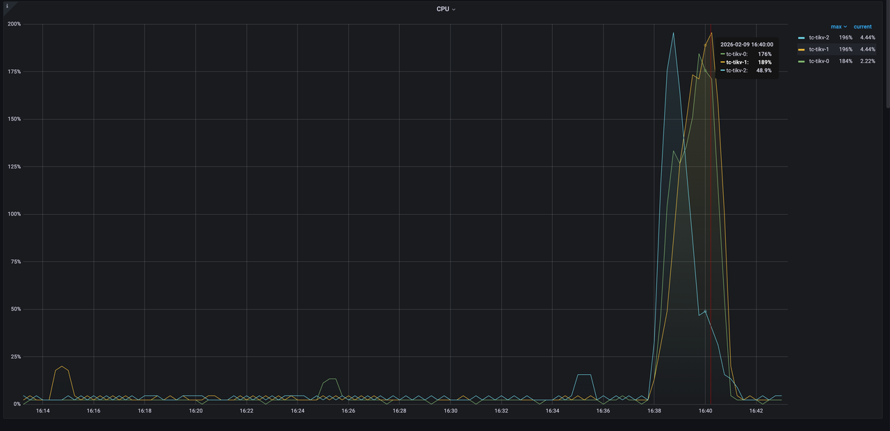
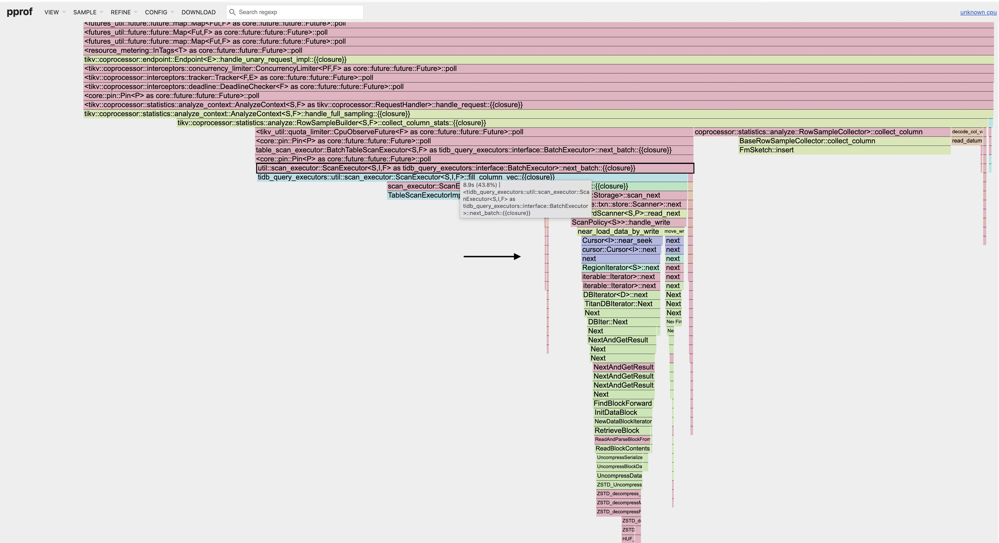
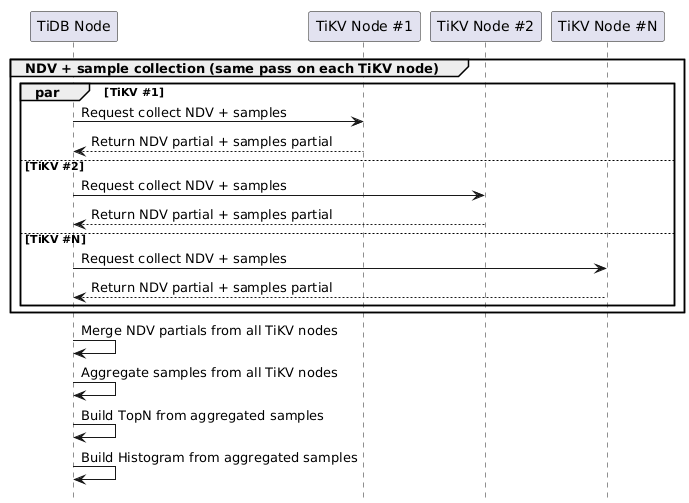
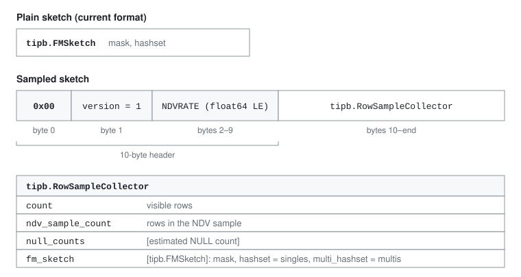

# Sampling-Based NDV for Large Tables

- Author(s): [0xPoe](https://github.com/0xPoe)
- Tracking Issue: https://github.com/pingcap/tidb/issues/67449

> [!WARNING]
> LLM disclosure: I wrote this document, AI polished the wording, and I reviewed the final text.

## Table of Contents

* [Introduction](#introduction)
* [Motivation](#motivation)
* [Detailed Design](#detailed-design)
    * [Current Implementation](#current-implementation)
    * [Design Challenges](#design-challenges)
        * [NDV Accuracy](#ndv-accuracy)
        * [Sampling in an LSM-Tree Storage Engine](#sampling-in-an-lsm-tree-storage-engine)
    * [Sampling-Based NDV Estimation](#sampling-based-ndv-estimation)
        * [GEE Estimator](#gee-estimator)
        * [Extend FMSketch to Track Singletons](#extend-fmsketch-to-track-singletons)
        * [Merge Across Regions](#merge-across-regions)
        * [NULL Counts and the NDV Population](#null-counts-and-the-ndv-population)
        * [Bounds from the Histogram Sample and the Schema](#bounds-from-the-histogram-sample-and-the-schema)
    * [Sampling on TiKV](#sampling-on-tikv)
    * [The NDVRATE Option](#the-ndvrate-option)
    * [Integrate with the Auto Analyze Priority Queue](#integrate-with-the-auto-analyze-priority-queue)
    * [Compatibility and Rollout](#compatibility-and-rollout)
        * [Response Format](#response-format)
        * [Persisted Sketches](#persisted-sketches)
        * [Partitioned Tables](#partitioned-tables)
* [Test Design](#test-design)
    * [Functional Tests](#functional-tests)
    * [Scenario Tests](#scenario-tests)
    * [Compatibility Tests](#compatibility-tests)
    * [Benchmark Tests](#benchmark-tests)
* [Impacts & Risks](#impacts--risks)
    * [Impacts](#impacts)
    * [Risks](#risks)
* [Unresolved Questions](#unresolved-questions)
* [Future Possibility](#future-possibility)
* [FAQ](#faq)

## Introduction

This document proposes sampling to reduce the cost of collecting statistics for large tables. Instead of processing every row to estimate the number of distinct values (NDV), TiKV selects rows at random before decoding their values, each independently with the same probability. This is called Bernoulli sampling.

We extend FMSketch to also track values seen only once, and TiDB uses the [GEE](https://dl.acm.org/doi/10.1145/335168.335230) estimator to estimate the NDV of the whole table. A new `NDVRATE` option turns this on, and Auto Analyze uses it for tables that are large or slow to analyze.

## Motivation

Collecting statistics for a large table can take a long time and use a lot of CPU, I/O, and network bandwidth, sometimes beyond the cluster's resource limits. This delays statistics collection and can slow down foreground queries that share those resources.

The CPU graph below shows a sharp rise in TiKV CPU usage during `ANALYZE`.



The flame graph below shows where TiKV spends CPU time. Wider blocks mean more CPU time is spent in that function and the functions it calls.



The profile points to three main areas of CPU usage:

1. `BatchExecutor::next_batch`: scans the table and copies the values into column vectors.
2. `FmSketch::insert`: hashes each value into the FMSketch that estimates the NDV.
3. `table::decode_col_value`: decodes string values to build their collation sort keys.

Most of this work serves NDV collection. TiDB needs only a small sample of rows to build TopN and histograms, but TiKV still processes every value of every analyzed column to estimate NDV. We therefore propose estimating NDV from a random sample of rows as well, so that TiKV can skip the values of rows outside the sample and `ANALYZE` on large tables uses less CPU.

## Detailed Design

### Current Implementation

To see where sampling can cut this cost, we first look at how `ANALYZE` collects statistics today. It collects NDV and row samples from each Region.

The [workflow](https://editor.plantuml.com/uml/fPCzQyCm48Pt_OeZMLfA1dliK5BZ8H2geGJlgdrH1BAawcJepw-i-ACrDKtfuE5EptlF2U4z1U53rsfsKGt2sThmPZ-OYqrLAoTCWCr9bGLms-06145VBS-FLJg7RJOWnofRPVA9oLSPFZ6SCUbjvu2N5Jm0YTPfXDfgZNLGri1TR24uGGInGb5VKWvC77JV2wxbDcEGTeVTqtN1HtZ5zmufZDE-AIZX4ODT2fH5puVEcuIbnOMUyR73K1CEodoXp6zJvlzGyeMItwRaVrQQ9driblNP5_GIlqO9pjws8BIUNuKMeMSfFKeHSBBydYawfHiuMSS7U9pHJ3VxAN1G5ApqebrDiNsyLly_V080) is as follows:



1. TiDB sends a request for each Region to the TiKV node that hosts it, and TiKV nodes process the requests in parallel.
2. In a single pass over the Region, TiKV inserts every value of each analyzed column and multi-column index into an FMSketch and collects row samples.
3. TiKV returns the partial FMSketches and samples to TiDB.
4. TiDB merges the FMSketches, combines the samples, and builds TopN and histograms from them.

Only step 2 processes every value, so that is where sampling can cut the cost.

### Design Challenges

Sampling can remove most of this work, but a sampling-based design must address two challenges: whether the NDV estimate stays accurate enough, and how to sample rows correctly in TiKV.

#### NDV Accuracy

The first question is whether we can accept a less accurate NDV. Today every value goes into the NDV calculation, so the NDV is very accurate in almost all cases. Sampling adds NDV error, which can affect the optimizer's choice of query plans. NDV accuracy is therefore the main criterion for deciding whether a sampling approach works.

#### Sampling in an LSM-Tree Storage Engine

The second challenge is how to sample rows correctly in TiKV. Engines with stable row identifiers can jump to a random row. An LSM tree spreads data across levels of SST files, and one key can have versions in several levels, so jumping to a random row is hard.

Instead, we need a streaming method. Bernoulli sampling reads rows in order and randomly decides whether to keep each one. It takes one pass and does not need the row count in advance.

We also need to support both TiKV engines: the classic engine keeps data in RocksDB on local disks, and the Cloud engine keeps it in remote object storage, where random access is expensive. Many large deployments still run the classic engine, so the design cannot target the Cloud engine alone.

Finally, the sample must follow MVCC rules: it must use the row versions that a query at the same snapshot would see. Otherwise, the sample would not reflect what a real query sees, and the NDV estimate would be wrong.

### Sampling-Based NDV Estimation

The simplest idea is to build an FMSketch from the row samples TiKV already returns: by default, about [110,000 rows](https://github.com/pingcap/tidb/blob/5acf6574288567bb473762e42313e25880c02419/pkg/executor/builder.go#L3454-L3457) for TopN and histograms.

But FMSketch only estimates the NDV of its input, so 110,000 rows can never show more than 110,000 distinct values. We need a separate, usually larger NDV sample, and an estimator that accounts for values the sample missed.

#### GEE Estimator

To estimate NDV from such a sample, we looked at how other databases do it. PostgreSQL uses the [Haas–Stokes Duj1 estimator](https://people.cs.umass.edu/~phaas/files/jasa3rj.pdf). We chose [GEE](https://dl.acm.org/doi/10.1145/335168.335230) (Guaranteed-Error Estimator), a similar estimator with better error guarantees:

```math
\widehat{D} = d + \left(\sqrt{\frac{N}{n}} - 1\right) f_1
```

| Symbol | Meaning |
| --- | --- |
| $N$ | Rows in the population: the estimated non-NULL rows for a single column, or all visible rows for a multi-column index. |
| $n$ | Rows in the NDV sample, drawn from the same population. |
| $d$ | Distinct values in the NDV sample. |
| $f_1$ | Distinct values that occur exactly once in the NDV sample. |

The first term, $d$, counts the distinct values in the sample. The second term estimates the distinct values the sample missed: values seen only once in the sample suggest many similar rare values that were not sampled, so GEE scales $f_1$ up by $\sqrt{N/n} - 1$. When every row is sampled, $n = N$, the second term is zero, and GEE returns the exact NDV $d$.

GEE's worst-case ratio error is about $\sqrt{N/n}$, and it occurs when nearly every value is distinct. Every sampled value is then a singleton, so GEE scales the sample NDV up by only $\sqrt{N/n}$, while the true NDV is about $N/n$ times the sample NDV. With 5% sampling, such a column can be underestimated by about $\sqrt{20} \approx 4.47$ times. When the schema guarantees that the values are unique, TiDB therefore uses the non-NULL row count instead of GEE, as described in [Bounds from the Histogram Sample and the Schema](#bounds-from-the-histogram-sample-and-the-schema).

#### Extend FMSketch to Track Singletons

GEE needs $f_1$, the number of singletons: values that appear exactly once in the sample. Sending every singleton from TiKV to TiDB would use too much network bandwidth and memory. We already face the same problem for NDV, and FMSketch already solves it, so we extend FMSketch to also estimate $f_1$.

Instead of every distinct value, [FMSketch](https://github.com/pingcap/tidb/blob/5acf6574288567bb473762e42313e25880c02419/pkg/statistics/fmsketch.go#L56-L66) keeps only the value hashes `h` with `h & mask == 0`, where $\mathrm{mask} = 2^L - 1$, and estimates NDV as their count times $2^L$. When the retained hashes exceed its [capacity of 10,000](https://github.com/pingcap/tidb/blob/5acf6574288567bb473762e42313e25880c02419/pkg/statistics/fmsketch.go#L36-L38), it increments $L$ and drops the hashes that no longer pass this filter.

There are two sampling steps here: Bernoulli sampling selects rows, and FMSketch keeps only some hashes of their values to limit memory use.

A hash depends only on the value, not on how often the value occurs, so every distinct value survives the filter with the same probability $2^{-L}$. Scaling the number of retained hashes by $2^L$ estimates $d$, and scaling the number of retained singletons the same way estimates $f_1$. **We only need to record which retained hashes appeared once and which appeared more than once.** The current FMSketch discards this information on insertion.

We split the retained hashes into two disjoint sets:

| Field | Meaning |
| --- | --- |
| `mask` | $2^L - 1$, shared by both sets. |
| `singles` | Retained hashes that appear exactly once in the NDV sample. |
| `multis` | Retained hashes that appear at least twice in the NDV sample. |
| `maxSize` | Maximum total number of hashes in `singles` and `multis`. |

On insertion, a hash seen again moves from `singles` to `multis`:

```text
insert(value):
    h = hash(value)
    if h & mask != 0:
        return
    if h in multis:
        return
    if h in singles:
        remove h from singles
        add h to multis
        return
    add h to singles
    while |singles| + |multis| > maxSize:
        mask = mask * 2 + 1
        retain only hashes satisfying h & mask == 0 in both sets
```

Values are hashed as before, including the collation rules for strings.

#### Merge Across Regions

TiKV builds a sketch for each Region, but GEE must see the whole table: adding per-Region NDVs or $f_1$ would count values that appear in several Regions more than once. **TiDB therefore merges the sketches and counters from all Regions first, then applies GEE once.** A value seen once in Region A and once in Region B is not a singleton in the combined sample, so the merge must compare hashes instead of adding counts:

```text
mask = max(mask_A, mask_B)
filter singles_A, multis_A, singles_B, and multis_B using mask

multis  = multis_A union multis_B union (singles_A intersect singles_B)
singles = (singles_A union singles_B) minus multis

while |singles| + |multis| > maxSize:
    mask = mask * 2 + 1
    retain only hashes satisfying h & mask == 0 in both sets
```

After the merge, the estimates are:

```math
\begin{aligned}
\widehat{d} &= (\mathrm{mask} + 1)\left(\lvert\mathrm{singles}\rvert + \lvert\mathrm{multis}\rvert\right) \\
\widehat{f}_1 &= (\mathrm{mask} + 1)\lvert\mathrm{singles}\rvert
\end{aligned}
```

$\widehat{d}$ is the same as today's NDV formula.

These are the $d$ and $f_1$ inputs to GEE. The merge requires sketches collected at the same `NDVRATE`, and each successful result must be merged exactly once: merging a result twice would move its singletons into `multis` and underestimate $f_1$.

The example below uses small integers as hashes and `maxSize = 2`, so the sketches level up (increase $L$) with only six values. The values occur a×1, b×2, c×3, d×1, e×1, and f×1, so the true $f_1$ is 4 and the true NDV is 6.

| Value | Hash | `h & 1` | `h & 3` |
| --- | --- | --- | --- |
| a | 4 | 0 | 0 |
| b | 3 | 1 | 3 |
| c | 8 | 0 | 0 |
| d | 6 | 0 | 2 |
| e | 5 | 1 | 1 |
| f | 9 | 1 | 1 |

Each of the three Regions reaches three hashes, exceeds `maxSize`, and levels up to `mask = 1`:

| Region | Values | Dropped at `mask = 1` | `singles` | `multis` |
| --- | --- | --- | --- | --- |
| 0 | a, b, c | b | {a, c} | {} |
| 1 | b, c, d | b | {c, d} | {} |
| 2 | c, e, f | e, f | {c} | {} |

Merging Regions 0 and 1 promotes `c`, a singleton on both sides, to `multis`. The result holds three hashes, so it levels up to `mask = 3`, which drops `d`. Merging Region 2 then changes nothing, because `c` is already in `multis`:

| Step | `mask` | `singles` | `multis` |
| --- | --- | --- | --- |
| Merge Regions 0 and 1, before leveling up | 1 | {a, d} | {c} |
| Merge Regions 0 and 1, after leveling up | 3 | {a} | {c} |
| Merge the result with Region 2 | 3 | {a} | {c} |

```math
\begin{aligned}
\widehat{f}_1 &= (\mathrm{mask} + 1)\lvert\mathrm{singles}\rvert = 4 \times 1 = 4 \\
\widehat{d} &= (\mathrm{mask} + 1)\left(\lvert\mathrm{singles}\rvert + \lvert\mathrm{multis}\rvert\right) = 4 \times 2 = 8
\end{aligned}
```

With only two retained hashes, these are rough estimates of the true values 4 and 6; a real sketch keeps up to 10,000 hashes. What matters is that the slightly extended sketch gives $f_1$ alongside NDV and stays mergeable, so TiDB can fold in every Region's result without extra memory pressure.

#### NULL Counts and the NDV Population

NDV counts only non-NULL values, so the $N$ and $n$ in GEE are non-NULL row counts. Sampling makes them harder to get: TiKV still counts every visible row, but it reads the values of sampled rows only, so it no longer knows exactly how many NULLs a column has.

TiKV therefore estimates the NULL count of each column from the sampled rows, scaling the NULLs it sees by visible rows / sampled rows. For example, if a Region has 1,000 visible rows, 50 of them are sampled, and 5 of those are NULL, TiKV reports about 100 NULLs. It estimates each column's total size the same way.

GEE does not need these NULL estimates. The sample is random, so its share of NULLs is about the same as the column's, which makes $N/n$ about equal to visible rows / sampled rows. TiDB adds up both row counts over all Regions and uses their ratio in GEE. It then clamps the estimate: never below the distinct values seen in the NDV sample, and never above the column's non-NULL rows.

#### Bounds from the Histogram Sample and the Schema

GEE can underestimate NDV. Two things TiDB already knows limit this.

First, the row sample for TopN and histograms is drawn separately and holds real values, so the NDV never falls below the distinct values in that sample. This matters when the NDV sample is small, such as in a small partition: without the bound, the histogram could hold more distinct values than its NDV, or lose its TopN and buckets entirely. The global merge applies the same bound.

Second, the schema can prove that values never repeat, which no sample can. **For a primary key or a unique index, TiDB uses the non-NULL row count as the NDV instead of GEE.** This removes GEE's worst case, and it matters most for partitioned tables, whose primary and unique keys include the partition columns and are therefore usually multi-column.

### Sampling on TiKV

With the estimator in place, we turn to where TiKV selects rows. The CPU profile in [Motivation](#motivation) shows that copying values into column vectors takes the largest share of CPU, so TiKV must decide on sampling before it copies values. This fits into the table scan, without changing the storage engine.

The table scan reads rows in [`fill_column_vec`](https://github.com/tikv/tikv/blob/2328c500488427de512da008a4822e422cbb3822/components/tidb_query_executors/src/util/scan_executor.rs#L110-L169), which takes each visible row from the existing MVCC-aware scanner and passes it to [`process_kv_pair`](https://github.com/tikv/tikv/blob/2328c500488427de512da008a4822e422cbb3822/components/tidb_query_executors/src/util/scan_executor.rs#L30-L41) to decode its values into column vectors. **TiKV makes the Bernoulli selection in `fill_column_vec`, before `process_kv_pair` decodes and copies the row's values**:

```text
for each visible row returned by the existing MVCC-aware scanner:
    count the visible row
    decide whether the row is selected for NDV
    if selected:
        materialize the required values
        update the extended FMSketches
        count the selected row for the NDV sample
```

The collector also keeps rows for TopN and histograms, selected independently of the NDV sample. Selecting rows at this point has these properties:

- It saves CPU in all three hot spots: the values of rows that neither sample needs are not copied into column vectors, decoded, or hashed into FMSketches.
- It works above the storage engine, so the same change applies to both the classic and Cloud engines.
- It keeps MVCC visibility and the row count: TiKV samples only visible rows and still counts all of them.
- TiKV still scans every row.

With this change, TiKV decodes, copies, and hashes only the values of rows that a sample needs, and TiDB turns the sampled sketches into an NDV estimate with GEE.

### The NDVRATE Option

Sampling trades NDV accuracy for speed, so it should not be used on every table. Small tables also gain little from it, because a full scan is already cheap. Manual `ANALYZE` therefore samples only when asked to, and Auto Analyze chooses sampling only for tables that are large or slow to analyze. To ask for sampling, we add an `NDVRATE` option:

```sql
ANALYZE TABLE table_name WITH 0.05 NDVRATE, 0.00001 SAMPLERATE;
```

`NDVRATE` controls the fraction of rows that TiKV processes for NDV. The existing `SAMPLERATE` controls the fraction returned to TiDB for TopN and histograms. These rates are independent: applying `SAMPLERATE` to rows already selected by `NDVRATE` would multiply them. **The implementation must preserve both requested rates.**

`NDVRATE` accepts values in `(0, 1]`. Without it, or at 1, `ANALYZE` uses the legacy full-input path. Multi-valued indexes and indexes on prefix or virtual columns are analyzed separately and always use full input.

Like `SAMPLERATE`, `NDVRATE` is saved in `mysql.analyze_options` when `tidb_persist_analyze_options` is ON, so a later `ANALYZE` without the option, including Auto Analyze, uses the same rate. `WITH 1 NDVRATE` saves full input, and `WITH DEFAULT NDVRATE` clears the saved rate. With dynamic partition pruning, the rate is a table option even when the statement names partitions, because the global merge needs one rate.

A new global variable, `tidb_enable_sampled_ndv`, turns sampling on or off for the whole cluster. It exists for rolling upgrades: older TiDB cannot read the sketches that sampling saves, and older TiKV cannot sample, so sampling should wait until the whole cluster is upgraded. [Compatibility and Rollout](#compatibility-and-rollout) describes its defaults. While it is OFF, `ANALYZE` reads every row and keeps any saved rate, and a statement that sets `NDVRATE` below 1 fails.

### Integrate with the Auto Analyze Priority Queue

Auto Analyze has to decide on its own when to sample. The row count is the natural signal, but it is not enough by itself, because the cost of `ANALYZE` also depends on cluster resources. Auto Analyze therefore uses both the row count and the previous `ANALYZE` duration.

**The priority queue uses `0.05 NDVRATE` when a table's row count exceeds the size threshold or its previous `ANALYZE` duration exceeds the duration threshold.** Two new global variables configure the thresholds:

| Proposed global variable | Initial value |
| --- | --- |
| `tidb_analyze_sampled_ndv_table_size_threshold` | `1000000000` rows |
| `tidb_analyze_sampled_ndv_duration_threshold` | `1800` seconds |

With these initial values, a table with more than 1 billion rows, or one whose latest `ANALYZE` ran for more than 30 minutes, uses `0.05 NDVRATE` when `tidb_enable_sampled_ndv` is ON.

- With `tidb_persist_analyze_options` ON, a table with a saved `NDVRATE`, including 1, keeps it and skips the thresholds.
- The row count comes from current table statistics, summed across partitions.
- The duration is how long the previous run took, including a run stopped by `tidb_max_auto_analyze_time`; for a partitioned table, it is the latest partition job's duration.
- Without a saved rate, a partitioned table with locked partitions uses the rate of their sketches instead, because those sketches cannot change.
- Setting a threshold to `0` disables that condition.

**Auto Analyze saves the rate it chooses, as a manual `ANALYZE` saves its options.** Without this, sampling would switch back and forth: a sampled run is faster, so the next run could fall below the duration threshold and return to full input, and on a partitioned table each switch reanalyzes every partition. The saved rate makes the choice stick, so later threshold changes do not affect a table that already samples. To change such a table, run `ANALYZE ... WITH DEFAULT NDVRATE` to let the thresholds decide again, or `WITH 1 NDVRATE` to keep full input. Turning `tidb_enable_sampled_ndv` OFF stops sampling for the whole cluster.

Partition jobs follow the precheck in [Partitioned Tables](#partitioned-tables). When the precheck expands one batch of a partition job to all partitions, later batches skip the partitions analyzed since the job started.

### Compatibility and Rollout

Sampled NDV changes both the TiKV response and the sketches TiDB saves. `ANALYZE` keeps running during rolling upgrades, so TiDB must handle responses and saved sketches from other versions. Both [TiUP](https://github.com/pingcap/tiup/blob/9f6ebb7edc26ca0ba53b9f4a70de22388f865910/pkg/cluster/spec/spec.go#L843-L873) and [TiDB Operator](https://docs.pingcap.com/tidb-in-kubernetes/stable/upgrade-a-tidb-cluster/#rolling-update-introduction) upgrade TiKV before TiDB by default.

- Old TiDB never requests sampling, so new TiKV returns legacy results.
- Old TiDB cannot read sampled sketches, so `tidb_enable_sampled_ndv` starts ON in new clusters and OFF in upgraded clusters; turn it ON only after the whole cluster is upgraded. The upgrade also adds an `ndv_rate` column to `mysql.analyze_options`.
- While the switch is OFF, upgraded TiDB does not request sampling. So even if TiDB is upgraded before TiKV, an `ANALYZE` during the TiKV upgrade never mixes legacy responses from old TiKV with sampled ones from new TiKV.

#### Response Format

The protocol lives in TiPB's `analyze.proto`:

| Field | Meaning |
| --- | --- |
| `AnalyzeColumnsReq.ndv_rate` (12) | A value in `(0, 1)` requests sampled NDV. |
| `RowSampleCollector.ndv_sample_count` (8) | Its presence marks a sampled response, even when the count is zero. |
| `FMSketch.multi_hashset` (3) | In a sampled response, `hashset` holds `singles` and `multi_hashset` holds `multis`. |

TiKV sets `ndv_sample_count` and `multi_hashset` only for sampling requests.

#### Persisted Sketches

TiDB saves FMSketches only for partitions, in the `value` column of `mysql.stats_fm_sketch`.

A sampled sketch needs more than a plain FMSketch: the global merge must check that every partition used the same `NDVRATE`, and GEE needs the row, sample, and NULL counts from collection time. Old TiDB must also never read a sampled sketch as a plain one: it would skip the unknown `multi_hashset` field, count only the `singles`, and get a wrong NDV without any error.

TiDB therefore saves a sampled sketch in a new format, while a plain sketch keeps its current one:



A protobuf message never starts with `0x00`, so old TiDB rejects this format instead of misreading it, and new TiDB tells the two formats apart by the first byte. Future changes to this format must bump the version byte rather than claim another leading byte, and TiDB rejects versions it does not know. Both formats share the existing `value` column, so the table schema does not change.

Statistics also move through JSON, for example with `LOAD STATS` and backups, so saved sketches must survive a dump and load. The dump keeps a plain sketch as an object in `fm_sketch`, as before, and writes a sampled sketch there as its encoded bytes. Old TiDB cannot parse the string form, so it rejects a sampled dump instead of misreading it. On load, TiDB checks every sketch before it writes any statistics, then saves the partition sketches back so that later global merges can use them. Histograms, TopN, and the final NDV keep their formats.

#### Partitioned Tables

With dynamic partition pruning, global statistics merge the saved sketches of all partitions for each column and index, and a sampled merge then applies GEE once. GEE assumes a single sampling rate, so every sketch merged for a column or index must use the same mode (full input or sampled) and, if sampled, the same `NDVRATE`. As in a full-input merge, a partition without a sketch is left out, so the estimate covers the partitions that have one.

Before `ANALYZE` runs, TiDB checks the sketch headers of the partitions whose saved statistics it reuses: those outside this run and those that are locked. It compares them with the rate this run uses, including a saved one.

- If any of them differs in mode or rate, TiDB expands the job to all partitions and warns which partitions were added and why.
- A locked partition cannot be analyzed again, so a rate mismatch there fails `ANALYZE` before it scans any data. Without a saved rate, Auto Analyze avoids the mismatch by using the locked partitions' rate.
- A partition without a sketch, for example after `ADD`, `TRUNCATE`, `REORGANIZE`, or `EXCHANGE PARTITION`, triggers neither expansion nor an error in either mode, because the global merge leaves it out until it is analyzed.
- Multi-valued indexes and indexes on prefix or virtual columns are always analyzed with full input, even in a sampled run. Their full-input sketches are therefore expected and never count as a mismatch.

The precheck reads only what is already saved, and a concurrent `ANALYZE` with another rate can still change other partitions' sketches after the check. The global merge therefore checks the rates of the sketches it actually merges. If they differ, `ANALYZE` returns an error and keeps the old global statistics, while the partition statistics this run already saved remain.

## Test Design

### Functional Tests

- **FMSketch:** singles and repeated hashes stay correct under insertion, mask leveling, and merges in any order.
- **Estimation:** GEE on merged sketches, the $N/n$ ratio, clamping, empty NDV samples, and the bounds from the histogram sample and the schema, in partitions and in the global merge.
- **TiKV and the Cloud engine:** only rows selected for NDV update the sketches, the NDV and histogram samples are drawn independently, and NULL counts and sizes are scaled to all visible rows.
- **SQL:** the `NDVRATE` option and switch; saving, reusing, and clearing saved rates; partition prechecks, expansion warnings, locked partitions, and indexes that always use full input; merge-time rate checks in both the synchronous and asynchronous global merge, where a failed merge keeps the old global statistics.

### Scenario Tests

- **Partitioned tables over time:** partial `ANALYZE`, Auto Analyze batches, partition DDL, locked partitions, and a change of `NDVRATE`; check when TiDB expands a run and that the global NDV stays consistent.
- **Auto Analyze decisions:** tables that cross the size or duration threshold, saved rates including 1, `WITH DEFAULT NDVRATE`, and `tidb_enable_sampled_ndv` turned OFF.

### Compatibility Tests

- **Upgrade:** an upgraded cluster adds the `ndv_rate` column and starts with `tidb_enable_sampled_ndv` OFF, so `ANALYZE` keeps using full input until the switch is turned ON.
- **Persisted data:** old TiDB rejects sampled sketches, both saved and in JSON dumps, and JSON dumps keep sampled sketches intact.

### Benchmark Tests

Compare TiKV CPU, `ANALYZE` duration, NDV error, and query plans with full input, across table sizes, sampling rates, and data that stresses sampling: skewed, near-unique, and NULL-heavy columns, multi-column indexes, and partitioned tables.

## Impacts & Risks

### Impacts

- Sampling reduces the values that TiKV decodes, copies, and hashes, but TiKV still scans every row.
- NULL counts and column sizes become estimates.
- With dynamic partition pruning, a partial `ANALYZE` may expand to all partitions, which increases its work.
- Once Auto Analyze samples a table, it keeps sampling even if the table later shrinks or the thresholds change, until the saved rate is cleared or overridden.

### Risks

- Sampling adds NDV error, which can change query plans.
- If a concurrent `ANALYZE` with another `NDVRATE` changes partition sketches after the precheck, the statement fails at the global merge: the partition statistics it has already saved remain, but the global statistics stay old.
- If neither sample of a column holds a non-NULL value, its NDV is zero even when the column is not empty.

## Unresolved Questions

- Should Auto Analyze keep a fixed 5% `NDVRATE` or adapt it to table size and data distribution?
- What NDV accuracy and query-plan regression limits should gate wider adoption?

## Future Possibility

Sampling inside the storage engine could reduce physical I/O.

## FAQ

- What is the relationship between `NDVRATE` and `SAMPLERATE`?

  They are independent. `NDVRATE` controls how many rows TiKV processes for NDV, including hashing their values into sketches, while `SAMPLERATE` controls how many rows are returned to TiDB for TopN and histograms.

- Does sampled NDV reduce the data that TiKV reads?

  No. TiKV still scans and counts every visible row; it only skips decoding, copying, and hashing the values of rows that are not selected. Engine-level sampling that reduces physical I/O is left as a [future possibility](#future-possibility).
