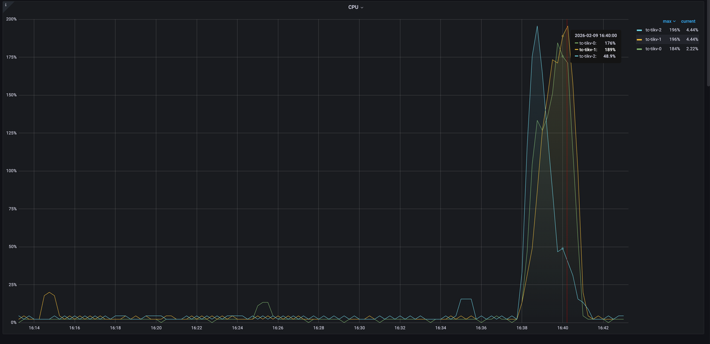
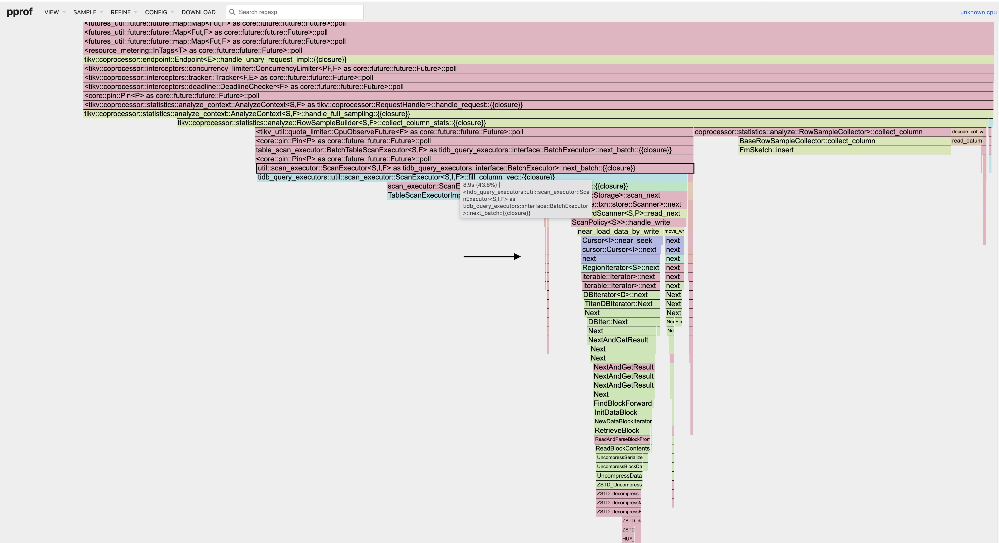
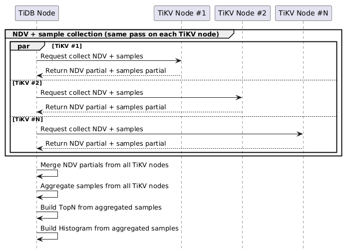
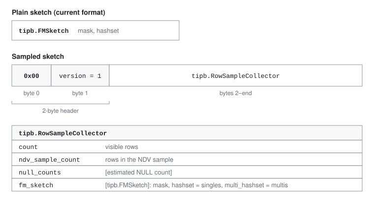

# Sampling-Based NDV for Large Tables

- Author(s): [0xPoe](https://github.com/0xPoe)
- Tracking Issue: https://github.com/pingcap/tidb/issues/67449

> [!WARNING]
> LLM disclosure: I wrote this document, AI polished the wording, and I reviewed the final text.

## Table of Contents

* [Introduction](#introduction)
* [Motivation](#motivation)
* [Detailed Design](#detailed-design)
    * [Current Implementation](#current-implementation)
    * [Design Challenges](#design-challenges)
        * [NDV Accuracy](#ndv-accuracy)
        * [Sampling in an LSM-Tree Storage Engine](#sampling-in-an-lsm-tree-storage-engine)
    * [Sampling-Based NDV Estimation](#sampling-based-ndv-estimation)
        * [GEE Estimator](#gee-estimator)
        * [Extend FMSketch to Track Singletons](#extend-fmsketch-to-track-singletons)
        * [Merge Across Regions](#merge-across-regions)
        * [NULL Counts and the NDV Population](#null-counts-and-the-ndv-population)
        * [Unique Values](#unique-values)
    * [Sampling on TiKV](#sampling-on-tikv)
    * [Choose the Sampling Rate](#choose-the-sampling-rate)
    * [The NDVRATE Option](#the-ndvrate-option)
    * [Compatibility and Rollout](#compatibility-and-rollout)
        * [Response Format](#response-format)
        * [Persisted Sketches](#persisted-sketches)
        * [Partitioned Tables](#partitioned-tables)
* [Test Design](#test-design)
    * [Functional Tests](#functional-tests)
    * [Scenario Tests](#scenario-tests)
    * [Compatibility Tests](#compatibility-tests)
    * [Benchmark Tests](#benchmark-tests)
* [Impacts & Risks](#impacts--risks)
    * [Impacts](#impacts)
    * [Risks](#risks)
* [Unresolved Questions](#unresolved-questions)
* [Future Possibility](#future-possibility)
* [FAQ](#faq)

## Introduction

This document proposes sampling to reduce the cost of collecting statistics for large tables. Instead of processing every row to estimate the number of distinct values (NDV), TiKV selects rows at random before decoding their values, each independently with the same probability.

We extend [FMSketch](https://github.com/pingcap/tidb/blob/5acf6574288567bb473762e42313e25880c02419/pkg/statistics/fmsketch.go#L40-L55) to also track values seen only once, and TiDB uses the [GEE](https://dl.acm.org/doi/10.1145/335168.335230) estimator to estimate the NDV of the whole table. `ANALYZE` samples only tables and partitions above a configurable row count, at a rate chosen from their size, and a new `NDVRATE` option sets the rate by hand.

## Motivation

Collecting statistics for a large table can take a long time and use a lot of CPU, I/O, and network bandwidth, sometimes beyond the cluster's resource limits. This delays statistics collection and can slow down foreground queries that share those resources.

The CPU graph below shows a sharp rise in TiKV CPU usage during `ANALYZE`.



The flame graph below shows where TiKV spends CPU time. Wider blocks mean more CPU time is spent in that function and the functions it calls.



The profile points to three main areas of CPU usage:

1. `BatchExecutor::next_batch`: scans the table and copies the values into column vectors.
2. `FmSketch::insert`: hashes each value into the FMSketch that estimates the NDV.
3. `table::decode_col_value`: decodes string values to build their collation sort keys.

Most of this work serves NDV collection. TiDB needs only a small sample of rows to build TopN and histograms, but TiKV still processes every value of every analyzed column to estimate NDV. We therefore propose estimating NDV from a random sample of rows as well, so that TiKV can skip the values of rows outside the sample and `ANALYZE` on large tables uses less CPU.

## Detailed Design

### Current Implementation

To see where sampling can cut this cost, we first look at how `ANALYZE` collects statistics today. It collects NDV and row samples from each Region.

The [workflow](https://editor.plantuml.com/uml/fPCzQyCm48Pt_OeZMLfA1dliK5BZ8H2geGJlgdrH1BAawcJepw-i-ACrDKtfuE5EptlF2U4z1U53rsfsKGt2sThmPZ-OYqrLAoTCWCr9bGLms-06145VBS-FLJg7RJOWnofRPVA9oLSPFZ6SCUbjvu2N5Jm0YTPfXDfgZNLGri1TR24uGGInGb5VKWvC77JV2wxbDcEGTeVTqtN1HtZ5zmufZDE-AIZX4ODT2fH5puVEcuIbnOMUyR73K1CEodoXp6zJvlzGyeMItwRaVrQQ9driblNP5_GIlqO9pjws8BIUNuKMeMSfFKeHSBBydYawfHiuMSS7U9pHJ3VxAN1G5ApqebrDiNsyLly_V080) is as follows:



1. TiDB sends a request for each Region to the TiKV node that hosts it, and TiKV nodes process the requests in parallel.
2. In a single pass over the Region, TiKV inserts every value of each analyzed column and multi-column index into an FMSketch and collects row samples.
3. TiKV returns the partial FMSketches and samples to TiDB.
4. TiDB merges the FMSketches, combines the samples, and builds TopN and histograms from them.

Only step 2 processes every value, so that is where sampling can cut the cost.

### Design Challenges

Sampling can remove most of this work, but a sampling-based design must address two challenges: whether the NDV estimate stays accurate enough, and how to sample rows correctly in TiKV.

#### NDV Accuracy

The first question is whether we can accept a less accurate NDV. Today every value goes into the NDV calculation, so the NDV is very accurate in almost all cases. Sampling adds NDV error, which can affect the optimizer's choice of query plans. NDV accuracy is therefore the main criterion for deciding whether a sampling approach works.

#### Sampling in an LSM-Tree Storage Engine

The second challenge is how to sample rows correctly in TiKV. In a heap-based engine such as PostgreSQL, a table is a numbered sequence of pages, so `ANALYZE` can read randomly chosen pages directly. TiKV has no such numbering: rows are keys in an LSM tree, and keys are spread unevenly, so seeking to a random key would favor rows that follow large gaps. Each seek also merges memtables and SST files across levels and checks the row's MVCC versions against the snapshot, so it costs more than reading a page in a heap or a B-tree.

Instead, we need a streaming method. Bernoulli sampling reads rows in order and randomly decides whether to keep each one. It takes one pass and does not need the row count in advance.

We also need to support both TiKV engines: the classic engine keeps data in RocksDB on local disks, and the Cloud engine keeps it in remote object storage, where random access is expensive. Many large deployments still run the classic engine, so the design cannot target the Cloud engine alone.

Finally, the sample must follow MVCC rules: it must use the row versions that a query at the same snapshot would see. Otherwise, the sample would not reflect what a real query sees, and the NDV estimate would be wrong.

### Sampling-Based NDV Estimation

The simplest idea is to build an FMSketch from the row samples TiKV already returns: by default, about [110,000 rows](https://github.com/pingcap/tidb/blob/5acf6574288567bb473762e42313e25880c02419/pkg/executor/builder.go#L3454-L3457) for TopN and histograms.

But FMSketch only estimates the NDV of its input, so 110,000 rows can never show more than 110,000 distinct values. We need a separate, usually larger NDV sample, and an estimator that accounts for values the sample missed.

#### GEE Estimator

To estimate NDV from such a sample, we looked at how other databases do it. PostgreSQL and MariaDB use the [Haas–Stokes Duj1 estimator](https://people.cs.umass.edu/~phaas/files/jasa3rj.pdf), and MySQL uses [GEE](https://dl.acm.org/doi/10.1145/335168.335230) (Guaranteed-Error Estimator) for the distinct values in its histograms. We chose GEE, which has better error guarantees than Duj1:

```math
\widehat{D} = d + \left(\sqrt{\frac{N}{n}} - 1\right) f_1
```

| Symbol | Meaning |
| --- | --- |
| $N$ | Rows in the population: the estimated non-NULL rows for a single column, or all visible rows for a multi-column index. |
| $n$ | Rows in the NDV sample, drawn from the same population. |
| $d$ | Distinct values in the NDV sample. |
| $f_1$ | Distinct values that occur exactly once in the NDV sample. |

The first term, $d$, counts the distinct values in the sample. The second term estimates the distinct values the sample missed: values seen only once in the sample suggest many similar rare values that were not sampled, so GEE scales $f_1$ up by $\sqrt{N/n} - 1$. When every row is sampled, $n = N$, the second term is zero, and GEE returns the exact NDV $d$.

Put another way, splitting $d$ into the $d - f_1$ values seen more than once and the $f_1$ values seen exactly once:

```math
\widehat{D} = (d - f_1) + \sqrt{N/n}\, f_1
```

Each value seen more than once counts as one value, and each value seen exactly once counts as $\sqrt{N/n}$ values, because it stands for similar values that the sample missed. With a sampling rate $r$, $N/n$ is about $1/r$, so a value seen once counts about 4.47 at 5%, 2 at 25%, and 1 when every row is read.

GEE's worst-case ratio error is about $\sqrt{N/n}$, and it occurs when nearly every value is distinct. Every sampled value is then a singleton, so GEE scales the sample NDV up by only $\sqrt{N/n}$, while the true NDV is about $N/n$ times the sample NDV. With 5% sampling, such a column can be underestimated by about $\sqrt{20} \approx 4.47$ times. When the schema guarantees that the values are unique, TiDB therefore uses the non-NULL row count instead of GEE, as described in [Unique Values](#unique-values). GEE can also overestimate: a column whose values each appear about $N/n$ times comes out high, because many of its values are sampled once although few were missed, by up to about 2 times with 5% sampling, 1.5 times with 10%, and 1.25 times with 20%.

#### Extend FMSketch to Track Singletons

GEE needs $f_1$, the number of singletons: values that appear exactly once in the sample. Sending every singleton from TiKV to TiDB would use too much network bandwidth and memory. We already face the same problem for NDV, and FMSketch already solves it, so we extend FMSketch to also estimate $f_1$.

Instead of every distinct value, [FMSketch](https://github.com/pingcap/tidb/blob/5acf6574288567bb473762e42313e25880c02419/pkg/statistics/fmsketch.go#L56-L66) keeps only the value hashes `h` with `h & mask == 0`, where $\mathrm{mask} = 2^L - 1$, and estimates NDV as their count times $2^L$. When the retained hashes exceed its [capacity of 10,000](https://github.com/pingcap/tidb/blob/5acf6574288567bb473762e42313e25880c02419/pkg/statistics/fmsketch.go#L36-L38), it increments $L$ and drops the hashes that no longer pass this filter.

There are two sampling steps here: Bernoulli sampling selects rows, and FMSketch keeps only some hashes of their values to limit memory use.

A hash depends only on the value, not on how often the value occurs, so every distinct value survives the filter with the same probability $2^{-L}$. Scaling the number of retained hashes by $2^L$ estimates $d$, and scaling the number of retained singletons the same way estimates $f_1$. **We only need to record which retained hashes appeared once and which appeared more than once.** The current FMSketch discards this information on insertion.

To get $f_1$, we therefore split the retained hashes into two disjoint sets. Counting `singles` gives $f_1$, and counting `singles` and `multis` together gives $d$, as the single set does today. The sketch holds:

| Field | Meaning |
| --- | --- |
| `mask` | $2^L - 1$, shared by both sets. |
| `singles` | Retained hashes that appear exactly once in the NDV sample. |
| `multis` | Retained hashes that appear at least twice in the NDV sample. |
| `maxSize` | Maximum total number of hashes in `singles` and `multis`. |

On insertion, a hash seen again moves from `singles` to `multis`:

```text
insert(value):
    h = hash(value)
    if h & mask != 0:
        return
    if h in multis:
        return
    if h in singles:
        remove h from singles
        add h to multis
        return
    add h to singles
    while |singles| + |multis| > maxSize:
        mask = mask * 2 + 1
        retain only hashes satisfying h & mask == 0 in both sets
```

Values are hashed as before, including the collation rules for strings.

#### Merge Across Regions

TiKV builds a sketch for each Region, but GEE must see the whole table: adding per-Region NDVs or $f_1$ would count values that appear in several Regions more than once. **TiDB therefore merges the sketches and counters from all Regions first, then applies GEE once.** A value seen once in Region A and once in Region B is not a singleton in the combined sample, so the merge must compare hashes instead of adding counts:

```text
mask = max(mask_A, mask_B)
filter singles_A, multis_A, singles_B, and multis_B using mask

multis  = multis_A union multis_B union (singles_A intersect singles_B)
singles = (singles_A union singles_B) minus multis

while |singles| + |multis| > maxSize:
    mask = mask * 2 + 1
    retain only hashes satisfying h & mask == 0 in both sets
```

After the merge, the estimates are:

```math
\begin{aligned}
\widehat{d} &= (\mathrm{mask} + 1)\left(\lvert\mathrm{singles}\rvert + \lvert\mathrm{multis}\rvert\right) \\
\widehat{f}_1 &= (\mathrm{mask} + 1)\lvert\mathrm{singles}\rvert
\end{aligned}
```

$\widehat{d}$ is the same as today's NDV formula.

These are the $d$ and $f_1$ inputs to GEE. All Regions of one request are sampled at the same rate, and each successful result must be merged exactly once: merging a result twice would move its singletons into `multis` and underestimate $f_1$. The global merge of a partitioned table also accepts full-input sketches and sketches of other rates, as described in [Partitioned Tables](#partitioned-tables).

The example below uses small integers as hashes and `maxSize = 2`, so the sketches level up (increase $L$) with only six values. The values occur a×1, b×2, c×3, d×1, e×1, and f×1, so the true $f_1$ is 4 and the true NDV is 6.

| Value | Hash | `h & 1` | `h & 3` |
| --- | --- | --- | --- |
| a | 4 | 0 | 0 |
| b | 3 | 1 | 3 |
| c | 8 | 0 | 0 |
| d | 6 | 0 | 2 |
| e | 5 | 1 | 1 |
| f | 9 | 1 | 1 |

Each of the three Regions reaches three hashes, exceeds `maxSize`, and levels up to `mask = 1`:

| Region | Values | Dropped at `mask = 1` | `singles` | `multis` |
| --- | --- | --- | --- | --- |
| 0 | a, b, c | b | {a, c} | {} |
| 1 | b, c, d | b | {c, d} | {} |
| 2 | c, e, f | e, f | {c} | {} |

Merging Regions 0 and 1 promotes `c`, a singleton on both sides, to `multis`. The result holds three hashes, so it levels up to `mask = 3`, which drops `d`. Merging Region 2 then changes nothing, because `c` is already in `multis`:

| Step | `mask` | `singles` | `multis` |
| --- | --- | --- | --- |
| Merge Regions 0 and 1, before leveling up | 1 | {a, d} | {c} |
| Merge Regions 0 and 1, after leveling up | 3 | {a} | {c} |
| Merge the result with Region 2 | 3 | {a} | {c} |

```math
\begin{aligned}
\widehat{f}_1 &= (\mathrm{mask} + 1)\lvert\mathrm{singles}\rvert = 4 \times 1 = 4 \\
\widehat{d} &= (\mathrm{mask} + 1)\left(\lvert\mathrm{singles}\rvert + \lvert\mathrm{multis}\rvert\right) = 4 \times 2 = 8
\end{aligned}
```

With only two retained hashes, these are rough estimates of the true values 4 and 6; a real sketch keeps up to 10,000 hashes. What matters is that the slightly extended sketch gives $f_1$ alongside NDV and stays mergeable, so TiDB can fold in every Region's result without extra memory pressure.

#### NULL Counts and the NDV Population

NDV counts only non-NULL values, so the $N$ and $n$ in GEE are non-NULL row counts. Sampling makes them harder to get: TiKV still counts every visible row, but it reads the values of sampled rows only, so it no longer knows exactly how many NULLs a column has.

TiKV therefore estimates the NULL count of each column from the sampled rows, scaling the NULLs it sees by visible rows / sampled rows. For example, if a Region has 1,000 visible rows, 50 of them are sampled, and 5 of those are NULL, TiKV reports about 100 NULLs. It estimates each column's total size the same way.

GEE does not need these NULL estimates. The sample is random, so its share of NULLs is about the same as the column's, which makes $N/n$ about equal to visible rows / sampled rows. TiDB adds up both row counts over all Regions and uses their ratio in GEE. It then clamps the estimate: never below the distinct values seen in the NDV sample, and never above the column's non-NULL rows.

#### Unique Values

The schema can prove that values never repeat, which no sample can. **For a column or index that the schema keeps unique, TiDB uses the non-NULL row count as the NDV instead of GEE.** This covers an integer primary key, the column of a single-column unique index without a prefix or condition, and a unique index without a condition. Tuples with a NULL may repeat, so a multi-column unique index qualifies only when all its columns are NOT NULL, as in a primary key. This removes GEE's worst case, and it matters most for partitioned tables, whose primary and unique keys include the partition columns and are therefore usually multi-column.

### Sampling on TiKV

With the estimator in place, we turn to where TiKV selects rows. The CPU profile in [Motivation](#motivation) shows that copying values into column vectors takes the largest share of CPU, so TiKV must decide on sampling before it copies values. This fits into the table scan, without changing the storage engine.

The table scan reads rows in [`fill_column_vec`](https://github.com/tikv/tikv/blob/2328c500488427de512da008a4822e422cbb3822/components/tidb_query_executors/src/util/scan_executor.rs#L110-L169), which takes each visible row from the existing MVCC-aware scanner and passes it to [`process_kv_pair`](https://github.com/tikv/tikv/blob/2328c500488427de512da008a4822e422cbb3822/components/tidb_query_executors/src/util/scan_executor.rs#L30-L41) to decode its values into column vectors. **TiKV makes the Bernoulli selection in `fill_column_vec`, before `process_kv_pair` decodes and copies the row's values**:

```text
for each visible row returned by the existing MVCC-aware scanner:
    count the visible row
    decide whether the row is selected for NDV
    if selected:
        materialize the required values
        update the extended FMSketches
        count the selected row for the NDV sample
        offer the row to the TopN and histogram sample
```

**TopN and histograms sample only the rows selected for NDV.** With `SAMPLERATE`, TiKV keeps each of these rows with probability `SAMPLERATE / NDVRATE`, so every visible row still enters that sample with probability `SAMPLERATE`. With `WITH N SAMPLES`, the reservoir sees only these rows. TiDB keeps the NDV rate high enough for both, as described in [Choose the Sampling Rate](#choose-the-sampling-rate). Selecting rows at this point has these properties:

- It saves CPU in all three hot spots: the values of rows outside the NDV sample are not copied into column vectors, decoded, or hashed into FMSketches.
- It works above the storage engine, so the same change applies to both the classic and Cloud engines.
- It keeps MVCC visibility and the row count: TiKV samples only visible rows and still counts all of them.
- It still scans every row, so each visible row has the same chance to be selected. With `SAMPLERATE`, each visible row also has the same chance as before to enter the TopN and histogram sample, so NDV sampling has no side effect on them.

With this change, TiKV decodes, copies, and hashes only the values of rows in the NDV sample, and TiDB turns the sampled sketches into an NDV estimate with GEE.

### Choose the Sampling Rate

Sampling trades NDV accuracy for speed, and small tables gain little from it, because a full scan is already cheap. `ANALYZE` therefore samples only large tables, at a rate chosen from their size. A new global variable, `tidb_analyze_sampled_ndv_threshold`, sets the row count $T$ above which sampling starts; `0` turns sampling off rather than sampling every table. The variable is global only, so a session cannot turn sampling on before the whole cluster is upgraded. [Compatibility and Rollout](#compatibility-and-rollout) describes its initial values.

The rule works on physical tables: a non-partitioned table, or one partition of a partitioned table. **Each physical table chooses its own rate from its current row count $M$:**

```math
r = \min\left(1,\ \max\left(0.05,\ \frac{T}{M}\right)\right)
```

- With at most $T$ rows, a physical table uses full input, as today.
- Between $T$ and $20T$ rows, the NDV sample holds $T$ rows, so processing values costs about as much as a full-input `ANALYZE` of $T$ rows. TiKV still scans every row.
- Above $20T$ rows, the rate stays at 0.05. Below that rate, scanning every row dominates the duration, so a lower rate saves little more time, while the error for nearly unique columns keeps growing as $\sqrt{1/r}$.

TiDB takes $M$ from the table statistics or, as it already does to choose `SAMPLERATE`, from the approximate count in PD when the statistics count is far smaller, for example right after a physical import. The rate changes continuously with the row count, so the rule adds no jumps to a table's NDV as the table grows. The initial $T$, 500,000,000 rows, keeps tables up to that size on full input and halves the values processed at 1,000,000,000 rows, about where a full-input `ANALYZE` of one table or partition becomes slow in practice. Partitions choose their rates independently, because the global merge accepts any mix of rates, as described in [Partitioned Tables](#partitioned-tables).

An `ANALYZE` with no given or saved `NDVRATE`, manual or automatic, applies this rule and does not save the rate it chooses, so a table always follows its size and the current $T$.

TopN and histograms sample only the rows selected for NDV, so the NDV rate must cover them: TiDB raises it to at least the `SAMPLERATE` in use, and with `WITH N SAMPLES` to at least $N/M$ so that the NDV sample holds about $N$ rows, and returns a note with the raised rate. With the default $T$ the rule's rate is always higher, so only a small $T$ or a small `NDVRATE` is raised.

### The NDVRATE Option

To set the rate by hand, we add an `NDVRATE` option:

```sql
ANALYZE TABLE table_name WITH 0.05 NDVRATE, 0.00001 SAMPLERATE;
```

`NDVRATE` controls the fraction of rows that TiKV processes for NDV. The existing `SAMPLERATE` still controls the fraction returned to TiDB for TopN and histograms: TiKV draws those rows from the NDV sample at `SAMPLERATE / NDVRATE`, so both rates hold. **A statement that sets `NDVRATE` below `SAMPLERATE` therefore fails.** In other cases, such as a saved `NDVRATE` or an adjusted `SAMPLERATE`, TiDB raises the NDV rate, as described in [Choose the Sampling Rate](#choose-the-sampling-rate).

`NDVRATE` accepts values in `(0, 1]`, including values below 0.05; at 1, `ANALYZE` uses the legacy full-input path. It replaces only the rate from the rule: physical tables with at most $T$ rows still use full input, and if no physical table has more than $T$ rows, the statement uses full input and returns a warning. While $T$ is 0, `ANALYZE` uses full input and keeps any saved rate, and a statement that sets `NDVRATE` below 1 fails. **Multi-valued indexes and indexes on prefix or virtual columns are analyzed separately and always use full input.**

Like `SAMPLERATE`, `NDVRATE` is saved in `mysql.analyze_options` when `tidb_persist_analyze_options` is ON, even when the statement does not use it because every table and partition in it has at most $T$ rows, so later runs without the option, including Auto Analyze, use it instead of the rule. Under dynamic partition pruning, all partitions share the table's options. As with other options, a statement that names partitions ignores its `NDVRATE` with a warning, and those partitions use the rate saved on the table, or the rule if none is saved. `WITH 1 NDVRATE` saves full input, and `WITH DEFAULT NDVRATE` clears the saved rate. `SHOW ANALYZE STATUS` shows the rate that each job used, for the seven days that TiDB keeps analyze jobs.

### Compatibility and Rollout

Sampled NDV changes both the TiKV response and the sketches TiDB saves. `ANALYZE` keeps running during rolling upgrades, so TiDB must handle responses and saved sketches from other versions. Both [TiUP](https://github.com/pingcap/tiup/blob/9f6ebb7edc26ca0ba53b9f4a70de22388f865910/pkg/cluster/spec/spec.go#L843-L873) and [TiDB Operator](https://docs.pingcap.com/tidb-in-kubernetes/stable/upgrade-a-tidb-cluster/#rolling-update-introduction) upgrade TiKV before TiDB by default.

- Old TiDB never requests sampling, so new TiKV returns legacy results.
- Old TiDB cannot read sampled sketches, so set `tidb_analyze_sampled_ndv_threshold` only after the whole cluster is upgraded.
- The threshold starts at 500,000,000 in new clusters but at 0 in upgraded clusters, so an upgrade never turns sampling on. Even if TiDB is upgraded before TiKV, it therefore gets no mix of sampled and legacy responses.

#### Response Format

The protocol lives in TiPB's `analyze.proto`:

| Field | Meaning |
| --- | --- |
| `AnalyzeColumnsReq.ndv_rate` (12) | Absent or 1 reads every row. A value in `(0, 1)` requests sampled NDV. TiKV then draws TopN and histogram rows from the NDV sample, so the value is never below the sample rate. |
| `RowSampleCollector.ndv_sample_count` (8) | Rows selected for the NDV sample. TiDB treats a response as sampled whenever this field is set, even to 0, because a Region can have no row selected. |
| `FMSketch.multi_hashset` (3) | In a sampled response, `hashset` holds `singles` and `multi_hashset` holds `multis`. |

TiKV sets `ndv_sample_count` and `multi_hashset` only for sampling requests.

#### Persisted Sketches

TiDB saves FMSketches only for partitions, in the `value` column of `mysql.stats_fm_sketch`.

A sampled sketch needs more than a plain FMSketch: the global merge scales each partition's singletons by that partition's own ratio of visible to sampled rows, so it needs the row, sample, and NULL counts from collection time. Old TiDB must also never read a sampled sketch as a plain one: it would skip the unknown `multi_hashset` field, count only the `singles`, and get a wrong NDV without any error.

TiDB therefore saves a sampled sketch in a new format, while a plain sketch keeps its current one:



A protobuf message never starts with `0x00`, so old TiDB rejects this format instead of misreading it, and new TiDB tells the two formats apart by the first byte. Future changes to this format must bump the version byte rather than claim another leading byte, and TiDB rejects versions it does not know. Both formats share the existing `value` column, so the table schema does not change.

Statistics also move through JSON, for example with `LOAD STATS` and backups, so saved sketches must survive a dump and load. The dump keeps a plain sketch as an object in `fm_sketch`, as before, and writes a sampled sketch there as its encoded bytes. Old TiDB cannot parse the string form, so it rejects a sampled dump instead of misreading it. On load, TiDB saves the partition sketches back so that later global merges can use them. Histograms, TopN, and the final NDV keep their formats.

#### Partitioned Tables

With dynamic partition pruning, the optimizer uses only global statistics, which TiDB builds by merging the saved sketches of all partitions. As in a full-input merge, a partition without a sketch, for example after `ADD`, `TRUNCATE`, `REORGANIZE`, or `EXCHANGE PARTITION`, is left out until it is analyzed.

Each partition chooses its own rate from its own row count, so one table can hold partitions analyzed with full input and partitions sampled at different rates. As [GEE Estimator](#gee-estimator) shows, GEE counts a value seen once as $\sqrt{N/n}$ values, and this factor depends on the rate: about 4.47 in a 5% sample, 1.41 in a 50% sample, and 1 when every row is read. GEE uses one factor for the whole sample, so it cannot be run once over partitions sampled at different rates. Adding up the NDV of each partition does not work either, because a value found in several partitions would be counted more than once, so the merge must combine the sketches.

**The global merge counts every value as 1, except a value that only one sampled partition saw, and only once: like a value seen once in GEE, it counts as $\sqrt{N/n}$ of that partition.**

| Value | Counts as |
| --- | --- |
| Seen exactly once in one sampled partition, and in no other partition | $\sqrt{N/n}$ of that partition: about 1.41 at 50%, 2 at 25%, and 4.47 at 5% |
| Any other value, including every value of a full-input partition | 1 |

The estimated global NDV is the sum of these counts. For example, p0 is analyzed with full input, and p1 is sampled at 25%, so its $N/n$ is about 4 and its factor is $\sqrt{4} = 2$:

| Value | Seen | Counts as |
| --- | --- | --- |
| A | in p0 | 1 |
| B | in p0, and once in p1 | 1 |
| C, D | once in p1, and nowhere else | 2 each |
| E | three times in p1 | 1 |

The estimate is 1 + 1 + 2 × 2 + 1 = 7.

When every partition uses the same rate, this is GEE on all the samples together. The only difference is that each partition uses its own ratio of rows to samples, and with one rate these ratios differ only by chance.

The merge works on the hashes that the sketches keep, like the Region merge. Every partition keeps or drops a given hash the same way, so the merge can tell whether a hash seen once in one partition also appears in another:

```text
mask = 0
count = {}                           # hash -> how many values it counts as
for each partition p:
    if mask < mask_p:
        mask = mask_p
        retain only hashes satisfying h & mask == 0 in count
    for h in hashes of p:
        if h & mask != 0:
            continue
        if p was analyzed with full input or h in multis_p or h in count:
            count[h] = 1             # seen more than once, or in another partition
        else:
            count[h] = sqrt(N_p / n_p)
        while |count| > maxSize:
            mask = mask * 2 + 1
            retain only hashes satisfying h & mask == 0 in count

NDV = (mask + 1) * (sum of count)
```

As in FMSketch insertion, the merge levels up as soon as it holds more than `maxSize` hashes, so it never holds more hashes than one sketch, and the order in which it visits the partitions does not change the result.

Each partition's values keep their own factor, so the error of the global estimate stays within the error range of the lowest-rate partition.

As in a partition, a column or index that the schema keeps unique gets its non-NULL rows as the global NDV, and other estimates stay within the non-NULL rows and the current row count. TiDB counts the non-NULL rows from the merged TopN and histograms rather than subtracting the partitions' NULL counts from the current row count, because those NULL counts date from the last `ANALYZE`, and after deletes the difference can drop to zero. The TopN and histogram samples can miss every value of a mostly NULL column, so TiDB uses the larger of that count and the non-NULL rows that the partitions' NDV samples saw.

Because every mix of rates merges, an `ANALYZE` never needs to analyze other partitions: a partition's rate changes only when that partition is analyzed, and locked partitions or a concurrent `ANALYZE` with another rate need no special handling.

## Test Design

### Functional Tests

- **FMSketch:** singles and repeated hashes stay correct under insertion, mask leveling, and merges in any order.
- **Estimation:** GEE on merged sketches, the $N/n$ ratio, clamping, empty NDV samples, and unique values, in partitions and in the global merge, including merges of full-input partitions and partitions sampled at different rates whose values overlap fully, partly, or not at all.
- **TiKV and the Cloud engine:** only rows selected for NDV update the sketches and enter the TopN and histogram sample, at `SAMPLERATE / NDVRATE` or through the reservoir, and NULL counts and sizes are scaled to all visible rows.
- **SQL:** the threshold, including 0, and the rate it chooses from statistics or PD row counts; the `NDVRATE` option and its warning; rejecting `NDVRATE` below `SAMPLERATE` and raising rates to `SAMPLERATE` or $N/M$; saving, reusing, and clearing saved rates; indexes that always use full input; global merges of mixed rates in both the synchronous and asynchronous merge.

### Scenario Tests

- **Partitioned tables over time:** partial `ANALYZE`, Auto Analyze batches, partition DDL, locked partitions, concurrent `ANALYZE` with different rates, and partitions that grow or shrink past $T$ or $20T$ or see $T$ change; check that only the analyzed partitions change and that the global NDV stays consistent.
- **Auto Analyze decisions:** tables around $T$ and $20T$, saved rates including 1, `WITH DEFAULT NDVRATE`, and the threshold set to 0.

### Compatibility Tests

- **Upgrade:** an upgraded cluster adds the `ndv_rate` column and starts with `tidb_analyze_sampled_ndv_threshold` at 0, so `ANALYZE` keeps using full input until the threshold is set.
- **Persisted data:** old TiDB rejects sampled sketches, both saved and in JSON dumps, and JSON dumps keep sampled sketches intact.

### Benchmark Tests

Compare TiKV CPU, `ANALYZE` duration, NDV error, and query plans with full input, across table sizes and widths, sampling rates, and data that stresses sampling: skewed, near-unique, and NULL-heavy columns, multi-column indexes, and partitioned tables that mix full-input partitions and partitions sampled at different rates.

## Impacts & Risks

### Impacts

- Sampling reduces the values that TiKV decodes, copies, and hashes, but TiKV still scans every row.
- NULL counts and column sizes become estimates.
- Setting the threshold changes the NDV of every table above it at its next `ANALYZE`, and setting it back to 0 restores full-input NDV only as each sampled table or partition is analyzed again.

### Risks

- Sampling adds NDV error in both directions, which can change query plans. The error of a partitioned table's global NDV is bounded by that of its lowest-rate partition.
- Right after a mass `DELETE`, the approximate count in PD can overstate $M$ until compaction, which lowers the rate as it lowers the adjusted `SAMPLERATE`.
- If the NDV sample of a column holds no non-NULL value, its NDV is zero even when the column is not empty. Under the rule the NDV sample holds at least $T$ rows, so this takes a column with almost no non-NULL values or a very low `NDVRATE`.

## Unresolved Questions

- Should the threshold also account for the number or width of analyzed columns? Counting rows alone samples narrow tables, whose `ANALYZE` time is mostly scanning.
- Is the default threshold right? With $T$ at 500,000,000, a nearly unique column that the schema does not keep unique comes out at about $\sqrt{T/M}$ of its NDV: 0.71 at 1,000,000,000 rows and 0.22 from 10,000,000,000 rows.
- What NDV accuracy and query-plan regression limits should gate wider adoption?

## Future Possibility

Sampling inside the storage engine could reduce physical I/O.

## FAQ

- What is the relationship between `NDVRATE` and `SAMPLERATE`?

  `NDVRATE` sets how many rows TiKV hashes into sketches, and `SAMPLERATE` how many it returns for TopN and histograms. The `SAMPLERATE` rows come from the `NDVRATE` rows, so TiDB uses the larger rate for NDV, which costs little because those rows are decoded anyway. A statement that sets `NDVRATE` below `SAMPLERATE` fails instead.

- Does sampled NDV reduce the data that TiKV reads?

  No. TiKV still scans and counts every visible row; it only skips decoding, copying, and hashing the values of rows that are not selected. Engine-level sampling that reduces physical I/O is left as a [future possibility](#future-possibility).
