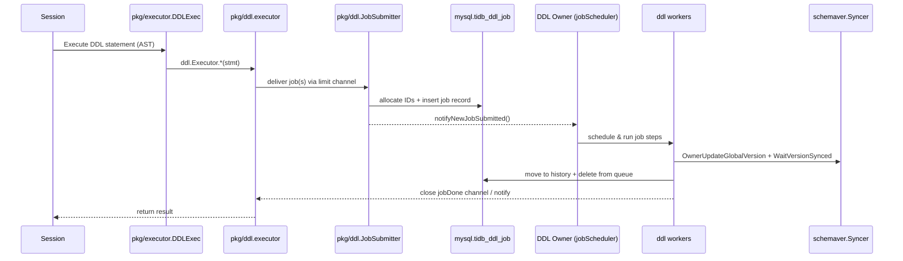

# DDL Notes (Read First)

TiDB DDL is **job-based** and **owner-driven**: a SQL DDL statement is converted into a persistent DDL *job*, then the **DDL owner** schedules and runs the job on workers, gradually changing schema states and waiting for schema version synchronization across TiDB nodes.

The most common mistake is to implement “DDL behavior” directly in `pkg/executor/` (SQL executor layer). That usually bypasses:

- Job persistence / owner failover (resumability).
- Schema state machine (`delete only` → `write only` → `reorg` → `public`).
- Schema version + diff update, and cluster-wide schema sync.
- MDL / lease based safety mechanisms.

This note set is meant to be **the first thing to read** before touching DDL-related code.

## Caveat (debugging and drift)

- Debugging: You may use these notes as a starting point, but you **MUST** validate conclusions against code/tests. Treat unverified statements as hypotheses (avoid hallucination/outdated assumptions).
- Drift: If implementation and `docs/note/ddl/*` diverge during design/development, you **MUST** update the notes to match reality and call it out in the PR/issue.

## Mental model (60 seconds)

1. `pkg/executor.DDLExec` receives a DDL AST node and calls `ddl.Executor` (DDL module).
2. `pkg/ddl.executor` converts the statement to a `model.Job` (or multiple jobs), then **submits** it via `JobSubmitter`.
3. `JobSubmitter` allocates IDs, writes the job into `mysql.tidb_ddl_job`, and notifies the owner-side scheduler.
4. Only the **DDL owner** runs `jobScheduler`, which dispatches jobs into worker pools.
5. Workers run the job **step-by-step** (meta changes + schema state transitions), update global schema version, then wait for followers to sync.
6. When done, the job is moved to history; the submitting session is unblocked and returns success/failure.

## Execution flow diagram

## Code map (where to look first)

### Front-end (SQL executor layer)

- `pkg/executor/ddl.go`: `type DDLExec`, `(*DDLExec).Next` dispatches AST → DDL module; handles transaction boundary and converts schema-outdated errors.

### DDL module (job-based execution)

- `pkg/ddl/ddl.go`: `NewDDL` wires everything; `(*ddl).Start` starts submit loop and campaigns owner.
- `pkg/ddl/executor.go`: `type Executor` (called by SQL layer); converts statements → jobs; `DoDDLJobWrapper` waits for job completion.
- `pkg/ddl/job_submitter.go`: `type JobSubmitter` batches submission, allocates IDs, inserts into job table, and notifies scheduler.
- `pkg/ddl/job_scheduler.go`: owner-only scheduler; `ownerListener.OnBecomeOwner` starts `jobScheduler` and worker pools.
- `pkg/ddl/job_worker.go`: worker logic; `transitOneJobStep` / `runOneJobStep` drive state transitions and meta updates.
- `pkg/ddl/schema_version.go` + `pkg/ddl/job_worker.go:updateGlobalVersionAndWaitSynced`: global schema version update + `WaitVersionSynced`.
- `pkg/ddl/schemaver/syncer.go`: `type Syncer` implements schema version synchronization (etcd-based).
- `pkg/ddl/systable/manager.go`: storage access for job/MDL related system tables.

### Cluster integration

- `pkg/domain/domain.go`: creates DDL via `ddl.NewDDL(...)`; initializes infosync + schema syncer, and orchestrates startup order.

## Reading order

1. `docs/note/ddl/01-execution-flow.md` — end-to-end call chain and responsibilities.
2. `docs/note/ddl/02-job-lifecycle.md` — job/version/state machines, schema sync, owner/failover.
3. `docs/note/ddl/03-reorg-backfill.md` — reorg/backfill and distributed backfill overview.
4. `docs/note/ddl/04-dev-checklist.md` — where-to-change, testing, and common pitfalls.
5. `docs/note/ddl/05-file-map.md` — quick “where is this implemented?” map inside `pkg/ddl/`.

## Related design docs (deep dives)

- Distributed DDL reorg: `docs/design/2022-09-19-distributed-ddl-reorg.md`
- Add index acceleration / ingest: `docs/design/2022-06-07-adding-index-acceleration.md`
- Multi-schema change: `docs/design/2022-04-15-multi-schema-change.md`
- Pause/Resume DDL: `docs/design/2023-04-15-ddl-pause-resume.md`
- Pause user DDL while upgrading: `docs/design/2023-04-11-pause-user-ddl-when-upgrading.md`
- Dist task framework: `docs/design/2023-04-11-dist-task.md`
