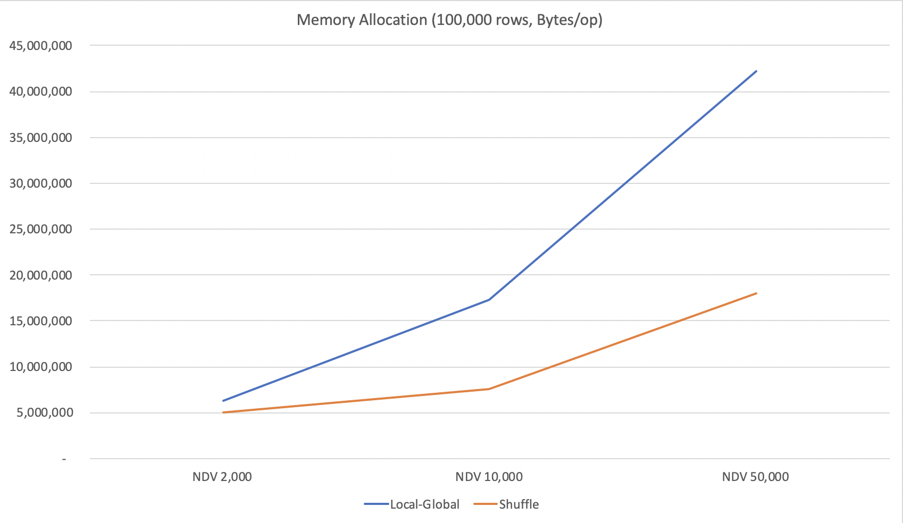
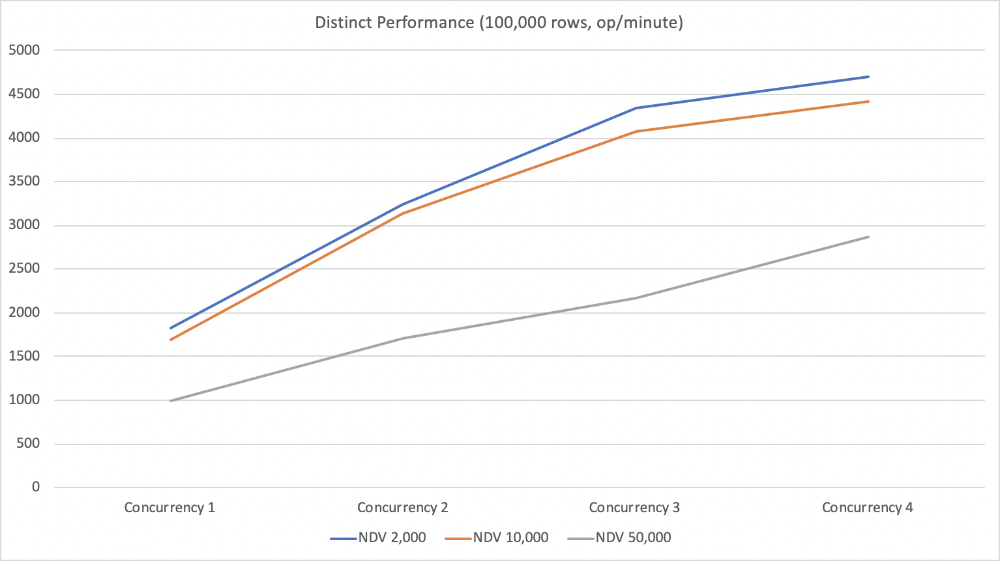
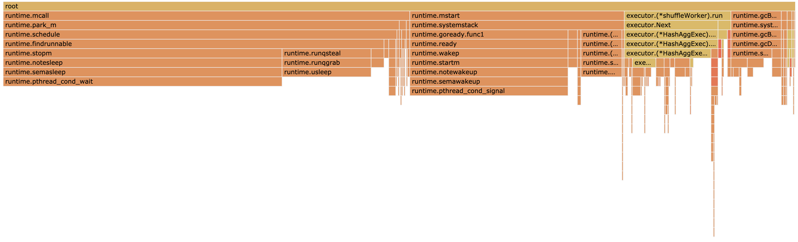
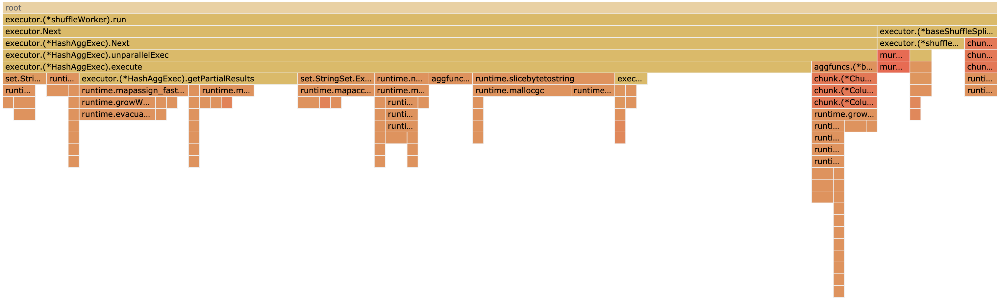
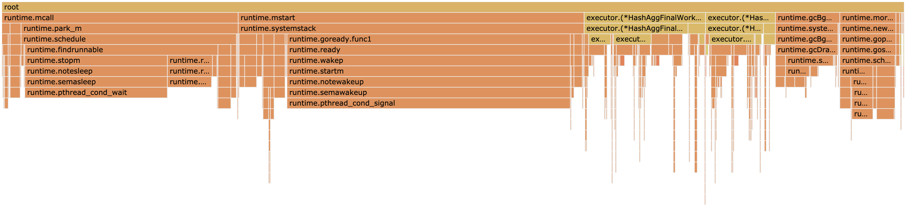
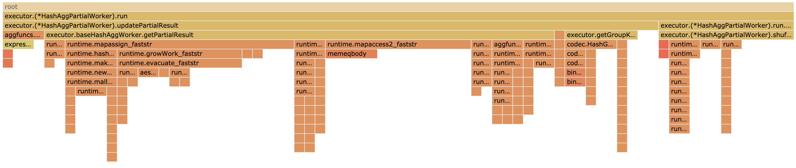
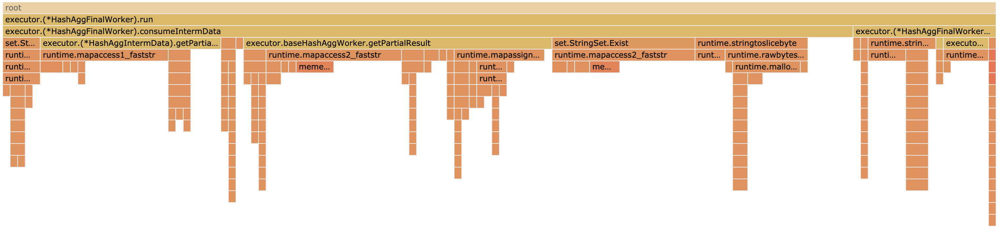

# Parallel HashAgg: Local-Global vs. Shuffle

_备注_
_Local-Global模式：即先将数据随机分片、并行局部聚合，再将多个局部结果按照 group by条件重新分片，进行全局聚合。当前主干代码的模式。_
_Shuffle模式：即先将数据按照group by条件分片，并行计算聚合结果，最后随机合并。通过新的Shuffle框架执行。_

## 主要结论

1. 计算性能：不同情况下各有优劣。NDV较大时Shuffle性能较优，NDV较小时Local-Global性能较优。
2. 内存开销：Local-Global > Shuffle。在4线程、10,000 NDV下Local-Global的内存占用约为Shuffle的2.3倍。
3. 适用场景：都有对方不支持的独特适用场景。Local-Global可以将Local下推，Shuffle支持distinct列。

## 优化建议
__将HashAgg拆成local和global两个算子，在Shuffle框架下实现并行计算。__
在统一的框架下，通过预估不同NDV下的开销，选择最优执行计划。具体来说：

* 对于NDV较小、不含distinct表达式的SQL，生成如下执行计划：
  `DataSource -> Shuffle(random partition) -> HashAgg(partial) -> Shuffle(repartition) -> HashAgg(final) -> Shuffle(random merge)`
* 对于NDV较大、或者包含distinct的SQL，生成如下执行计划：
  `DataSource -> Shuffle(hash partition) -> HashAgg -> Shuffle(random merge)`

## 详细分析

### 计算性能

* `NDV / RowCount = 0.1`情况下，两者性能相当。
* `NDV / RowCount = 0.02`情况下，Local-Global性能大约是Shuffle的2.2倍
* `NDV / RowCount = 0.5`情况下，Shuffle性能大约是Local-Global的1.8倍

注意1：`NDV / RowCount` 取值根据抽样数据推断，非严格测试。具体数据见附录1。

注意2：测试用例为100,000 rows。所以在10,000 NDV下，两种模式性能相当。本文后续的对比分析大部分是在100,000 rows、10,000 NDV情况下。

造成这个结果的主要原因包括：

1. Local-Global保存聚合结果的开销相对较大

  NDV直接决定了聚合结果的大小，而读写聚合结果的map相关操作是工作线程的最主要开销。_（详见附录2的火焰图。测试用例中聚合函数只有一个`avg`）_
  在Local-Global中，每个partial worker都可能拥有所有的key，同时每个final worker拥有`NDV / N`个key。所以总数据量为 `(N+1) x NDV`。

  在Shuffle中，只有`N`个`NDV / N`大小的map，总数据量为`NDV`。从实际测试数据看，4线程、10,000 NDV情况下，Local-Global的总内存消耗是Shuffle的2.3倍（见附录1）。

2. Shuffle的分片开销相对较大

   Shuffle的分片规模等于RowCount，而且需要按行复制整个tuple。Local-Global的分片规模等于NDV，而且只复制key。

   从火焰图（见附录2，4线程、100,000 rows、10,000 NDV、每个tuple 16B）中估算，Shuffle的分片开销在工作线程中占比大约12%，而Local-Global约为6%；即Shuffle的开销约为Local-Global的2倍。


### 内存开销
Local-Global > Shuffle。在100,000 rows、10,000 NDV情况下，Local-Global的内存占用约为Shuffle的2.3倍（见附录1）。

原因正如“计算性能”部分提到的，Local-Global需要`(N+1) x NDV`大小的map、而Shuffle只需要`NDV`。具体如下方对比曲线，详细数据请见附录1中 `B/op` 字段。

在10,000 NDV的火焰图（详见附录2.a与2.c）中，Local-Global `runtime.morestack`的耗时占比为6.22%，而Shuffle中仅为0.74%。




GC方面，两者相近，4线程、100,000 rows、10,000 NDV下，根据火焰图的结果，Local-Global中`runtime.gcBgMarker`占比7.14%，Shuffle中占比6.36%。


### 适用场景

Local-Global模式支持把Local下推到TiKV，对性能有比较大的提升。目前Shuffle框架不支持这个能力。

Shuffle支持distinct计算，100,000 rows、10,000 NDV下，4线程性能提升2.6倍，详见下方曲线。




### 附录

#### 附录1：go test bench原始数据（为方便查看，格式略作调整）
```
go test -v -benchmem -bench=BenchmarkAggConcurrency -run=BenchmarkAggConcurrency 
goos: darwin
goarch: amd64
pkg: github.com/pingcap/tidb/executor

BenchmarkAggConcurrency/(execType:stream,_aggFunc:avg,_ndv:2000,_hasDistinct:false,_rows:100000,_concurrency:1,_partitioning:false)-12         	     775	   1516048 ns/op	   41834 B/op	      50 allocs/op
BenchmarkAggConcurrency/(execType:hash,_aggFunc:avg,_ndv:2000,_hasDistinct:false,_rows:100000,_concurrency:1,_partitioning:false)-12           	      67	  17423748 ns/op	 4072352 B/op	  206206 allocs/op
BenchmarkAggConcurrency/(execType:hash,_aggFunc:avg,_ndv:2000,_hasDistinct:false,_rows:100000,_concurrency:2,_partitioning:false)-12           	     207	   5421740 ns/op	 4820522 B/op	   28807 allocs/op
BenchmarkAggConcurrency/(execType:hash,_aggFunc:avg,_ndv:2000,_hasDistinct:false,_rows:100000,_concurrency:3,_partitioning:false)-12           	     270	   4404621 ns/op	 5516055 B/op	   38991 allocs/op
BenchmarkAggConcurrency/(execType:hash,_aggFunc:avg,_ndv:2000,_hasDistinct:false,_rows:100000,_concurrency:4,_partitioning:false)-12           	     304	   4135879 ns/op	 6341717 B/op	   49219 allocs/op

--- SKIP: BenchmarkAggConcurrency/(execType:stream,_aggFunc:avg,_ndv:2000,_hasDistinct:false,_rows:100000,_concurrency:1,_partitioning:true)
    benchmark_test.go:404: 
BenchmarkAggConcurrency/(execType:hash,_aggFunc:avg,_ndv:2000,_hasDistinct:false,_rows:100000,_concurrency:1,_partitioning:true)-12            	      67	  17339306 ns/op	 4072704 B/op	  206208 allocs/op
BenchmarkAggConcurrency/(execType:hash,_aggFunc:avg,_ndv:2000,_hasDistinct:false,_rows:100000,_concurrency:2,_partitioning:true)-12            	     114	  10600079 ns/op	 4593837 B/op	  210717 allocs/op
BenchmarkAggConcurrency/(execType:hash,_aggFunc:avg,_ndv:2000,_hasDistinct:false,_rows:100000,_concurrency:3,_partitioning:true)-12            	     127	   9900291 ns/op	 4701346 B/op	  212900 allocs/op
BenchmarkAggConcurrency/(execType:hash,_aggFunc:avg,_ndv:2000,_hasDistinct:false,_rows:100000,_concurrency:4,_partitioning:true)-12            	     123	   9920060 ns/op	 5071263 B/op	  215122 allocs/op

BenchmarkAggConcurrency/(execType:stream,_aggFunc:avg,_ndv:10000,_hasDistinct:false,_rows:100000,_concurrency:1,_partitioning:false)-12        	     553	   2159774 ns/op	   40305 B/op	      50 allocs/op
BenchmarkAggConcurrency/(execType:hash,_aggFunc:avg,_ndv:10000,_hasDistinct:false,_rows:100000,_concurrency:1,_partitioning:false)-12          	      52	  22148937 ns/op	 6650889 B/op	  222569 allocs/op
BenchmarkAggConcurrency/(execType:hash,_aggFunc:avg,_ndv:10000,_hasDistinct:false,_rows:100000,_concurrency:2,_partitioning:false)-12          	      98	  11743957 ns/op	12067048 B/op	  124979 allocs/op
BenchmarkAggConcurrency/(execType:hash,_aggFunc:avg,_ndv:10000,_hasDistinct:false,_rows:100000,_concurrency:3,_partitioning:false)-12          	     100	  11171693 ns/op	14938312 B/op	  163943 allocs/op
BenchmarkAggConcurrency/(execType:hash,_aggFunc:avg,_ndv:10000,_hasDistinct:false,_rows:100000,_concurrency:4,_partitioning:false)-12          	     100	  10983772 ns/op	17324493 B/op	  197143 allocs/op

--- SKIP: BenchmarkAggConcurrency/(execType:stream,_aggFunc:avg,_ndv:10000,_hasDistinct:false,_rows:100000,_concurrency:1,_partitioning:true)
    benchmark_test.go:404: 
BenchmarkAggConcurrency/(execType:hash,_aggFunc:avg,_ndv:10000,_hasDistinct:false,_rows:100000,_concurrency:1,_partitioning:true)-12           	      49	  22151875 ns/op	 6650238 B/op	  222567 allocs/op
BenchmarkAggConcurrency/(execType:hash,_aggFunc:avg,_ndv:10000,_hasDistinct:false,_rows:100000,_concurrency:2,_partitioning:true)-12           	      85	  13613066 ns/op	 7189871 B/op	  227083 allocs/op
BenchmarkAggConcurrency/(execType:hash,_aggFunc:avg,_ndv:10000,_hasDistinct:false,_rows:100000,_concurrency:3,_partitioning:true)-12           	      93	  11807697 ns/op	 7403106 B/op	  229502 allocs/op
BenchmarkAggConcurrency/(execType:hash,_aggFunc:avg,_ndv:10000,_hasDistinct:false,_rows:100000,_concurrency:4,_partitioning:true)-12           	      98	  11551404 ns/op	 7603899 B/op	  231502 allocs/op

BenchmarkAggConcurrency/(execType:stream,_aggFunc:avg,_ndv:50000,_hasDistinct:false,_rows:100000,_concurrency:1,_partitioning:false)-12        	     259	   4605696 ns/op	   45935 B/op	      51 allocs/op
BenchmarkAggConcurrency/(execType:hash,_aggFunc:avg,_ndv:50000,_hasDistinct:false,_rows:100000,_concurrency:1,_partitioning:false)-12          	      32	  36513556 ns/op	17079080 B/op	  291200 allocs/op
BenchmarkAggConcurrency/(execType:hash,_aggFunc:avg,_ndv:50000,_hasDistinct:false,_rows:100000,_concurrency:2,_partitioning:false)-12          	      31	  37067161 ns/op	40298133 B/op	  434131 allocs/op
BenchmarkAggConcurrency/(execType:hash,_aggFunc:avg,_ndv:50000,_hasDistinct:false,_rows:100000,_concurrency:3,_partitioning:false)-12          	      40	  31799131 ns/op	42797959 B/op	  477342 allocs/op
BenchmarkAggConcurrency/(execType:hash,_aggFunc:avg,_ndv:50000,_hasDistinct:false,_rows:100000,_concurrency:4,_partitioning:false)-12          	      44	  25915581 ns/op	42178840 B/op	  500296 allocs/op

--- SKIP: BenchmarkAggConcurrency/(execType:stream,_aggFunc:avg,_ndv:50000,_hasDistinct:false,_rows:100000,_concurrency:1,_partitioning:true)
    benchmark_test.go:404: 
BenchmarkAggConcurrency/(execType:hash,_aggFunc:avg,_ndv:50000,_hasDistinct:false,_rows:100000,_concurrency:1,_partitioning:true)-12           	      32	  36519546 ns/op	17074693 B/op	  291131 allocs/op
BenchmarkAggConcurrency/(execType:hash,_aggFunc:avg,_ndv:50000,_hasDistinct:false,_rows:100000,_concurrency:2,_partitioning:true)-12           	      55	  21274743 ns/op	17640263 B/op	  295601 allocs/op
BenchmarkAggConcurrency/(execType:hash,_aggFunc:avg,_ndv:50000,_hasDistinct:false,_rows:100000,_concurrency:3,_partitioning:true)-12           	      56	  19340114 ns/op	22009355 B/op	  298242 allocs/op
BenchmarkAggConcurrency/(execType:hash,_aggFunc:avg,_ndv:50000,_hasDistinct:false,_rows:100000,_concurrency:4,_partitioning:true)-12           	      73	  15639858 ns/op	18022791 B/op	  299630 allocs/op

BenchmarkAggConcurrency/(execType:stream,_aggFunc:avg,_ndv:2000,_hasDistinct:true,_rows:100000,_concurrency:1,_partitioning:false)-12          	      90	  12124374 ns/op	 4067417 B/op	   24852 allocs/op
BenchmarkAggConcurrency/(execType:hash,_aggFunc:avg,_ndv:2000,_hasDistinct:true,_rows:100000,_concurrency:1,_partitioning:false)-12            	      36	  33212882 ns/op	 8159449 B/op	  231033 allocs/op
BenchmarkAggConcurrency/(execType:hash,_aggFunc:avg,_ndv:2000,_hasDistinct:true,_rows:100000,_concurrency:2,_partitioning:false)-12            	      32	  33334162 ns/op	 8141348 B/op	  231009 allocs/op
BenchmarkAggConcurrency/(execType:hash,_aggFunc:avg,_ndv:2000,_hasDistinct:true,_rows:100000,_concurrency:3,_partitioning:false)-12            	      34	  32830600 ns/op	 8126509 B/op	  230989 allocs/op
BenchmarkAggConcurrency/(execType:hash,_aggFunc:avg,_ndv:2000,_hasDistinct:true,_rows:100000,_concurrency:4,_partitioning:false)-12            	      36	  33096260 ns/op	 8159082 B/op	  231060 allocs/op

--- SKIP: BenchmarkAggConcurrency/(execType:stream,_aggFunc:avg,_ndv:2000,_hasDistinct:true,_rows:100000,_concurrency:1,_partitioning:true)
    benchmark_test.go:404: 
BenchmarkAggConcurrency/(execType:hash,_aggFunc:avg,_ndv:2000,_hasDistinct:true,_rows:100000,_concurrency:1,_partitioning:true)-12             	      37	  32800116 ns/op	 8162276 B/op	  231023 allocs/op
BenchmarkAggConcurrency/(execType:hash,_aggFunc:avg,_ndv:2000,_hasDistinct:true,_rows:100000,_concurrency:2,_partitioning:true)-12             	      66	  18481863 ns/op	 8686745 B/op	  235533 allocs/op
BenchmarkAggConcurrency/(execType:hash,_aggFunc:avg,_ndv:2000,_hasDistinct:true,_rows:100000,_concurrency:3,_partitioning:true)-12             	      79	  13796191 ns/op	 8821036 B/op	  237730 allocs/op
BenchmarkAggConcurrency/(execType:hash,_aggFunc:avg,_ndv:2000,_hasDistinct:true,_rows:100000,_concurrency:4,_partitioning:true)-12             	      96	  12751440 ns/op	 9104825 B/op	  239935 allocs/op

BenchmarkAggConcurrency/(execType:stream,_aggFunc:avg,_ndv:10000,_hasDistinct:true,_rows:100000,_concurrency:1,_partitioning:false)-12         	     120	   9817055 ns/op	 2963603 B/op	   31463 allocs/op
BenchmarkAggConcurrency/(execType:hash,_aggFunc:avg,_ndv:10000,_hasDistinct:true,_rows:100000,_concurrency:1,_partitioning:false)-12           	      32	  35480620 ns/op	 9707164 B/op	  253888 allocs/op
BenchmarkAggConcurrency/(execType:hash,_aggFunc:avg,_ndv:10000,_hasDistinct:true,_rows:100000,_concurrency:2,_partitioning:false)-12           	      33	  35233855 ns/op	 9713571 B/op	  253884 allocs/op
BenchmarkAggConcurrency/(execType:hash,_aggFunc:avg,_ndv:10000,_hasDistinct:true,_rows:100000,_concurrency:3,_partitioning:false)-12           	      33	  35064191 ns/op	 9731222 B/op	  254024 allocs/op
BenchmarkAggConcurrency/(execType:hash,_aggFunc:avg,_ndv:10000,_hasDistinct:true,_rows:100000,_concurrency:4,_partitioning:false)-12           	      33	  35168771 ns/op	 9709799 B/op	  253853 allocs/op

--- SKIP: BenchmarkAggConcurrency/(execType:stream,_aggFunc:avg,_ndv:10000,_hasDistinct:true,_rows:100000,_concurrency:1,_partitioning:true)
    benchmark_test.go:404: 
BenchmarkAggConcurrency/(execType:hash,_aggFunc:avg,_ndv:10000,_hasDistinct:true,_rows:100000,_concurrency:1,_partitioning:true)-12            	      33	  35334350 ns/op	 9719328 B/op	  253959 allocs/op
BenchmarkAggConcurrency/(execType:hash,_aggFunc:avg,_ndv:10000,_hasDistinct:true,_rows:100000,_concurrency:2,_partitioning:true)-12            	      64	  19152827 ns/op	10258921 B/op	  258480 allocs/op
BenchmarkAggConcurrency/(execType:hash,_aggFunc:avg,_ndv:10000,_hasDistinct:true,_rows:100000,_concurrency:3,_partitioning:true)-12            	      76	  14713216 ns/op	10471330 B/op	  260840 allocs/op
BenchmarkAggConcurrency/(execType:hash,_aggFunc:avg,_ndv:10000,_hasDistinct:true,_rows:100000,_concurrency:4,_partitioning:true)-12            	      96	  13576695 ns/op	10679177 B/op	  262910 allocs/op

BenchmarkAggConcurrency/(execType:stream,_aggFunc:avg,_ndv:50000,_hasDistinct:true,_rows:100000,_concurrency:1,_partitioning:false)-12         	     100	  11006997 ns/op	 5580849 B/op	   86516 allocs/op
BenchmarkAggConcurrency/(execType:hash,_aggFunc:avg,_ndv:50000,_hasDistinct:true,_rows:100000,_concurrency:1,_partitioning:false)-12           	      19	  60682958 ns/op	23297877 B/op	  377553 allocs/op
BenchmarkAggConcurrency/(execType:hash,_aggFunc:avg,_ndv:50000,_hasDistinct:true,_rows:100000,_concurrency:2,_partitioning:false)-12           	      19	  60622068 ns/op	23307176 B/op	  377683 allocs/op
BenchmarkAggConcurrency/(execType:hash,_aggFunc:avg,_ndv:50000,_hasDistinct:true,_rows:100000,_concurrency:3,_partitioning:false)-12           	      19	  61069472 ns/op	23304774 B/op	  377570 allocs/op
BenchmarkAggConcurrency/(execType:hash,_aggFunc:avg,_ndv:50000,_hasDistinct:true,_rows:100000,_concurrency:4,_partitioning:false)-12           	      20	  61468806 ns/op	23302770 B/op	  377597 allocs/op

--- SKIP: BenchmarkAggConcurrency/(execType:stream,_aggFunc:avg,_ndv:50000,_hasDistinct:true,_rows:100000,_concurrency:1,_partitioning:true)
    benchmark_test.go:404: 
BenchmarkAggConcurrency/(execType:hash,_aggFunc:avg,_ndv:50000,_hasDistinct:true,_rows:100000,_concurrency:1,_partitioning:true)-12            	      20	  60519877 ns/op	23310714 B/op	  377763 allocs/op
BenchmarkAggConcurrency/(execType:hash,_aggFunc:avg,_ndv:50000,_hasDistinct:true,_rows:100000,_concurrency:2,_partitioning:true)-12            	      36	  35082508 ns/op	23866310 B/op	  382110 allocs/op
BenchmarkAggConcurrency/(execType:hash,_aggFunc:avg,_ndv:50000,_hasDistinct:true,_rows:100000,_concurrency:3,_partitioning:true)-12            	      43	  27747166 ns/op	28241767 B/op	  384997 allocs/op
BenchmarkAggConcurrency/(execType:hash,_aggFunc:avg,_ndv:50000,_hasDistinct:true,_rows:100000,_concurrency:4,_partitioning:true)-12            	      54	  20893585 ns/op	24273326 B/op	  386622 allocs/op

PASS
ok  	github.com/pingcap/tidb/executor	75.863s
```


#### 附录2：火焰图

##### 2.a Shuffle整体


##### 2.b Shuffle worker


##### 2.c Local-Global整体


##### 2.d Local-Global partial worker


##### 2.e Local-Global final worker



