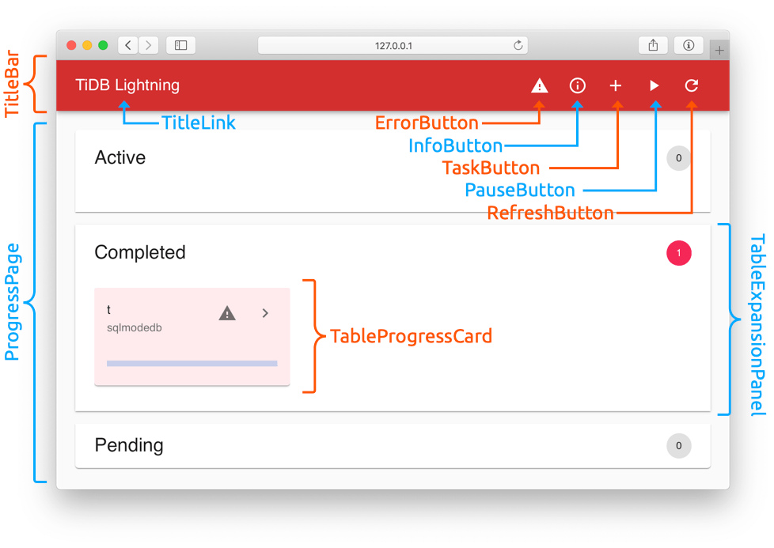
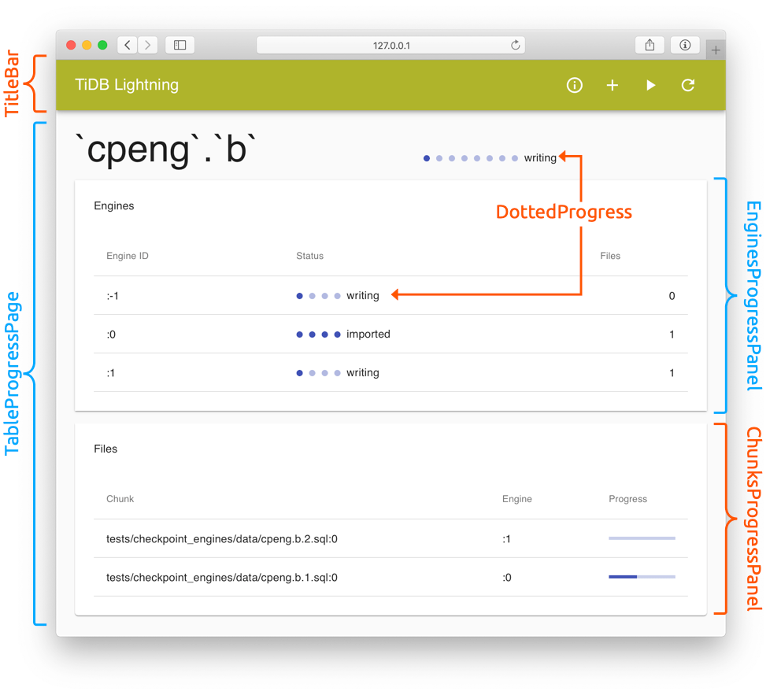
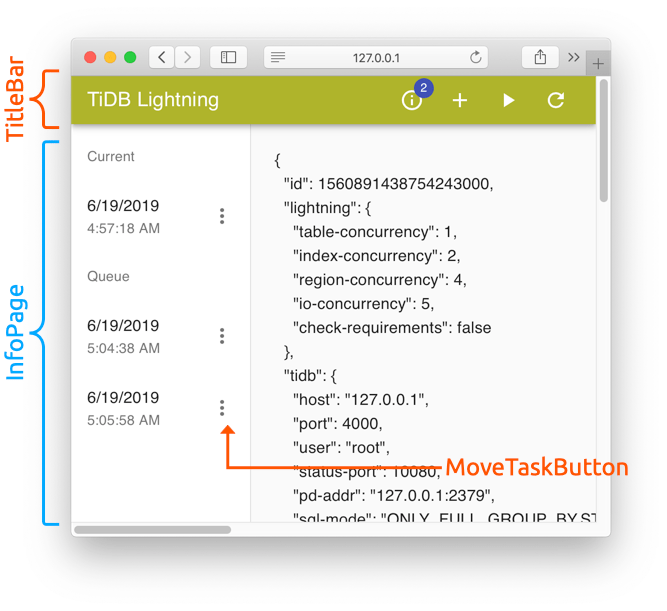

TiDB Lightning Web Interface
============================

TiDB Lightning provides a web interface for local monitoring task control. The
app is written using [Material-UI] based on [React].

[Material-UI]: https://material-ui.com/
[React]: https://reactjs.org/

Building
--------

The web app requires `npm` to build. It can be compiled by running webpack in
*this* directory

```sh
# from `lightning/web/src/*` produces `lightning/web/dist/*`
cd web/
export NODE_OPTIONS="--openssl-legacy-provider"
npm install
npm run build
```

or, equivalently, running the make command in the *parent* directory.

```sh
# from `lightning/web/src/*` produces `lightning/web/dist/*`
make lightning_web
```

The output can be found in the `lightning/web/dist/` folder. Lightning embeds the entire
`lightning/web/dist/` folder into Go code via [vfsgen]. The web app compilation and Go
code conversion can be done via the make command

```sh
# from `web/dist/*` produces `lightning/web/res_vfsdata.go`
make data_parsers
```

For web development, you could build a special version of `tidb-lightning` which
reads directly from `lightning/web/dist/` by

```sh
make build_lightning_for_web
```

Run `bin/tidb-lightning --server-mode --status-addr 127.0.0.1:8289`, then open
`http://127.0.0.1:8289/` to use the web interface.

Local development tools like `webpack-dev-server` are not yet supported, since
we do not allow cross-origin requests yet.

[vfsgen]: https://github.com/shurcooL/vfsgen

Front-end
---------

The TiDB Lightning web interface is a single-page application (SPA). The file
`public/index.html` is the HTML template before rendering. The actual source
code are written in TypeScript in the `src/*` folder.

The application is divided into 3 "pages":

<details><summary><strong>ProgressPage</strong> (reachable by clicking the "TiDB Lightning" link on the TitleBar)</summary>



</details>
<details><summary><strong>TableProgressPage</strong> (reachable by clicking the ">" button on a TableProgressCard)</summary>



</details>
<details><summary><strong>InfoPage</strong> (reachable by clicking the "ⓘ" InfoButton on the TitleBar)</summary>



</details>

The components inside the TitleBar and each page are highlighted in the above
images. The associated dialogs and menus are embedded into each component
directly.

Back-end
--------

The "back-end" is Lightning itself. The API defined by Lightning is declared in
`src/api.ts`. The corresponding server code is in `lightning/lightning.go`.
Unless otherwise specified, all APIs return JSON and is in the form
`{"error": "message"}` in case of error.

There is also an [OpenAPI (Swagger) definition](docs/api.yaml), but this is only
a best-effort documentation of the current API. It should not be taken as a
normative reference.
