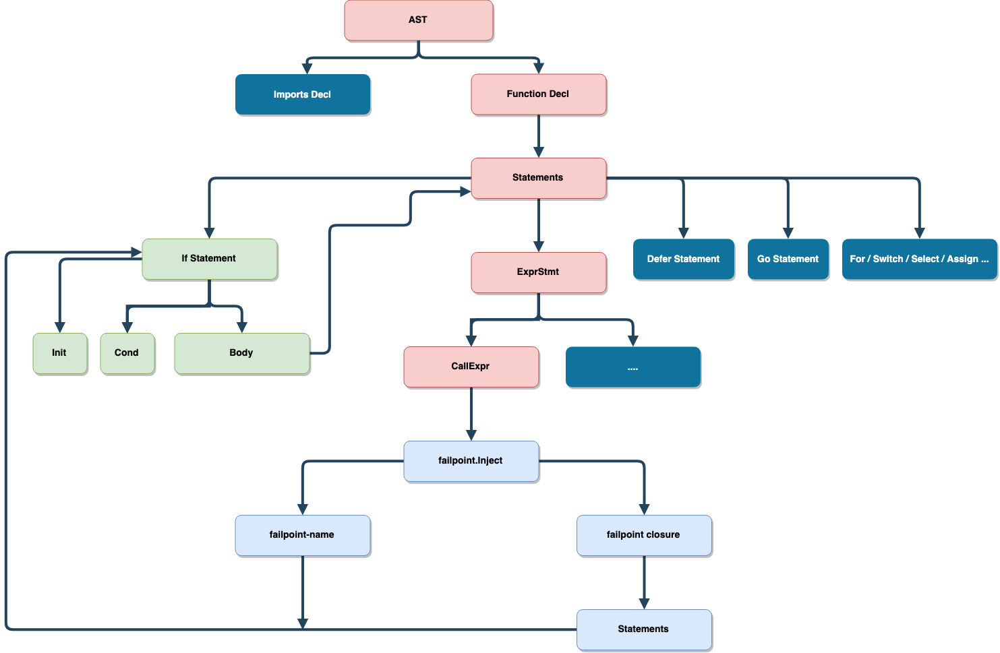

# failpoint
[](https://github.com/pingcap/failpoint/blob/master/LICENSE)
[](https://golang.org/)
[](https://goreportcard.com/report/github.com/pingcap/failpoint)
[](https://travis-ci.com/pingcap/failpoint)
[](https://codecov.io/gh/pingcap/failpoint)
[](https://github.com/avelino/awesome-go)  

An implementation of [failpoints][failpoint] for Golang.

[failpoint]: http://www.freebsd.org/cgi/man.cgi?query=fail

## Quick Start

1.  Build `failpoint-ctl` from source

    ``` bash
    git clone https://github.com/pingcap/failpoint.git
    cd failpoint
    make
    ls bin/failpoint-ctl
    ```

2.  Inject failpoints to your program, eg:

    ``` go
    package main

    import "github.com/pingcap/failpoint"

    func main() {
        failpoint.Inject("testPanic", func() {
            panic("failpoint triggerd")
        })
    }
    ```

3.  Transfrom your code with `failpoint-ctl enable`

4.  Build with `go build`

5.  Enable failpoints with `GO_FAILPOINTS` environment variable

    ``` bash
    GO_FAILPOINTS="main/testPanic=return(true)" ./your-program
    ```

## Design principles

- Define failpoint in valid Golang code, not comments or anything else
- Failpoint does not have any extra cost

    - Will not take effect on regular logic
    - Will not cause regular code performance regression
    - Failpoint code will not appear in the final binary

- Failpoint routine is writable/readable and should be checked by a compiler
- Generated code by failpoint definition is easy to read
- Keep the line numbers same with the injecting codes(easier to debug)
- Support parallel tests with context.Context

## Key concepts

- Failpoint

    Faillpoint is a code snippet that is only executed when the corresponding failpoint is active.
    The closure will never be executed if `failpoint.Disable("failpoint-name-for-demo")` is executed.

    ```go
    var outerVar = "declare in outer scope"
    failpoint.Inject("failpoint-name-for-demo", func(val failpoint.Value) {
        fmt.Println("unit-test", val, outerVar)
    })
    ```

- Marker functions

    - It is just an empty function

        - To hint the rewriter to rewrite with an equality statement
        - To receive some parameters as the rewrite rule
        - It will be inline in the compiling time and emit nothing to binary (zero cost)
        - The variables in external scope can be accessed in closure by capturing, and the converted code is still legal
        because all the captured-variables location in outer scope of IF statement.

    - It is easy to write/read 
    - Introduce a compiler check for failpoints which cannot compile in the regular mode if failpoint code is invalid

- Marker funtion list

    - `func Inject(fpname string, fpblock func(val Value)) {}`
    - `func InjectContext(fpname string, ctx context.Context, fpblock func(val Value)) {}`
    - `func Break(label ...string) {}`
    - `func Goto(label string) {}`
    - `func Continue(label ...string) {}`
    - `func Fallthrough() {}`
    - `func Return(results ...interface{}) {}`
    - `func Label(label string) {}`

## How to inject a failpoint to your program

- You can call `failpoint.Inject` to inject a failpoint to the call site, where `failpoint-name` is
used to trigger the failpoint and `failpoint-closure` will be expanded as the body of the IF statement.

    ```go
    failpoint.Inject("failpoint-name", func(val failpoint.Value) {
        failpoint.Return("unit-test", val)
    })
    ```

    The converted code looks like:

    ```go
    if val, ok := failpoint.Eval(_curpkg_("failpoint-name")); ok {
        return "unit-test", val
    }
    ```

- `failpoint.Value` is the value that passes by `failpoint.Enable("failpoint-name", "return(5)")`
which can be ignored.

    ```go
    failpoint.Inject("failpoint-name", func(_ failpoint.Value) {
        fmt.Println("unit-test")
    })
    ```

    OR

    ```go
    failpoint.Inject("failpoint-name", func() {
        fmt.Println("unit-test")
    })
    ```

    And the converted code looks like:

    ```go
    if _, ok := failpoint.Eval(_curpkg_("failpoint-name")); ok {
        fmt.Println("unit-test")
    }
    ```

- Also, the failpoint closure can be a function which takes `context.Context`. You can
do some customized things with `context.Context` like controlling whether a failpoint is
active in parallel tests or other cases. For example,

    ```go
    failpoint.InjectContext(ctx, "failpoint-name", func(val failpoint.Value) {
        fmt.Println("unit-test", val)
    })
    ```

    The converted code looks like:

    ```go
    if val, ok := failpoint.EvalContext(ctx, _curpkg_("failpoint-name")); ok {
        fmt.Println("unit-test", val)
    }
    ```

- You can ignore `context.Context`, and this will generate the same code as above non-context version. For example,

    ```go
    failpoint.InjectContext(nil, "failpoint-name", func(val failpoint.Value) {
        fmt.Println("unit-test", val)
    })
    ```

    Becomes

    ```go
    if val, ok := failpoint.EvalContext(nil, _curpkg_("failpoint-name")); ok {
        fmt.Println("unit-test", val)
    }
    ```

- You can control a failpoint by failpoint.WithHook

    ```go
    func (s *dmlSuite) TestCRUDParallel() {
        sctx := failpoint.WithHook(context.Backgroud(), func(ctx context.Context, fpname string) bool {
            return ctx.Value(fpname) != nil // Determine by ctx key
        })
        insertFailpoints = map[string]struct{} {
            "insert-record-fp": {},
            "insert-index-fp": {},
            "on-duplicate-fp": {},
        }
        ictx := failpoint.WithHook(context.Backgroud(), func(ctx context.Context, fpname string) bool {
            _, found := insertFailpoints[fpname] // Only enables some failpoints.
            return found
        })
        deleteFailpoints = map[string]struct{} {
            "tikv-is-busy-fp": {},
            "fetch-tso-timeout": {},
        }
        dctx := failpoint.WithHook(context.Backgroud(), func(ctx context.Context, fpname string) bool {
            _, found := deleteFailpoints[fpname] // Only disables failpoints. 
            return !found
        })
        // other DML parallel test cases.
        s.RunParallel(buildSelectTests(sctx))
        s.RunParallel(buildInsertTests(ictx))
        s.RunParallel(buildDeleteTests(dctx))
    }
    ```

- If you use a failpoint in the loop context, maybe you will use other marker functions.

    ```go
    failpoint.Label("outer")
    for i := 0; i < 100; i++ {
        inner:
            for j := 0; j < 1000; j++ {
                switch rand.Intn(j) + i {
                case j / 5:
                    failpoint.Break()
                case j / 7:
                    failpoint.Continue("outer")
                case j / 9:
                    failpoint.Fallthrough()
                case j / 10:
                    failpoint.Goto("outer")
                default:
                    failpoint.Inject("failpoint-name", func(val failpoint.Value) {
                        fmt.Println("unit-test", val.(int))
                        if val == j/11 {
                            failpoint.Break("inner")
                        } else {
                            failpoint.Goto("outer")
                        }
                    })
            }
        }
    }
    ```

    The above code block will generate the following code:

    ```go
    outer:
        for i := 0; i < 100; i++ {
        inner:
            for j := 0; j < 1000; j++ {
                switch rand.Intn(j) + i {
                case j / 5:
                    break
                case j / 7:
                    continue outer
                case j / 9:
                    fallthrough
                case j / 10:
                    goto outer
                default:
                    if val, ok := failpoint.Eval(_curpkg_("failpoint-name")); ok {
                        fmt.Println("unit-test", val.(int))
                        if val == j/11 {
                            break inner
                        } else {
                            goto outer
                        }
                    }
                }
            }
        }
    ```

- You may doubt why we do not use `label`, `break`, `continue`, and `fallthrough` directly
instead of using failpoint marker functions. 

    - Any unused symbol like an ident or a label is not permitted in Golang. It will be invalid if some
    label is only used in the failpoint closure. For example,
    
        ```go
        label1: // compiler error: unused label1
            failpoint.Inject("failpoint-name", func(val failpoint.Value) {
                if val.(int) == 1000 {
                    goto label1 // illegal to use goto here
                }
                fmt.Println("unit-test", val)
            })
        ```

    - `break` and `continue` can only be used in the loop context, which is not legal in the Golang code 
    if we use them in closure directly.

### Some complicated failpoints demo

- Inject a failpoint to the IF INITIAL statement or CONDITIONAL expression

    ```go
    if a, b := func() {
        failpoint.Inject("failpoint-name", func(val failpoint.Value) {
            fmt.Println("unit-test", val)
        })
    }, func() int { return rand.Intn(200) }(); b > func() int {
        failpoint.Inject("failpoint-name", func(val failpoint.Value) int {
            return val.(int)
        })
        return rand.Intn(3000)
    }() && b < func() int {
        failpoint.Inject("failpoint-name-2", func(val failpoint.Value) {
            return rand.Intn(val.(int))
        })
        return rand.Intn(6000)
    }() {
        a()
        failpoint.Inject("failpoint-name-3", func(val failpoint.Value) {
            fmt.Println("unit-test", val)
        })
    }
    ```

    The above code block will generate something like this:

    ```go
    if a, b := func() {
        if val, ok := failpoint.Eval(_curpkg_("failpoint-name")); ok {
            fmt.Println("unit-test", val)
        }
    }, func() int { return rand.Intn(200) }(); b > func() int {
        if val, ok := failpoint.Eval(_curpkg_("failpoint-name")); ok {
            return val.(int)
        }
        return rand.Intn(3000)
    }() && b < func() int {
        if val, ok := failpoint.Eval(_curpkg_("failpoint-name-2")); ok {
            return rand.Intn(val.(int))
        }
        return rand.Intn(6000)
    }() {
        a()
        if val, ok := failpoint.Eval(_curpkg_("failpoint-name-3")); ok {
            fmt.Println("unit-test", val)
        }
    }
    ```

- Inject a failpoint to the SELECT statement to make it block one CASE if the failpoint is active

    ```go
    func (s *StoreService) ExecuteStoreTask() {
        select {
        case <-func() chan *StoreTask {
            failpoint.Inject("priority-fp", func(_ failpoint.Value) {
                return make(chan *StoreTask)
            })
            return s.priorityHighCh
        }():
            fmt.Println("execute high priority task")

        case <- s.priorityNormalCh:
            fmt.Println("execute normal priority task")

        case <- s.priorityLowCh:
            fmt.Println("execute normal low task")
        }
    }
    ```

    The above code block will generate something like this:

    ```go
    func (s *StoreService) ExecuteStoreTask() {
        select {
        case <-func() chan *StoreTask {
            if _, ok := failpoint.Eval(_curpkg_("priority-fp")); ok {
                return make(chan *StoreTask)
            })
            return s.priorityHighCh
        }():
            fmt.Println("execute high priority task")

        case <- s.priorityNormalCh:
            fmt.Println("execute normal priority task")

        case <- s.priorityLowCh:
            fmt.Println("execute normal low task")
        }
    }
    ```

- Inject a failpoint to dynamically extend SWITCH CASE arms

    ```go
    switch opType := operator.Type(); {
    case opType == "balance-leader":
        fmt.Println("create balance leader steps")

    case opType == "balance-region":
        fmt.Println("create balance region steps")

    case opType == "scatter-region":
        fmt.Println("create scatter region steps")

    case func() bool {
        failpoint.Inject("dynamic-op-type", func(val failpoint.Value) bool {
            return strings.Contains(val.(string), opType)
        })
        return false
    }():
        fmt.Println("do something")

    default:
        panic("unsupported operator type")
    }
    ```

    The above code block will generate something like this:

    ```go
    switch opType := operator.Type(); {
    case opType == "balance-leader":
        fmt.Println("create balance leader steps")

    case opType == "balance-region":
        fmt.Println("create balance region steps")

    case opType == "scatter-region":
        fmt.Println("create scatter region steps")

    case func() bool {
        if val, ok := failpoint.Eval(_curpkg_("dynamic-op-type")); ok {
            return strings.Contains(val.(string), opType)
        }
        return false
    }():
        fmt.Println("do something")

    default:
        panic("unsupported operator type")
    }
    ```

- More complicated failpoints

    - There are more complicated failpoint sites that can be injected to
        - for the loop INITIAL statement, CONDITIONAL expression and POST statement
        - for the RANGE statement
        - SWITCH INITIAL statement
        - …
    - Anywhere you can call a function

## Failpoint name best practice

As you see above, `_curpkg_` will automatically wrap the original failpoint name in `failpoint.Eval` call.
You can think of `_curpkg_` as a macro that automatically prepends the current package path to the failpoint name. For example,

```go
package ddl // which parent package is `github.com/pingcap/tidb`

func demo() {
	// _curpkg_("the-original-failpoint-name") will be expanded as `github.com/pingcap/tidb/ddl/the-original-failpoint-name`
	if val, ok := failpoint.Eval(_curpkg_("the-original-failpoint-name")); ok {...}
}
```

You do not need to care about `_curpkg_` in your application. It is automatically generated after running `failpoint-ctl enable`
and is deleted with `failpoint-ctl disable`.

Because all failpoints in a package share the same namespace, we need to be careful to
avoid name conflict. There are some recommended naming rules to improve this situation.

- Keep name unique in current subpackage
- Use a self-explanatory name for the failpoint
    
    You can enable failpoints by environment variables
    ```shell
    GO_FAILPOINTS="github.com/pingcap/tidb/ddl/renameTableErr=return(100);github.com/pingcap/tidb/planner/core/illegalPushDown=return(true);github.com/pingcap/pd/server/schedulers/balanceLeaderFailed=return(true)"
    ```
    
## Implementation details

1. Define a group of marker functions
2. Parse imports and prune a source file which does not import a failpoint
3. Traverse AST to find marker function calls
4. Marker function calls will be rewritten with an IF statement, which calls `failpoint.Eval` to determine whether a
failpoint is active and executes failpoint code if the failpoint is enabled



## Acknowledgments

- Thanks [gofail](https://github.com/etcd-io/gofail) to provide initial implementation.
