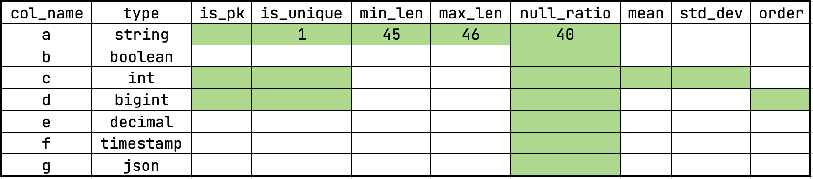

## About this tool
This tool can generate data and write directly into S3.

If you want to create data quickly and utilize machine resources, it is recommended to prepare multiple commands and then run this tool concurrently.

## How to use

### Step 1. Prepare your table info
This tool uses a csv configuration file to define the schema information required for data generation. Before generating data, please convert your table structure into this configuration format.

This is a sample configuration file, it's recommend to view and edit with a spreadsheet tool. Each row corresponds to a column in your table, there are column names, data types, and other properties behind. By adjusting the relevant attributes, you can customize the data generation to meet your requirements.

Currently, this tool supports the following data types:
-	int: The value range is consistent with int32
-	bigint: The value range is consistent with int64
-	boolean: The value is `0` or `1`
-	decimal: The total number of decimal digits is `27`, The number of digits after the decimal point is `9`
-	string: The character scope is [a-zA-Z0-9]
-	timestamp: Time from `1971-1-1 00:00:00` to now
-	json: The marshal result of struct `UserInfo`

``` golang
    type UserInfo struct {
        User     string   `json:"user"`
        UserID   int      `json:"user_id"`
        Zipcode  []int    `json:"zipcode"`    // more than 1 non-unique int
        UniqueID []string `json:"unique_ids"` // more than 1 unique uuid string
    }
```



Please note that not all attributes apply to every data type. The attributes marked in green in the configuration file are effective for the respective data type. Below are details on the relevant properties for each type

- string
  - `is_pk` : Default `0`. Set to `1` to ensure this column’s values are unique and non-null, can be used as a primary key.
  - `is_unique`: Default is `0`. Set to `1` to ensure this column’s values are unique but can include `NULL` values. If is_unique is set to `1`, the `min_len` and `max_len should` be greater than `36`.
  -	`min_len`, max_len: Default is `0`. These values specify the minimum and maximum string length. The generated string length will vary randomly between these two values.
  -	`null_ratio`: Default is `0`. Specifies the percentage of null values in this column. The range is [0, 100], where 0 means no `NULL` values and 100 means all values are `NULL`.

- boolean
  - `null_ratio`: Default is 0. Specifies the percentage of null values in this column. The range is [0, 100].

- int
  - `is_pk`: Default is `0`. Set to `1` to ensure this column’s values are unique and non-null.
  -	`is_unique`: Default is `0`. Set to `1` to ensure this column’s values are unique but can include null values.
  -	`null_ratio`: Default is `0`. Specifies the percentage of null values in this column.
  -	`mean`, `std_dev`: Default is `0`. These parameters control the mean and standard deviation for generating data following a normal distribution. By default, data is generated using a uniform distribution.

- bigint
  - `is_pk`: Default is `0`. Set to `1` to ensure this column’s values are unique and non-null.
  -	`is_unique`: Default is `0`. Set to `1` to ensure this column’s values are unique but can include null values.
  -	`null_ratio`: Default is `0`. Specifies the percentage of null values in this column. 
  - `order`: Default is `""`. Possible values are:
      - `total ordered` — Data is generated in strictly ascending order and unique.
      - `partial ordered` — Data is partially ordered with some randomness and unique.
      - `total random` — Data is generated in a completely random order and unique.

- decimal, timestamp, and json
  - `null_ratio`: Default is `0`. Specifies the percentage of null values in these columns.

By following this guide and adjusting the configuration file accordingly, you can effectively customize the generated data to fit your testing or benchmarking needs.

## Step 2. Prepare your command line
The tool uses command line parameters to control the path to write to S3, the number of rows generated, the number of rows in each csv file, etc. So prepare your command line before starting to create data. The command line parameters are listed below:

```
  -base64Encode
        Base64 encode the CSV file
  -credential string
        Path to S3 credential file
  -deleteAfterGen
        Delete all files after generating (TEST ONLY!)
  -deleteFile string
        Delete a specific file from S3
  -deleteFileByPrefix string
        Delete all files with the specific prefix
  -fetchFile string
        Fetch a specific file from S3, need to specify the local path.
  -fileName string
        Base file name (default "testCSVWriter")
  -fileNameSuffixStart int
        Start of file name suffix
  -generatorNum int
        Number of generator goroutines (default 1)
  -glanceFile string
        Glance the first 1024*1024 character of a specific file from S3
  -localPath string
        Local path to write file
  -pkBegin int
        Begin of primary key, [begin, end)
  -pkEnd int
        End of primary key [begin, end) (default 10)
  -rowNumPerFile int
        Number of rows to generate in each csv file (default 10)
  -s3AccessKey string
        S3 access key
  -s3Endpoint string
        S3 endpoint
  -s3Path string
        S3 path (default "gcs://global-sort-dir/testGenerateCSV")
  -s3Provider string
        S3 provider
  -s3Region string
        S3 region
  -s3SecretKey string
        S3 secret key
  -showFile
        List all files in the S3 directory
  -tableInfo string
        Path to table information (default "/home/admin/table_info.csv")
  -writerNum int
        Number of writer goroutines (default 8)

```

The `pkBegin` and `pkEnd` controls the total row generated, even if your table does not have a primary key, these two parameters is also needed.
If you are going to execute multiple commands generate data concurrently, you can build this as a binary and plan the range of primary keys, the number of files in each directory, file names in advance.
For example, this command will generate 50000(pkEnd-pkBegin) rows data, each csv has 10000 rows, total 5 csv files will be written to `s3Path=gcs://path/to/directory` directory, file names are `part000.000000000.csv ~ part000.000000004.csv`
```
go run main.go -tableInfo=./table_info.csv -pkBegin=0 -pkEnd=50000 -rowNumPerFile=10000 -s3Path=gcs://path/to/directory -fileNameSuffixStart=0 -fileName=part000
```

## TODO
1. Make this tool concurrency friendly. Since the random pkg has some lock problem, concurrency is inefficient in a golang program.
2. Make this tool standalone.
